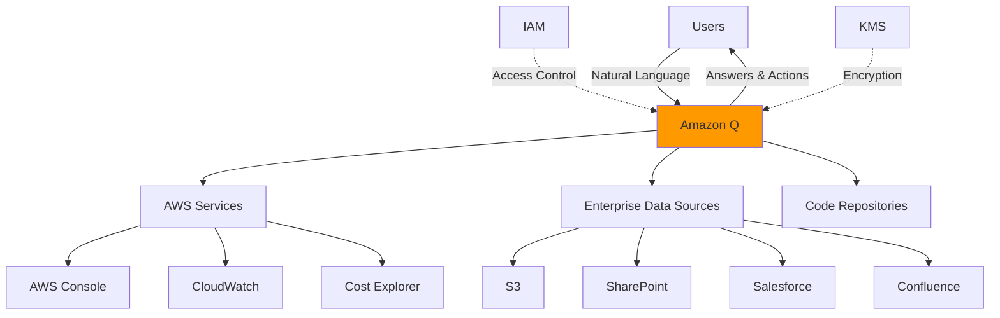
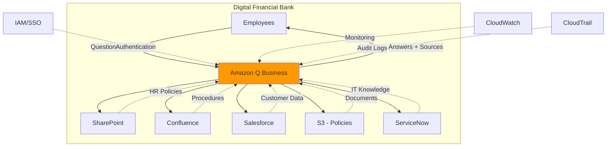
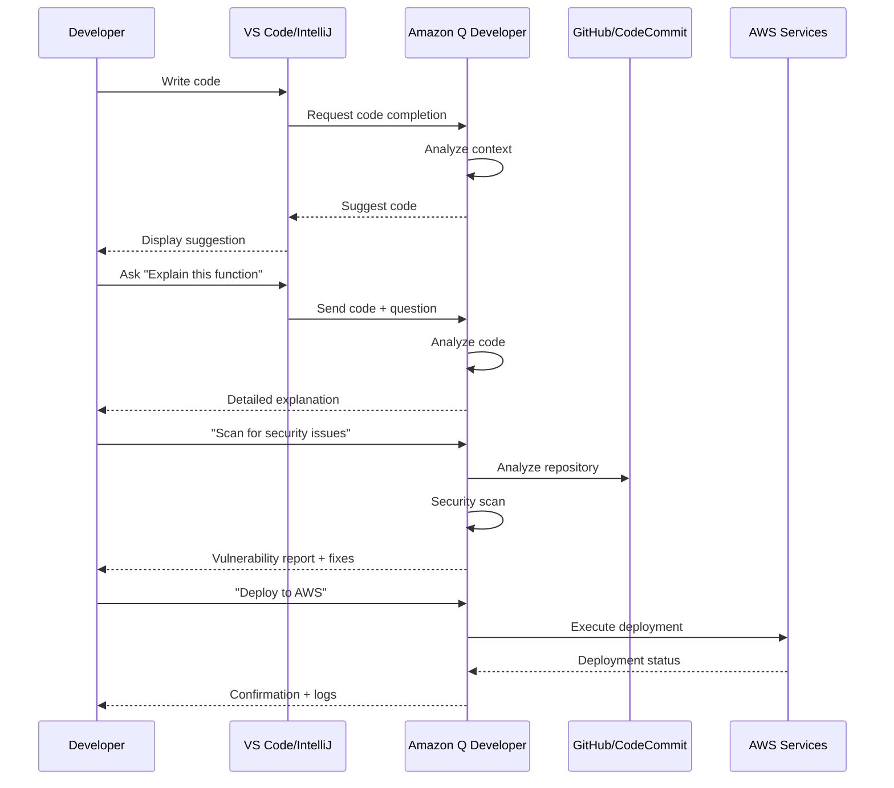

# Amazon Q Study Guide - AWS Cloud Practitioner Exam

## 1. Service Overview

### Definition and Classification
**Amazon Q** is a generative AI-powered assistant designed for business use, providing intelligent answers, content generation, and task automation across AWS services and enterprise applications. It's AWS's answer to ChatGPT for business environments.

**Service Category:** Generative AI / AI Assistant  
**Primary Function:** Business AI Assistant & Developer Productivity  
**Launch Year:** 2023 (Preview), 2024 (GA)

### Key Differentiators
- **Business-Focused:** Trained on enterprise data, not just public internet
- **AWS Integration:** Deep integration with AWS Console, services, and documentation
- **Security & Privacy:** Enterprise-grade security, no training on customer data
- **Role-Based Access:** Respects organizational permissions and data access controls
- **Multi-Modal:** Text generation, code generation, data analysis, troubleshooting
- **Customizable:** Connect to company data sources (S3, SharePoint, Salesforce, etc.)

### Simple Architecture



**Pricing Model:** 
- **Amazon Q Business:** Per user per month subscription
- **Amazon Q Developer:** Free tier + Pro tier (per user/month)
- **Amazon Q in AWS Console:** Included with AWS account

---

## 2. Core Concepts

### Concept 1: Amazon Q Variants
Amazon Q comes in three distinct offerings for different use cases.

| Variant                     | Purpose                        | Primary Users             | Key Features                                                |
| --------------------------- | ------------------------------ | ------------------------- | ----------------------------------------------------------- |
| **Amazon Q Business**       | Enterprise knowledge assistant | Business users, employees | Connect to company data, answer questions, generate content |
| **Amazon Q Developer**      | Code generation & assistance   | Developers, DevOps        | Code completion, debugging, security scanning, AWS CLI help |
| **Amazon Q in AWS Console** | AWS service assistance         | Cloud administrators      | Troubleshooting, cost optimization, architecture guidance   |

### Concept 2: Data Connectors
Pre-built integrations that allow Amazon Q to access and understand your enterprise data.

**Supported Data Sources (40+ connectors):**
- **Cloud Storage:** S3, Google Drive, Box, Dropbox
- **Collaboration:** SharePoint, Confluence, Slack, Microsoft Teams
- **CRM/Support:** Salesforce, ServiceNow, Zendesk, Jira
- **Databases:** RDS, Aurora, Redshift
- **Custom:** API-based integration

**Key Point:** Amazon Q doesn't copy all data - it indexes and references it with proper access controls.

### Concept 3: Retrieval Augmented Generation (RAG)
The technology that allows Amazon Q to provide accurate, company-specific answers.

**How RAG Works:**
1. User asks a question
2. Q searches connected data sources for relevant information
3. Q retrieves specific documents/data
4. Q generates answer using retrieved context + AI model
5. Q cites sources for transparency

**Benefits:**
- Reduces AI "hallucinations" (making up information)
- Provides verifiable, source-backed answers
- Keeps information current without retraining models
- Respects data access permissions

### Concept 4: Plugins and Actions
Extend Amazon Q's capabilities to perform tasks, not just answer questions.

**Plugin Types:**

| Plugin Category | Examples                         | Capabilities                   |
| --------------- | -------------------------------- | ------------------------------ |
| **AWS Actions** | Start/stop EC2, create S3 bucket | Execute AWS service operations |
| **Third-Party** | Jira, ServiceNow, Salesforce     | Create tickets, update records |
| **Custom**      | Internal APIs, databases         | Company-specific workflows     |

**Example:** "Create a Jira ticket for the login bug" → Q creates the ticket automatically.

### Concept 5: Guardrails and Content Filtering
Built-in safety mechanisms to ensure appropriate, secure responses.

**Protection Layers:**
- **Content Filtering:** Blocks harmful, offensive, or inappropriate content
- **PII Detection:** Identifies and masks sensitive personal information
- **Hallucination Detection:** Warns when AI might be uncertain
- **Access Control:** Only shows data user has permission to see
- **Audit Logging:** Tracks all queries and responses for compliance

### Comparison: Amazon Q vs Other AI Assistants

| Feature             | Amazon Q Business            | ChatGPT Enterprise   | Microsoft Copilot         |
| ------------------- | ---------------------------- | -------------------- | ------------------------- |
| **Enterprise Data** | 40+ native connectors        | Limited integrations | Microsoft 365 focus       |
| **AWS Integration** | Deep, native                 | None                 | Limited                   |
| **Data Privacy**    | No training on customer data | Configurable         | Configurable              |
| **Access Control**  | Role-based, granular         | Basic                | Microsoft 365 permissions |
| **Code Generation** | AWS-optimized                | General purpose      | GitHub Copilot separate   |
| **Deployment**      | AWS-managed                  | OpenAI-managed       | Microsoft-managed         |
| **Pricing**         | Per user/month               | Per user/month       | Per user/month            |

---

## 3. Key Features

### Feature 1: Conversational AI Interface
Natural language interaction for asking questions and getting answers.

**Capabilities:**
- Multi-turn conversations (remembers context)
- Follow-up questions without repeating context
- Clarifying questions when query is ambiguous
- Support for 100+ languages

**Example Interaction:**
```
User: "What's our vacation policy?"
Q: "Digital Financial Bank offers 20 days PTO annually..."

User: "What about sick leave?"
Q: "In addition to vacation, employees receive 10 sick days..."
```

### Feature 2: Enterprise Knowledge Search
Search across all connected data sources with a single query.

**Search Capabilities:**

| Capability           | Description                              | Example                               |
| -------------------- | ---------------------------------------- | ------------------------------------- |
| **Semantic Search**  | Understands meaning, not just keywords   | "time off" finds "vacation policy"    |
| **Cross-Source**     | Searches multiple systems simultaneously | Finds info in SharePoint + Confluence |
| **Ranked Results**   | Orders by relevance and recency          | Most relevant documents first         |
| **Source Citations** | Links to original documents              | "Found in HR_Policy.pdf, page 12"     |

### Feature 3: Content Generation
Create documents, summaries, emails, and reports using AI.

**Generation Types:**
- **Summaries:** Condense long documents into key points
- **Drafts:** Create emails, reports, proposals from prompts
- **Translations:** Convert content between languages
- **Reformatting:** Change tone, style, or format

**Example Use Cases:**
- Summarize 50-page compliance report into 2-page executive summary
- Draft customer email response based on support ticket
- Create meeting notes from transcript
- Generate product comparison table from specifications

### Feature 4: Code Generation and Assistance (Q Developer)
AI-powered coding assistant integrated into IDEs and AWS Console.

**Developer Features:**

| Feature                 | Description                       | Benefit                   |
| ----------------------- | --------------------------------- | ------------------------- |
| **Code Completion**     | Real-time suggestions as you type | 57% faster coding         |
| **Code Explanation**    | Explains what code does           | Faster onboarding         |
| **Bug Detection**       | Identifies potential issues       | Fewer production bugs     |
| **Security Scanning**   | Finds vulnerabilities             | Improved security posture |
| **Test Generation**     | Creates unit tests automatically  | Better code coverage      |
| **Code Transformation** | Upgrades Java 8→17, etc.          | Faster modernization      |

**Supported Languages:** Python, Java, JavaScript, TypeScript, C#, Go, Rust, PHP, Ruby, Kotlin, C++, Shell

### Feature 5: AWS Console Integration
Built-in assistant for AWS service management and troubleshooting.

**Console Capabilities:**
- **Service Guidance:** "How do I set up an S3 bucket?"
- **Troubleshooting:** "Why is my EC2 instance not starting?"
- **Cost Analysis:** "Why did my bill increase this month?"
- **Best Practices:** "What's the recommended RDS backup strategy?"
- **Quick Actions:** "Show me all stopped EC2 instances"

**Example:**
```
User: "My Lambda function is timing out"
Q: "I see your function has a 3-second timeout but averages 
    5 seconds execution. Recommend increasing timeout to 10 seconds.
    [Increase Timeout Button]"
```

### Feature 6: Data Analysis and Visualization
Query and analyze data using natural language.

**Analysis Capabilities:**
- SQL query generation from natural language
- Data visualization (charts, graphs)
- Trend analysis and insights
- Anomaly detection

**Example:**
```
User: "Show me sales trends for Q4 2024"
Q: [Generates SQL query] → [Creates line chart] → 
   "Sales increased 23% in Q4, with peak in December"
```

### Feature 7: Customization and Fine-Tuning
Adapt Amazon Q to your organization's specific needs.

**Customization Options:**

| Option                 | Purpose                      | Example                          |
| ---------------------- | ---------------------------- | -------------------------------- |
| **Custom Prompts**     | Define response style/format | "Always include sources"         |
| **Topic Restrictions** | Limit Q to specific domains  | Only HR and IT topics            |
| **Response Templates** | Standardize output format    | Email responses follow template  |
| **Terminology**        | Teach company-specific terms | "DFB" = "Digital Financial Bank" |

### Feature Comparison: Q Business vs Q Developer

| Feature             | Q Business                  | Q Developer                    |
| ------------------- | --------------------------- | ------------------------------ |
| **Primary Use**     | Business questions, content | Code generation, debugging     |
| **Target Users**    | All employees               | Developers, DevOps             |
| **Data Sources**    | Enterprise systems          | Code repos, AWS docs           |
| **Code Generation** | Basic                       | Advanced                       |
| **IDE Integration** | ✗                           | ✓ (VS Code, IntelliJ, etc.)    |
| **AWS Console**     | Basic                       | Advanced                       |
| **Pricing**         | $20/user/month              | Free tier + $25/user/month Pro |

---

## 4. Architecture Patterns

### Pattern 1: Enterprise Knowledge Assistant



**Integration Points:**
- **IAM/SSO:** Single sign-on with corporate identity provider
- **Data Connectors:** Sync metadata and index content from sources
- **CloudWatch:** Monitor query volume, latency, errors
- **CloudTrail:** Audit all queries for compliance
- **VPC:** Private connectivity to internal data sources

**Benefits:**
- Single interface for all company knowledge
- Reduces time searching for information by 60%
- Maintains existing security and permissions
- Scales to thousands of employees

---

### Pattern 2: Developer Productivity Platform



**Use Case:** Accelerate development workflow from coding to deployment.

**Components:**
- **IDE Plugins:** VS Code, IntelliJ IDEA, Visual Studio, JetBrains
- **CLI Integration:** AWS CLI with Q assistance
- **Code Repository:** GitHub, GitLab, CodeCommit integration
- **CI/CD:** Integration with CodePipeline, Jenkins

**Developer Benefits:**
- 57% faster code writing
- 27% faster code reviews
- Automated security scanning
- Instant AWS documentation access

---

### Pattern 3: AWS Operations Assistant

**Scenario:** Cloud administrators need help managing AWS infrastructure, troubleshooting issues, and optimizing costs.

**Architecture Components:**
- **Amazon Q in Console:** Built-in assistant in AWS Management Console
- **CloudWatch Integration:** Real-time metrics and logs analysis
- **Cost Explorer Integration:** Spending analysis and recommendations
- **Trusted Advisor Integration:** Best practice recommendations

**Common Operations:**

| Task                  | Q Assistance                  | Outcome                               |
| --------------------- | ----------------------------- | ------------------------------------- |
| **Troubleshooting**   | "Why is my RDS slow?"         | Identifies high CPU, suggests scaling |
| **Cost Optimization** | "How can I reduce S3 costs?"  | Recommends lifecycle policies         |
| **Security**          | "Are my S3 buckets secure?"   | Lists public buckets, suggests fixes  |
| **Architecture**      | "Best way to deploy web app?" | Recommends ECS + ALB + RDS            |

**Integration with AWS Services:**
- **CloudFormation:** Generate IaC templates
- **Systems Manager:** Execute commands on EC2 instances
- **Lambda:** Create and deploy functions
- **EC2:** Start/stop instances, modify configurations

---

## 5. Real-World Use Cases

### Use Case 1: Employee Self-Service HR Assistant

**Business Challenge:**  
Digital Financial Bank's HR team receives 500+ repetitive questions monthly about policies, benefits, time-off, and procedures. HR staff spends 40% of time answering the same questions, delaying strategic initiatives.

**Amazon Q Solution:**
- Deploy Amazon Q Business connected to SharePoint (HR policies), Workday (benefits), and S3 (employee handbook)
- Enable self-service portal accessible via web and Slack
- Configure role-based access (employees see only relevant policies)
- Train Q on company-specific terminology and acronyms

**Implementation:**
1. Create Amazon Q Business application ($20/user/month for 5,000 employees)
2. Connect data sources: SharePoint (policies), Workday (benefits), S3 (documents)
3. Configure SSO with corporate Active Directory
4. Deploy web widget and Slack integration
5. Monitor usage and refine based on zero-result queries

**Business Outcomes:**
- 65% reduction in HR support tickets (325 tickets/month deflected)
- Average response time: 10 seconds vs 2 hours with HR staff
- HR team freed up for strategic projects (talent acquisition, culture initiatives)
- Employee satisfaction with HR support increased 45%
- $180K annual savings in HR operational costs
- 24/7 availability (no waiting for business hours)

**Example Interactions:**
```
Employee: "How many vacation days do I have?"
Q: "You have 15 vacation days remaining for 2024. 
    You've used 5 days so far. [View Details]"

Employee: "What's the parental leave policy?"
Q: "Digital Financial Bank offers 12 weeks paid parental leave 
    for primary caregivers and 6 weeks for secondary caregivers. 
    Source: HR_Policy_2024.pdf, Section 4.2"
```

**Exam Relevance:** Demonstrates Q Business core functionality, data connectors, and ROI.

---

### Use Case 2: Accelerated Software Development

**Business Challenge:**  
Digital Financial Bank's 200-developer team struggles with:
- Slow onboarding (3-6 months to productivity)
- Inconsistent code quality and security practices
- Legacy Java 8 applications needing modernization
- Time wasted searching AWS documentation

**Amazon Q Solution:**
- Deploy Amazon Q Developer Pro for all developers
- Integrate with VS Code, IntelliJ, and AWS Console
- Connect to internal code repositories (GitLab)
- Enable automated security scanning and code reviews

**Implementation:**
1. Install Q Developer plugins in all IDEs (VS Code, IntelliJ)
2. Configure GitLab integration for code analysis
3. Set up automated security scanning in CI/CD pipeline
4. Train developers on Q features (code completion, explanation, transformation)
5. Establish metrics: code velocity, bug rates, security vulnerabilities

**Business Outcomes:**
- 57% faster code writing (measured by lines of code per hour)
- New developer productivity in 3 weeks vs 3 months (90% faster onboarding)
- 40% reduction in security vulnerabilities detected in production
- Modernized 15 Java 8 applications to Java 17 in 3 months (vs 12 months manual)
- $1.2M annual productivity gains
- 27% faster code reviews

**Example Developer Workflow:**
```
Developer: Types "function to validate email"
Q: [Suggests complete function with regex validation]

Developer: "Explain this Lambda function"
Q: "This function processes S3 events, validates JSON, 
    and writes to DynamoDB. It uses exponential backoff 
    for retries..."

Developer: "Scan for security issues"
Q: "Found 3 vulnerabilities:
    1. SQL injection risk in line 45
    2. Hardcoded credentials in line 78
    3. Missing input validation in line 102
    [View Fixes]"
```

**Exam Relevance:** Shows Q Developer capabilities, IDE integration, and security features.

---

### Use Case 3: Customer Support Knowledge Assistant

**Business Challenge:**  
Digital Financial Bank's 300 customer support agents handle 15,000 daily inquiries. Agents spend 4-5 minutes per call searching for answers across 10+ systems, leading to long hold times and customer frustration.

**Amazon Q Solution:**
- Deploy Amazon Q Business for support team
- Connect to Salesforce (customer data), ServiceNow (knowledge base), Confluence (procedures)
- Integrate with call center software for real-time assistance
- Enable quick actions (create ticket, update account, send email)

**Implementation:**
1. Create Q Business application for support team (300 users)
2. Configure connectors: Salesforce, ServiceNow, Confluence, S3 (product docs)
3. Integrate Q API with call center software (Genesys)
4. Create custom plugins for common actions (create ticket, update status)
5. Set up real-time monitoring dashboard

**Business Outcomes:**
- Average handle time reduced by 90 seconds per call (30% improvement)
- First-call resolution improved from 68% to 87%
- Customer satisfaction (CSAT) increased from 3.2 to 4.5 out of 5
- 22% reduction in call transfers
- $2.1M annual savings in call center operations
- Agent satisfaction improved (less frustration finding information)

**Example Support Interaction:**
```
Agent: "Customer asking about disputed charge process"
Q: "Disputed charges are processed within 10 business days.
    Steps: 1) Verify transaction, 2) Submit dispute form,
    3) Provide documentation. 
    [Create Dispute Ticket] [Send Email Template]
    Source: Support_Procedures.pdf"

Agent: [Clicks Create Dispute Ticket]
Q: [Creates ServiceNow ticket with customer info pre-filled]
```

**Exam Relevance:** Demonstrates Q Business plugins, actions, and third-party integrations.

---

### Use Case 4: AWS Cost Optimization and Governance

**Business Challenge:**  
Digital Financial Bank's AWS spending increased 40% year-over-year to $8M annually. Cloud team lacks visibility into cost drivers and struggles to identify optimization opportunities across 50+ AWS accounts.

**Amazon Q Solution:**
- Use Amazon Q in AWS Console for cost analysis
- Connect to Cost Explorer, Trusted Advisor, and CloudWatch
- Generate cost optimization recommendations
- Automate implementation of savings opportunities

**Implementation:**
1. Enable Amazon Q in AWS Console (included with AWS account)
2. Configure access to Cost Explorer and Trusted Advisor
3. Set up CloudWatch dashboards for resource utilization
4. Create custom Q queries for cost analysis
5. Implement recommended optimizations

**Business Outcomes:**
- Identified $1.8M in annual savings opportunities (22.5% reduction)
- Implemented savings: Reserved Instances ($800K), S3 lifecycle policies ($400K), rightsizing ($600K)
- Reduced time for cost analysis from 2 days to 30 minutes
- Improved resource utilization from 45% to 72%
- Automated monthly cost reports for leadership
- Prevented cost overruns with proactive alerts

**Example Q Interactions:**

```
Admin: "Why did my bill increase last month?"
Q: "Your bill increased $45K (18%) due to:
    1. EC2 costs up $28K (new m5.2xlarge instances in us-east-1)
    2. S3 storage up $12K (data growth in analytics bucket)
    3. Data transfer up $5K (increased CloudFront usage)
    [View Detailed Breakdown]"

Admin: "How can I reduce S3 costs?"
Q: "Recommendations for S3 cost reduction:
    1. Enable Intelligent-Tiering: Save $180K/year
    2. Delete incomplete multipart uploads: Save $15K/year
    3. Move logs to Glacier after 90 days: Save $95K/year
    [Implement All] [View Details]"

Admin: "Show me underutilized EC2 instances"
Q: "Found 23 underutilized instances (< 20% CPU):
    - 15 t3.medium instances: Downsize to t3.small (Save $8K/month)
    - 8 m5.large instances: Stop during non-business hours (Save $5K/month)
    [Generate Rightsizing Report]"
```

**Exam Relevance:** Shows Q in AWS Console, cost optimization, and integration with AWS services.

---

### Use Case 5: Compliance and Regulatory Documentation Search

**Business Challenge:**  
Digital Financial Bank's compliance team must respond to regulatory inquiries within 48 hours, requiring quick access to policies, audit reports, and regulatory filings across 200,000+ documents. Manual search takes 6-8 hours per inquiry, risking missed deadlines and penalties.

**Amazon Q Solution:**
- Deploy Amazon Q Business for compliance team
- Connect to S3 (regulatory filings), SharePoint (policies), Box (audit reports)
- Configure custom metadata: regulation_type, jurisdiction, effective_date
- Enable source citations for audit trail
- Implement access controls (only compliance team can access)

**Implementation:**
1. Create dedicated Q Business application for compliance (50 users)
2. Configure connectors: S3, SharePoint, Box
3. Define custom attributes: document_type, regulation, jurisdiction, date
4. Set up strict IAM policies (compliance team only)
5. Enable CloudTrail logging for all queries (audit requirement)
6. Create compliance-specific prompts and templates

**Business Outcomes:**
- Search time reduced from 7 hours to 20 minutes (94% improvement)
- 100% on-time regulatory responses (vs 85% previously)
- Zero regulatory penalties due to missed deadlines ($500K+ in avoided fines)
- Improved audit readiness (instant document retrieval)
- $350K annual savings in compliance labor costs
- Enhanced confidence in regulatory interactions

**Example Compliance Queries:**
```
Compliance Officer: "Find all documents related to GDPR data retention"
Q: "Found 47 documents related to GDPR data retention:
    1. Data_Retention_Policy_2024.pdf (Updated Jan 2024)
    2. GDPR_Compliance_Audit_2023.pdf (Section 4.2)
    3. EU_Data_Processing_Agreement.pdf
    [View All Results] [Export List]"

Compliance Officer: "What's our policy on customer data deletion?"
Q: "Customer data deletion policy (GDPR Article 17):
    - Requests processed within 30 days
    - Automated deletion from all systems
    - Confirmation sent to customer
    - Exceptions: Legal holds, regulatory requirements
    Source: Data_Privacy_Policy_2024.pdf, Section 8.3"

Compliance Officer: "Show me all SOC 2 audit reports from 2023"
Q: "Found 4 SOC 2 audit reports from 2023:
    1. SOC2_Type2_Q1_2023.pdf
    2. SOC2_Type2_Q2_2023.pdf
    3. SOC2_Type2_Q3_2023.pdf
    4. SOC2_Type2_Q4_2023.pdf
    All reports show no significant findings.
    [Download All]"
```

**Exam Relevance:** Demonstrates Q Business security, access controls, audit logging, and metadata filtering.

---

## 6. Integration & Deployment

### API Access Methods

**AWS SDK Support:**
- Python (Boto3)
- Java
- JavaScript/Node.js
- .NET
- Go, Ruby, PHP

**Key API Operations:**

| Operation                      | Purpose                    | Use Case                        |
| ------------------------------ | -------------------------- | ------------------------------- |
| `ChatSync`                     | Send message, get response | Real-time chat interface        |
| `ListApplications`             | List Q applications        | Management dashboard            |
| `CreateApplication`            | Create new Q app           | Initial setup                   |
| `CreateDataSource`             | Add data connector         | Connect to SharePoint, S3, etc. |
| `CreatePlugin`                 | Add custom action          | Integrate with internal APIs    |
| `GetChatControlsConfiguration` | Get guardrails settings    | Security configuration          |

**REST API Example (Chat):**
```json
POST /applications/{applicationId}/conversations/{conversationId}/messages
{
  "userMessage": "What is our vacation policy?",
  "userId": "user@digitalfinancialbank.com",
  "clientToken": "unique-request-id"
}

Response:
{
  "systemMessage": "Digital Financial Bank offers 20 days PTO...",
  "sourceAttributions": [
    {
      "title": "HR_Policy_2024.pdf",
      "url": "https://sharepoint.dfb.com/hr/policies/...",
      "snippet": "Employees receive 20 days paid time off..."
    }
  ]
}
```

### Security Essentials

**Authentication & Authorization:**
- **IAM Identity Center (SSO):** Single sign-on with corporate identity
- **IAM Roles:** Service-to-service authentication
- **SAML 2.0:** Integration with Active Directory, Okta, Azure AD
- **OAuth 2.0:** Third-party application access
- **MFA:** Multi-factor authentication support

**Data Security:**

| Security Layer            | Implementation            | Purpose                      |
| ------------------------- | ------------------------- | ---------------------------- |
| **Encryption at Rest**    | AWS KMS (required)        | Protect stored data          |
| **Encryption in Transit** | TLS 1.3                   | Secure communication         |
| **Data Isolation**        | Per-application isolation | Prevent cross-contamination  |
| **Access Control**        | IAM + source system ACLs  | Respect existing permissions |
| **PII Detection**         | Automatic masking         | Protect sensitive data       |
| **Content Filtering**     | Built-in guardrails       | Block inappropriate content  |

**Privacy Guarantees:**
- **No Training on Customer Data:** Your data never trains Amazon Q's base models
- **Data Residency:** Data stays in your AWS region
- **Audit Logging:** CloudTrail logs all queries and responses
- **Data Retention:** Configurable (30-90 days for conversations)
- **Right to Delete:** Complete data deletion on request

**Compliance:**
- HIPAA eligible
- PCI DSS compliant
- SOC 1, 2, 3 certified
- GDPR compliant
- ISO 27001 certified
- FedRAMP in progress

**Best Practices:**
- Use IAM Identity Center for centralized user management
- Enable CloudTrail logging for all Q applications
- Implement least privilege access policies
- Regularly review data source permissions
- Use VPC endpoints for private connectivity
- Enable content filtering and guardrails
- Monitor usage with CloudWatch
- Conduct regular security audits

### Deployment Options

**Amazon Q Business:**
1. **Web Experience:** Hosted web interface (no code required)
2. **Embedded Widget:** Add to existing web applications
3. **Slack Integration:** Native Slack app
4. **Microsoft Teams:** Native Teams app
5. **API Integration:** Custom applications via REST API

**Amazon Q Developer:**
1. **IDE Plugins:** VS Code, IntelliJ, Visual Studio, PyCharm
2. **AWS Console:** Built-in assistant
3. **AWS CLI:** Command-line integration
4. **CI/CD Integration:** GitHub Actions, GitLab CI, Jenkins

### Pricing Summary

**Amazon Q Business:**

| Component              | Price          | Notes                            |
| ---------------------- | -------------- | -------------------------------- |
| **Q Business Lite**    | $3/user/month  | Basic Q&A, limited features      |
| **Q Business Pro**     | $20/user/month | Full features, unlimited queries |
| **Data Connectors**    | Included       | 40+ connectors at no extra cost  |
| **Storage**            | Included       | Up to 100 GB per application     |
| **Additional Storage** | $0.10/GB/month | Beyond 100 GB                    |

**Amazon Q Developer:**

| Tier     | Price          | Features                                              |
| -------- | -------------- | ----------------------------------------------------- |
| **Free** | $0             | Code completion, limited queries                      |
| **Pro**  | $25/user/month | Unlimited queries, security scans, agent capabilities |

**Amazon Q in AWS Console:**
- **Included** with AWS account (no additional charge)
- Pay only for underlying AWS service usage

**Cost Optimization Tips:**
- Start with Q Business Lite for non-power users
- Use Q in Console (free) for AWS operations
- Monitor usage to identify inactive users
- Leverage free tier of Q Developer for evaluation
- Consolidate data sources to reduce connector overhead

**Example Monthly Cost (Digital Financial Bank):**
- 5,000 employees (Q Business Pro): $100,000
- 200 developers (Q Developer Pro): $5,000
- Q in Console: $0 (included)
- **Total: ~$105,000/month**

**ROI Calculation:**
- Productivity savings: $400K/month
- Support cost reduction: $180K/month
- Development acceleration: $100K/month
- **Total Savings: $680K/month**
- **Net Benefit: $575K/month (448% ROI)**

---

## 7. Exam Tips & Key Takeaways

### Must-Know Facts for AWS Cloud Practitioner Exam

1. **Service Purpose:** Amazon Q is a generative AI assistant for business and development
2. **Three Variants:** Q Business (employees), Q Developer (coders), Q in Console (AWS ops)
3. **Data Privacy:** Does NOT train on customer data
4. **RAG Technology:** Retrieves company data before generating answers
5. **40+ Connectors:** Pre-built integrations with enterprise systems
6. **Security:** Respects existing permissions, document-level access control
7. **Pricing:** Per-user subscription model ($3-$25/user/month)
8. **AWS Integration:** Deep integration with AWS Console and services

### Common Exam Scenarios

**Scenario 1: Enterprise Knowledge Management**
*Question:* "A company wants to enable 10,000 employees to search across SharePoint, Salesforce, and S3 using natural language. The solution must respect existing permissions and not train AI models on company data. Which service should they use?"

**Answer:** Amazon Q Business
- **Why:** 40+ connectors including SharePoint, Salesforce, S3
- **Why:** Respects source system permissions (ACLs)
- **Why:** Guaranteed no training on customer data
- **Why Not Kendra:** Kendra is search-only, Q provides conversational AI + actions
- **Why Not ChatGPT:** No enterprise connectors, privacy concerns

---

**Scenario 2: Developer Productivity**
*Question:* "A development team wants AI-powered code completion, security
---

**Scenario 2: Developer Productivity**
*Question:* "A development team wants AI-powered code completion, security scanning, and the ability to explain existing code. The solution must integrate with VS Code and IntelliJ. Which service should they use?"

**Answer:** Amazon Q Developer
- **Why:** Native IDE integration (VS Code, IntelliJ, PyCharm, etc.)
- **Why:** Code completion, explanation, and security scanning built-in
- **Why:** Optimized for AWS service development
- **Why Not Q Business:** Designed for business users, not developers
- **Why Not GitHub Copilot:** Less AWS-specific, no security scanning

---

**Scenario 3: AWS Cost Optimization**
*Question:* "A cloud administrator needs help identifying cost savings opportunities across 100+ AWS accounts. They want recommendations for rightsizing, Reserved Instances, and unused resources. Which Amazon Q variant should they use?"

**Answer:** Amazon Q in AWS Console
- **Why:** Built-in integration with Cost Explorer and Trusted Advisor
- **Why:** Free (included with AWS account)
- **Why:** Provides actionable cost optimization recommendations
- **Why:** Can analyze spending patterns across multiple accounts
- **Feature:** Natural language queries like "Why did my bill increase?"

---

**Scenario 4: Customer Self-Service Portal**
*Question:* "A bank wants to reduce call center volume by enabling customers to ask questions about products, policies, and account services. The solution must provide accurate answers with source citations and work 24/7."

**Answer:** Amazon Q Business with customer-facing deployment
- **Why:** RAG ensures accurate, source-backed answers
- **Why:** Can connect to product databases, policy documents, FAQs
- **Why:** Provides source citations for transparency
- **Why:** 24/7 availability reduces call center load
- **Integration:** Deploy via web widget or API

---

**Scenario 5: Data Privacy Requirements**
*Question:* "A healthcare organization needs an AI assistant but is concerned about patient data being used to train AI models. They require HIPAA compliance and data residency in US regions."

**Answer:** Amazon Q Business (HIPAA-eligible)
- **Why:** Guaranteed no training on customer data
- **Why:** HIPAA eligible with BAA (Business Associate Agreement)
- **Why:** Data stays in specified AWS region
- **Why:** Document-level access controls respect HIPAA requirements
- **Security:** Encryption at rest and in transit, audit logging

---

**Scenario 6: Multi-Language Support**
*Question:* "A global company needs an AI assistant that can answer questions in English, Spanish, French, German, and Japanese from a single knowledge base."

**Answer:** Amazon Q Business
- **Why:** Supports 100+ languages natively
- **Why:** Single knowledge base serves all languages
- **Why:** No additional configuration or cost for multi-language
- **Feature:** Automatically detects user's language and responds accordingly

---

### Service Comparison Table

| Feature              | Amazon Q Business  | Amazon Q Developer | Amazon Q in Console | Amazon Kendra     |
| -------------------- | ------------------ | ------------------ | ------------------- | ----------------- |
| **Primary Use**      | Employee knowledge | Code generation    | AWS operations      | Enterprise search |
| **Generative AI**    | ✓ Full             | ✓ Full             | ✓ Full              | ✗ Search only     |
| **Code Generation**  | Basic              | Advanced           | AWS-specific        | ✗                 |
| **Data Connectors**  | 40+                | Code repos         | AWS services        | 40+               |
| **Conversational**   | ✓ Multi-turn       | ✓ Multi-turn       | ✓ Multi-turn        | ✗ Query-based     |
| **Actions/Plugins**  | ✓                  | ✓                  | ✓                   | ✗                 |
| **IDE Integration**  | ✗                  | ✓                  | ✗                   | ✗                 |
| **Training on Data** | Never              | Never              | Never               | N/A               |
| **Pricing**          | $3-20/user/month   | Free + $25/month   | Included            | $810-1,400+/month |
| **Best For**         | Business Q&A       | Development        | AWS management      | Document search   |

### Quick Reference Cheat Sheet

**When to Use Amazon Q Business:**
✅ Employee knowledge management  
✅ Customer self-service portals  
✅ HR, IT, compliance Q&A  
✅ Content generation (emails, reports, summaries)  
✅ Multi-source enterprise search with AI  
✅ Need conversational interface  
✅ Require actions/plugins (create tickets, update records)  
✅ Want to reduce support ticket volume  

**When to Use Amazon Q Developer:**
✅ Code completion and generation  
✅ Code explanation and documentation  
✅ Security vulnerability scanning  
✅ Unit test generation  
✅ Code modernization (Java 8→17, etc.)  
✅ AWS CLI assistance  
✅ Debugging and troubleshooting code  
✅ Learning new programming languages  

**When to Use Amazon Q in Console:**
✅ AWS service troubleshooting  
✅ Cost optimization and analysis  
✅ Architecture recommendations  
✅ Best practices guidance  
✅ Quick AWS operations  
✅ Learning AWS services  
✅ No additional cost needed  

**When NOT to Use Amazon Q:**
❌ Need full control over AI model training  
❌ Require on-premises deployment  
❌ Budget constraints (Kendra may be cheaper for search-only)  
❌ Simple keyword search is sufficient  
❌ Don't need generative AI capabilities  

---

**Key Differentiators (Memorize for Exam):**

| Aspect             | Key Point                                           |
| ------------------ | --------------------------------------------------- |
| **AI Type**        | Generative AI (creates content, not just searches)  |
| **Data Privacy**   | NEVER trains on customer data                       |
| **Technology**     | RAG (Retrieval Augmented Generation)                |
| **Variants**       | Business, Developer, Console (3 distinct offerings) |
| **Connectors**     | 40+ pre-built (same as Kendra)                      |
| **Conversational** | Multi-turn conversations with context               |
| **Actions**        | Can perform tasks, not just answer questions        |
| **Security**       | Document-level ACLs, HIPAA eligible                 |

---

**Common Exam Keywords:**
- "Generative AI assistant" → **Amazon Q**
- "Code completion" → **Amazon Q Developer**
- "Employee knowledge base with AI" → **Amazon Q Business**
- "AWS cost optimization help" → **Amazon Q in Console**
- "No training on customer data" → **Amazon Q** (key differentiator)
- "Conversational AI for business" → **Amazon Q Business**
- "IDE integration for coding" → **Amazon Q Developer**

---

**Pricing Quick Reference:**

| User Type                     | Recommended Service | Monthly Cost/User | Annual Cost (1000 users) |
| ----------------------------- | ------------------- | ----------------- | ------------------------ |
| **Business Users**            | Q Business Lite     | $3                | $36,000                  |
| **Power Users**               | Q Business Pro      | $20               | $240,000                 |
| **Developers**                | Q Developer Pro     | $25               | $300,000                 |
| **AWS Admins**                | Q in Console        | $0                | $0                       |
| **Mixed (80% Lite, 20% Pro)** | Hybrid              | $7.40 avg         | $88,800                  |

---

**Integration Patterns to Remember:**

**Pattern 1: Q Business + Enterprise Systems**
```
Employees → Q Business → [SharePoint + Salesforce + S3 + ServiceNow] → Answers
```

**Pattern 2: Q Developer + Development Tools**
```
Developers → IDE (VS Code) → Q Developer → [Code Repos + AWS Docs] → Code Suggestions
```

**Pattern 3: Q in Console + AWS Services**
```
Admins → AWS Console → Q in Console → [CloudWatch + Cost Explorer + Trusted Advisor] → Recommendations
```

---

**Exam Strategy Tips:**

1. **Identify the Variant:** Look for keywords
   - "Employees" or "business users" → Q Business
   - "Developers" or "code" → Q Developer
   - "AWS operations" or "cost" → Q in Console

2. **Data Privacy Questions:** Amazon Q NEVER trains on customer data (key differentiator from public AI)

3. **Eliminate Options:**
   - Kendra = search only, no generative AI
   - Lex = chatbots, not knowledge assistant
   - SageMaker = build custom models, not ready-made assistant

4. **Cost Questions:**
   - Q in Console = FREE
   - Q Developer = Free tier available
   - Q Business = Paid per user

5. **Security Questions:**
   - Q respects source system permissions
   - HIPAA eligible
   - No training on customer data

6. **Use Case Matching:**
   - Knowledge management → Q Business
   - Development acceleration → Q Developer
   - AWS troubleshooting → Q in Console
   - Document search only → Kendra

---

**Final Exam Checklist:**

- [ ] Understand Q is generative AI, not just search (vs Kendra)
- [ ] Know the 3 variants: Business, Developer, Console
- [ ] Remember: NEVER trains on customer data
- [ ] Q Business has 40+ connectors (same as Kendra)
- [ ] Q Developer integrates with IDEs (VS Code, IntelliJ, etc.)
- [ ] Q in Console is FREE (included with AWS account)
- [ ] Pricing: $3-25/user/month depending on variant and tier
- [ ] RAG technology ensures accurate, source-backed answers
- [ ] Supports 100+ languages
- [ ] HIPAA eligible, SOC 2 compliant
- [ ] Can perform actions via plugins (not just Q&A)
- [ ] Multi-turn conversational interface

---

**Memory Aid - "AMAZON Q":**
- **A**I assistant (generative, not just search)
- **M**ulti-variant (Business, Developer, Console)
- **A**ctions enabled (plugins for tasks)
- **Z**ero training on customer data
- **O**rganizational knowledge (40+ connectors)
- **N**atural language (conversational interface)
- **Q**uery and generate (search + create content)

---

