# Amazon Comprehend - AWS Cloud Practitioner Study Guide

## Table of Contents
1. `[Service Overview](#service-overview)`
2. `[Core Concepts](#core-concepts)`
3. `[Key Features & Capabilities](#key-features--capabilities)`
4. `[Architecture Patterns](#architecture-patterns)`
5. `[Real-World Use Cases](#real-world-use-cases)`
6. `[Integration & Deployment](#integration--deployment)`
7. `[Exam Tips & Key Takeaways](#exam-tips--key-takeaways)`

---

## Service Overview

**Amazon Comprehend** is a fully managed Natural Language Processing (NLP) service that uses machine learning to extract insights and relationships from unstructured text data.

### Service Classification
- **Category**: Machine Learning / AI Services
- **Type**: Fully Managed (Serverless)
- **Pricing Model**: Pay-per-use (per unit of text analyzed)
- **AWS Well-Architected Pillar**: Cost Optimization, Operational Excellence

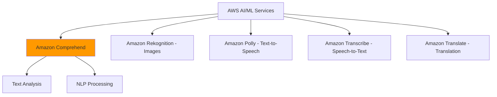

---

## Core Concepts

### 1. Natural Language Processing (NLP)
Machine learning technology that enables computers to understand, interpret, and derive meaning from human language in text format.

**Exam Relevance**: Understand that NLP is the underlying technology, and Comprehend is AWS's managed implementation.

### 2. Unstructured Text Data
Information in free-form text (emails, reviews, documents, social media) that lacks predefined format, making it difficult to analyze without NLP tools.

**Examples**: Customer reviews, support tickets, medical records, legal documents, social media posts.

### 3. Pre-trained Models
Ready-to-use ML models trained on massive datasets that work immediately without requiring:
- Custom training data
- Data science expertise
- Infrastructure management
- Model deployment

**Exam Relevance**: Key differentiator - no ML expertise required to use Comprehend.

### 4. Fully Managed Service
AWS handles all infrastructure, scaling, patching, and maintenance. You only focus on sending text and receiving insights.

```mermaid
graph LR
    A[Your Application] -->|Send Text| B[Amazon Comprehend API]
    B -->|Return Insights| A
    
    C[AWS Manages] -.->|Infrastructure| B
    C -.->|Scaling| B
    C -.->|Updates| B
    C -.->|Security| B
    
    style B fill:#FF9900
    style C fill:#232F3E
```

---

## Key Features & Capabilities

### Feature Overview

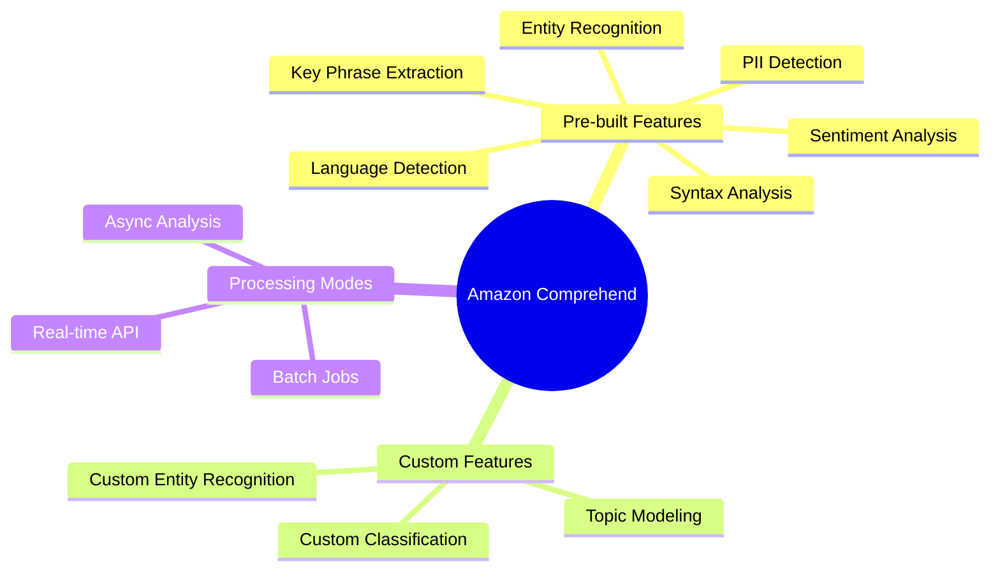

### 1. Sentiment Analysis

**What it does**: Determines emotional tone in text (positive, negative, neutral, mixed).

**Returns**: 
- Overall sentiment label
- Confidence scores for each sentiment (0-1 scale)

**Use Cases**:
- Analyze customer reviews and feedback
- Monitor brand reputation on social media
- Prioritize negative customer support tickets

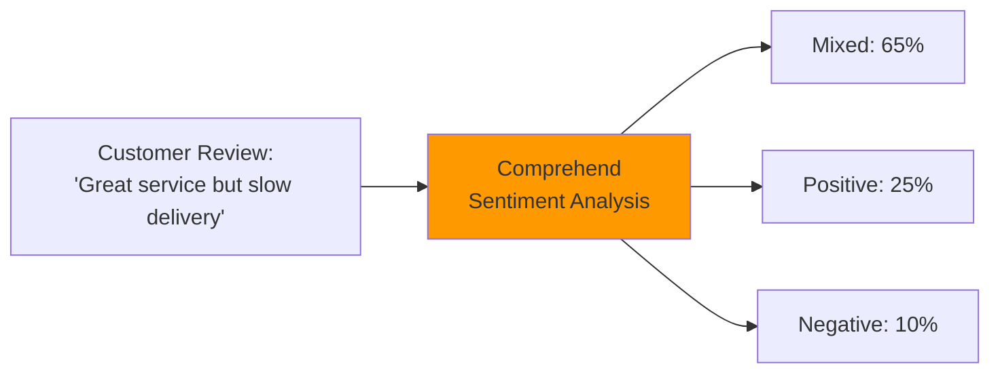

**Exam Tip**: Remember sentiment analysis provides confidence scores, not just labels.

---

### 2. Entity Recognition (NER)

**What it does**: Identifies and categorizes specific information in text.

**Standard Entity Types**:
- PERSON (names)
- LOCATION (cities, countries)
- ORGANIZATION (companies)
- DATE (specific dates, time periods)
- QUANTITY (numbers, measurements)
- COMMERCIAL_ITEM (products, brands)
- EVENT (concerts, conferences)
- TITLE (job titles, book titles)

**Use Cases**:
- Extract customer information from forms
- Identify products mentioned in reviews
- Parse dates and amounts from invoices

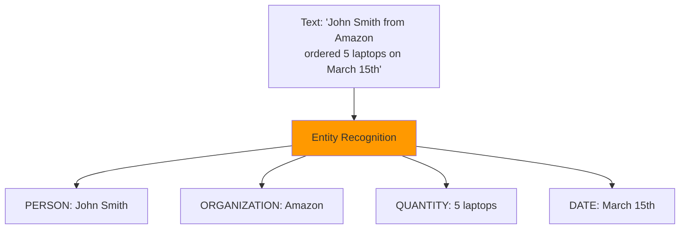

**Exam Tip**: Know the difference between standard entities (pre-built) and custom entities (you train).

---

### 3. Key Phrase Extraction

**What it does**: Identifies the most important words and phrases that capture main topics.

**Returns**: List of key phrases with confidence scores.

**Use Cases**:
- Summarize long documents
- Index content for search
- Identify trending topics in feedback

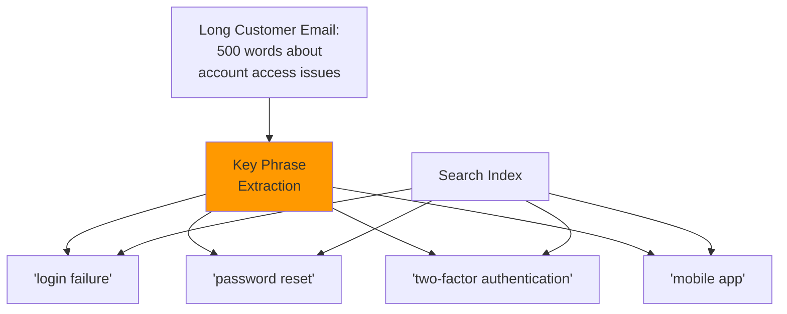

**Exam Tip**: Key phrases help with document indexing and search optimization.

---

### 4. PII Detection & Redaction

**What it does**: Automatically finds and optionally masks personally identifiable information.

**PII Types Detected**:
- Social Security Numbers (SSN)
- Credit card numbers
- Email addresses
- Phone numbers
- Physical addresses
- Passport numbers
- Driver's license numbers
- Bank account numbers

**Use Cases**:
- Ensure GDPR/HIPAA compliance
- Protect customer data in logs
- Redact sensitive info before sharing documents

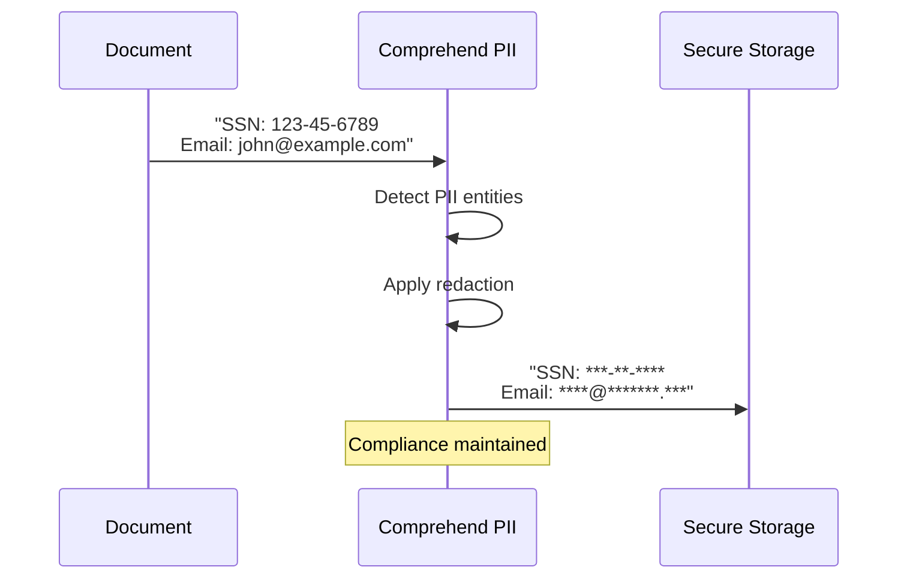

**Exam Tip**: PII detection is critical for compliance (GDPR, HIPAA, PCI-DSS). Know this is a built-in feature.

---

### 5. Custom Classification

**What it does**: Trains models to categorize documents into your specific business categories.

**Process**:
1. Provide labeled training data (minimum 50 documents per category)
2. Comprehend trains a custom model
3. Deploy model for classification
4. Classify new documents automatically

**Use Cases**:
- Route support tickets to correct departments
- Classify loan applications by type
- Organize legal documents by category

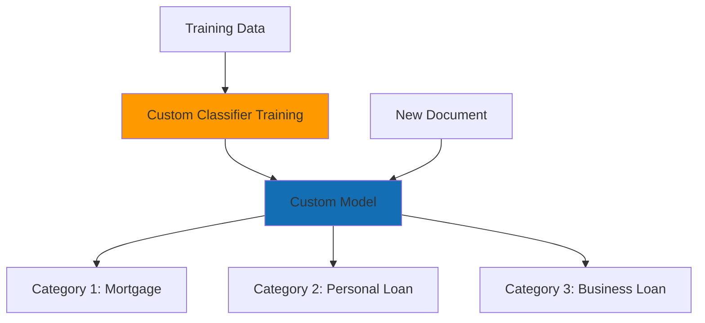

**Exam Tip**: Custom classification requires training data. Pre-built sentiment/entity recognition does not.

---

### 6. Custom Entity Recognition

**What it does**: Identifies domain-specific terms unique to your business that standard models don't recognize.

**Examples**:
- Internal product codes
- Proprietary terminology
- Industry-specific jargon
- Company-specific abbreviations

**Use Cases**:
- Extract internal SKU numbers
- Identify proprietary product names
- Recognize company-specific codes

**Exam Tip**: Use custom entities when standard entity types aren't sufficient for your domain.

---

### 7. Topic Modeling

**What it does**: Discovers abstract themes across large document collections without predefined categories.

**How it works**: Uses unsupervised learning to group documents by similar topics.

**Use Cases**:
- Analyze thousands of customer feedback entries
- Discover emerging trends in support tickets
- Organize large document repositories

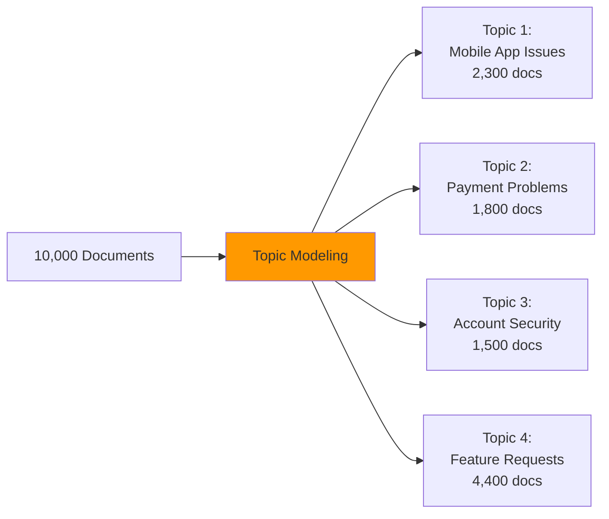

**Exam Tip**: Topic modeling is unsupervised (no training labels needed), unlike custom classification.

---

### 8. Language Detection

**What it does**: Identifies which language text is written in from 100+ supported languages.

**Returns**: 
- Primary language code (e.g., "en" for English)
- Confidence score

**Use Cases**:
- Route multilingual customer inquiries
- Apply correct language processing
- Organize documents by language

**Exam Tip**: Language detection happens automatically before other analyses.

---

### 9. Syntax Analysis

**What it does**: Breaks down sentence structure to identify parts of speech.

**Identifies**:
- Nouns, verbs, adjectives, adverbs
- Sentence structure
- Grammatical relationships

**Use Cases**:
- Improve chatbot understanding
- Parse complex queries
- Extract specific grammatical elements

**Exam Tip**: Less commonly tested but useful for advanced text processing.

---

## Architecture Patterns

### Pattern 1: Real-time Processing

**Use Case**: Chatbots, live sentiment monitoring, instant PII detection

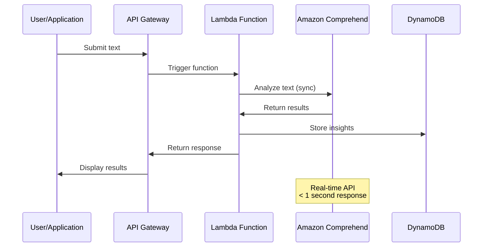

**Key Characteristics**:
- Synchronous API calls
- Sub-second response times
- Best for < 5,000 characters per request
- Pay per API call

**Exam Tip**: Real-time = synchronous API, immediate results.

---

### Pattern 2: Batch Processing

**Use Case**: Analyzing large document collections, nightly reports, historical analysis

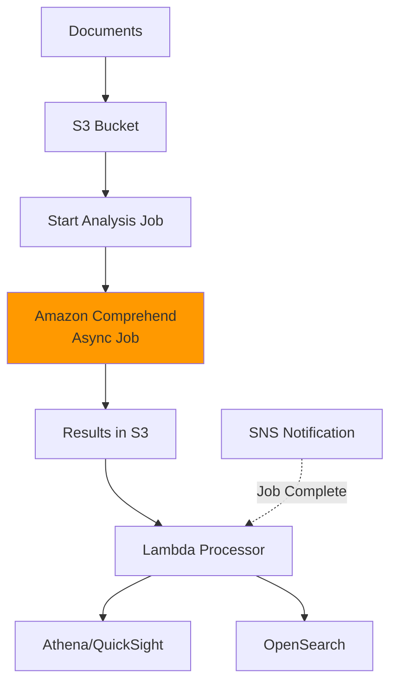

**Key Characteristics**:
- Asynchronous processing
- Handles millions of documents
- Results stored in S3
- More cost-effective for large volumes
- Processing time: minutes to hours

**Exam Tip**: Batch processing = asynchronous jobs for large-scale analysis.

---

### Pattern 3: Event-Driven Architecture

**Use Case**: Automatic processing when documents arrive

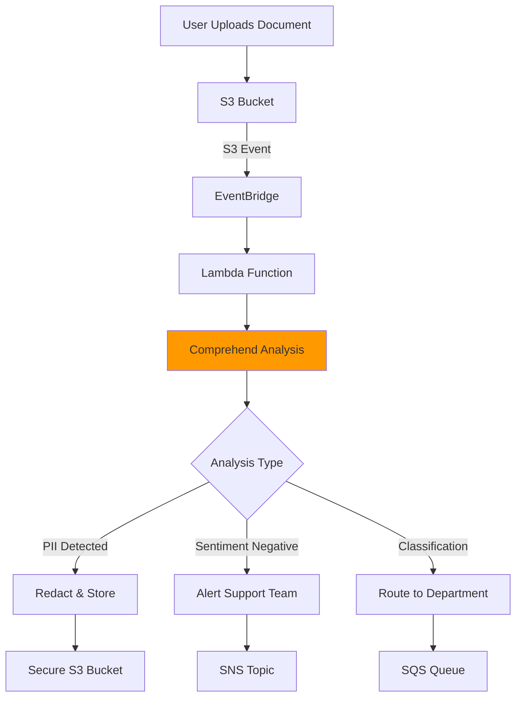

**Key Characteristics**:
- Fully automated workflow
- Triggered by events (S3 uploads, API calls)
- Serverless architecture
- Scales automatically

**Exam Tip**: Event-driven = automatic processing triggered by AWS events.

---

### Pattern 4: Multi-Service Integration

**Use Case**: Complete document processing pipeline

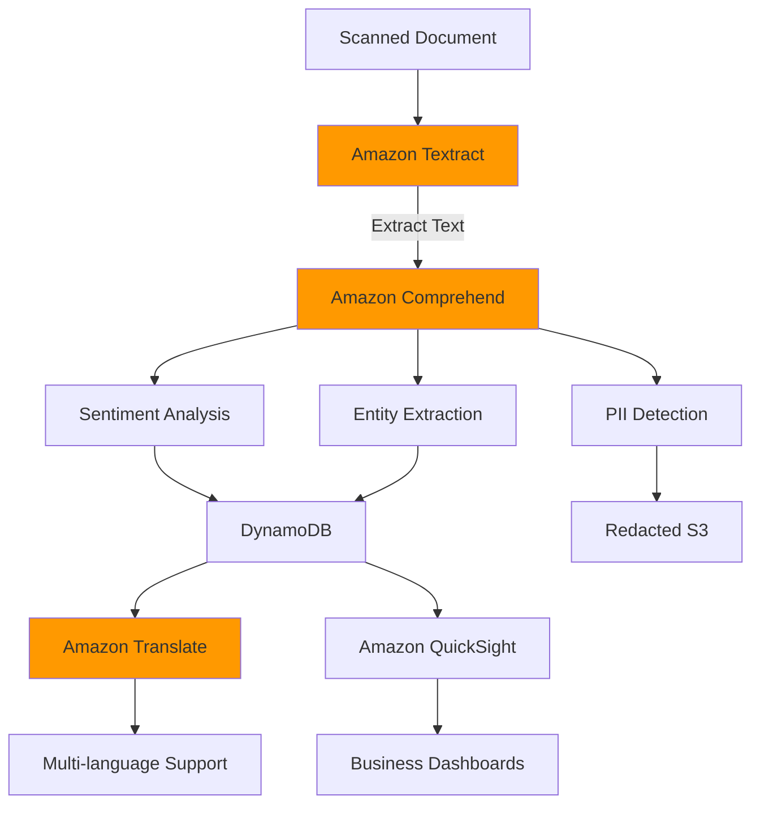

**Key AWS Services Integration**:
- **Amazon Textract**: Extract text from images/PDFs
- **Amazon Translate**: Translate to other languages
- **Amazon Transcribe**: Convert speech to text first
- **Amazon Kendra**: Intelligent search with Comprehend insights
- **Amazon QuickSight**: Visualize sentiment trends

**Exam Tip**: Know how Comprehend fits into broader AWS AI/ML service ecosystem.

---

## Real-World Use Cases

### Use Case 1: Digital Banking - Customer Feedback Analysis

**Business Challenge**: Analyze 10,000+ monthly customer reviews across app stores, surveys, and social media.

**Solution Architecture**:

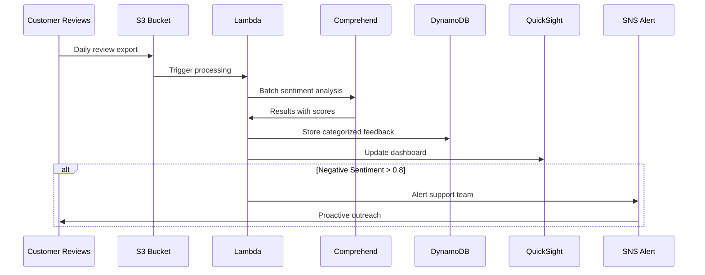

**Comprehend Features Used**:
- **Sentiment Analysis**: Classify positive/negative/neutral feedback
- **Key Phrase Extraction**: Identify common issues ("login failure", "slow performance")
- **Entity Recognition**: Extract product names, feature mentions
- **Topic Modeling**: Discover emerging themes across thousands of reviews

**Business Outcomes**:
- 60% reduction in response time to negative feedback
- Automated categorization of 95% of reviews
- Early detection of app issues before escalation
- Data-driven product roadmap decisions

**Exam Relevance**: Demonstrates batch processing, multi-feature usage, and integration with analytics services.

---

### Use Case 2: Healthcare - Medical Records Analysis

**Business Challenge**: Extract insights from unstructured clinical notes while maintaining HIPAA compliance.

**Solution Architecture**:

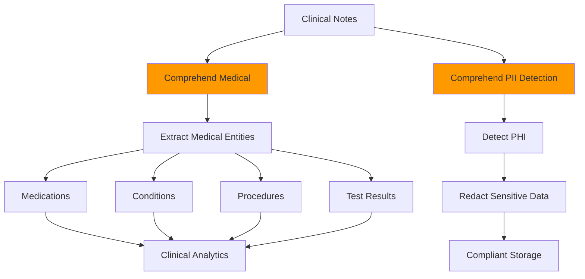

**Comprehend Features Used**:
- **PII Detection & Redaction**: Protect patient identifiable information (PHI)
- **Comprehend Medical**: Specialized for medical terminology (separate service)
- **Custom Entity Recognition**: Identify hospital-specific codes

**Business Outcomes**:
- HIPAA compliance automated
- 80% faster medical coding
- Improved patient care through data insights
- Reduced manual chart review time

**Exam Tip**: Know that Comprehend Medical is a specialized variant for healthcare use cases.

---

### Use Case 3: E-commerce - Product Review Intelligence

**Business Challenge**: Understand customer sentiment about specific product features from millions of reviews.

**Solution Architecture**:

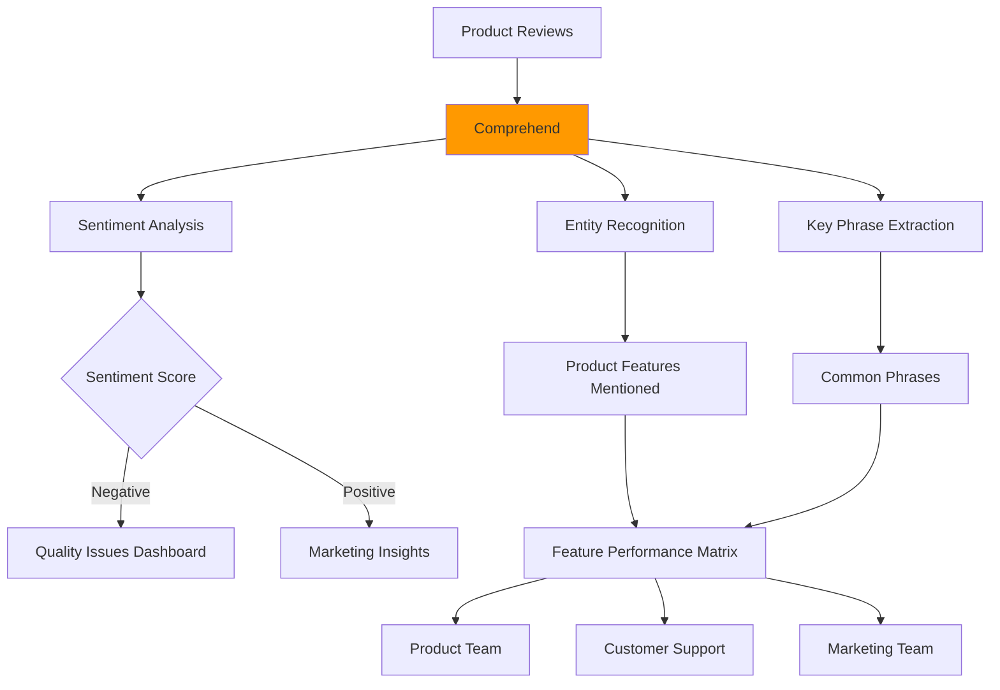

**Comprehend Features Used**:
- **Sentiment Analysis**: Overall product satisfaction
- **Entity Recognition**: Identify specific features (battery, screen, camera)
- **Key Phrase Extraction**: Common complaints or praise
- **Custom Classification**: Route reviews by product category

**Business Outcomes**:
- Identify defective product batches 3 days earlier
- 40% improvement in product development cycle
- Targeted marketing based on positive sentiment
- Automated review moderation

---

### Use Case 4: Legal - Contract Analysis

**Business Challenge**: Review and categorize thousands of legal contracts for compliance and risk assessment.

**Solution Architecture**:

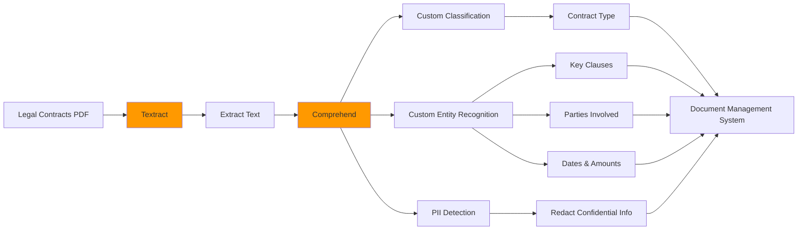

**Comprehend Features Used**:
- **Custom Classification**: Categorize by contract type (NDA, employment, vendor)
- **Custom Entity Recognition**: Extract legal-specific terms (indemnification clauses, liability limits)
- **Entity Recognition**: Identify parties, dates, monetary values
- **PII Detection**: Protect confidential information

**Business Outcomes**:
- 70% reduction in contract review time
- Automated compliance checking
- Risk identification before signing
- Searchable contract repository

---

### Use Case 5: Customer Support - Intelligent Ticket Routing

**Business Challenge**: Automatically route and prioritize 50,000+ monthly support tickets.

**Solution Architecture**:

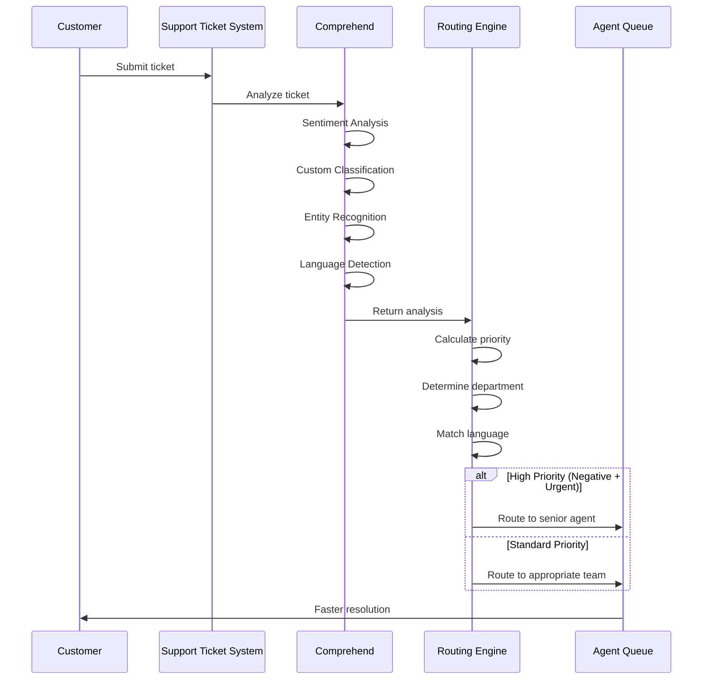

**Comprehend Features Used**:
- **Sentiment Analysis**: Prioritize frustrated customers
- **Custom Classification**: Route to correct department (billing, technical, account)
- **Entity Recognition**: Extract account numbers, product names
- **Language Detection**: Route to language-appropriate agents
- **Key Phrase Extraction**: Identify issue type

**Business Outcomes**:
- 65% of tickets auto-routed correctly
- 45% reduction in average handling time
- 25% improvement in customer satisfaction
- 24/7 automated triage

**Exam Tip**: This demonstrates real-time processing with multiple Comprehend features working together.

---

## Integration & Deployment

### API Access Methods

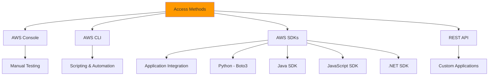

**Exam Tip**: Know that Comprehend is accessible via console, CLI, SDKs, and REST APIs like most AWS services.

---

### Processing Modes Comparison

| Feature              | Real-time (Synchronous)  | Batch (Asynchronous)                |
| -------------------- | ------------------------ | ----------------------------------- |
| **Response Time**    | < 1 second               | Minutes to hours                    |
| **Input Size**       | Up to 5,000 characters   | Unlimited documents                 |
| **Use Case**         | Chatbots, live analysis  | Large-scale processing              |
| **Cost**             | Per API call             | Per unit of text (cheaper at scale) |
| **Results Location** | API response             | S3 bucket                           |
| **Best For**         | Interactive applications | Bulk analysis, reports              |

**Exam Tip**: Understand when to use synchronous vs asynchronous processing.

---

### Security & Compliance

```mermaid
graph TB
    A[Security Features] --> B[Encryption]
    A --> C[Access Control]
    A --> D[Compliance]
    A --> E[Data Privacy]
    
    B --> F[At Rest: KMS]
    B --> G[In Transit: TLS]
    
    C --> H[IAM Policies]
    C --> I[VPC Endpoints]
    C --> J[Resource-based Policies]
    
    D --> K[HIPAA Eligible]
    D --> L[GDPR Compliant]
    D --> M[PCI DSS]
    D --> N[SOC Certified]
    
    E --> O[No Data Retention]
    E --> P[PII Detection Built-in]
    
    style A fill:#232F3E
```

**Key Security Points**:

1. **Encryption**:
   - Data encrypted at rest using AWS KMS
   - Data encrypted in transit using TLS 1.2+
   - Customer-managed keys supported

2. **Access Control**:
   - IAM policies control who can use Comprehend
   - VPC endpoints for private connectivity
   - Resource-based policies for cross-account access

3. **Compliance Certifications**:
   - HIPAA eligible (for healthcare)
   - GDPR compliant (for EU data)
   - PCI DSS (for payment data)
   - SOC 1, 2, 3 certified
   - ISO 27001 certified

4. **Data Privacy**:
   - AWS does not use your data to train models
   - No data retention after processing (except custom models)
   - Built-in PII detection and redaction

**Exam Tip**: Know that Comprehend is HIPAA eligible and doesn't retain customer data for training.

---

### Pricing Model

```mermaid
graph LR
    A[Pricing Components] --> B[Pre-built APIs]
    A --> C[Custom Models]
    
    B --> D[Per Unit of Text]
    B --> E[100 characters = 1 unit]
    B --> F[Different rates per feature]
    
    C --> G[Training Cost]
    C --> H[Model Management Cost]
    C --> I[Inference Cost]
    
    J[Free Tier] --> K[50K units/month for 12 months]
    
    style A fill:#FF9900
```

**Pricing Breakdown**:

1. **Pre-built Features** (Pay per use):
   - Charged per unit (100 characters = 1 unit)
   - Minimum 3 units per request
   - Different rates for different features
   - Example: Sentiment analysis ~$0.0001 per unit

2. **Custom Models**:
   - Training: One-time cost per model
   - Management: Monthly cost per active model
   - Inference: Per unit analyzed

3. **Free Tier**:
   - 50,000 units per month for 12 months
   - Applies to new AWS accounts
   - Covers pre-built features only

**Cost Optimization Tips**:
- Use batch processing for large volumes (cheaper)
- Combine multiple analyses in single API call
- Use custom models only when necessary
- Monitor usage with CloudWatch

**Exam Tip**: Understand pay-per-use pricing model and that there's a free tier for new accounts.

---

## Exam Tips & Key Takeaways

### Must-Know Facts for AWS Cloud Practitioner

#### 1. Service Definition
✅ **Amazon Comprehend is a fully managed NLP service that uses ML to extract insights from text**
- No ML expertise required
- No infrastructure to manage
- Pay only for what you use

#### 2. Key Features to Remember

```mermaid
mindmap
  root((Comprehend<br/>Features))
    Pre-built
      Sentiment Analysis
      Entity Recognition
      Key Phrase Extraction
      Language Detection
      PII Detection
    Custom
      Custom Classification
      Custom Entities
      Topic Modeling
    Processing
      Real-time API
      Batch Jobs
```

**Exam Tip**: If asked about text analysis, sentiment analysis, or NLP on AWS → Think Comprehend

#### 3. Common Exam Scenarios

**Scenario 1**: "A company needs to analyze customer reviews to determine satisfaction levels"
- **Answer**: Amazon Comprehend with Sentiment Analysis

**Scenario 2**: "A healthcare provider needs to extract medical information while protecting patient data"
- **Answer**: Amazon Comprehend Medical with PII Detection

Classification

**Scenario 4**: "A financial institution needs to redact sensitive information from documents before sharing"
- **Answer**: Amazon Comprehend PII Detection and Redaction

**Scenario 5**: "A company receives support requests in multiple languages and needs to route them appropriately"
- **Answer**: Amazon Comprehend Language Detection

**Scenario 6**: "An organization wants to analyze thousands of documents overnight to find common themes"
- **Answer**: Amazon Comprehend Batch Processing with Topic Modeling

**Exam Tip**: Match the business requirement to the specific Comprehend feature.

---

#### 4. Service Comparisons

**Comprehend vs Other AWS AI Services**:

```mermaid
graph TB
    A[Text Input] --> B{What do you need?}
    
    B -->|Analyze text content| C[Amazon Comprehend]
    B -->|Extract text from images| D[Amazon Textract]
    B -->|Convert speech to text| E[Amazon Transcribe]
    B -->|Translate languages| F[Amazon Translate]
    B -->|Text to speech| G[Amazon Polly]
    B -->|Search documents| H[Amazon Kendra]
    
    style C fill:#FF9900
```

| Service         | Primary Function            | Use Case                    |
| --------------- | --------------------------- | --------------------------- |
| **Comprehend**  | Text analysis & NLP         | Sentiment, entities, topics |
| **Textract**    | Extract text from documents | OCR, form processing        |
| **Transcribe**  | Speech-to-text              | Convert audio to text       |
| **Translate**   | Language translation        | Multi-language support      |
| **Polly**       | Text-to-speech              | Voice applications          |
| **Kendra**      | Intelligent search          | Enterprise search           |
| **Rekognition** | Image/video analysis        | Visual content analysis     |

**Exam Tip**: Comprehend analyzes text that's already in text format. Use Textract first if you need to extract text from images/PDFs.

---

#### 5. Integration Patterns

**Common AWS Service Integrations**:

```mermaid
graph TB
    A[Data Sources] --> B[S3]
    A --> C[DynamoDB]
    A --> D[Kinesis]
    
    B --> E[Lambda]
    C --> E
    D --> E
    
    E --> F[Amazon Comprehend]
    
    F --> G[Storage]
    F --> H[Analytics]
    F --> I[Notifications]
    
    G --> J[S3]
    G --> K[DynamoDB]
    
    H --> L[QuickSight]
    H --> M[Athena]
    H --> N[OpenSearch]
    
    I --> O[SNS]
    I --> P[SQS]
    I --> Q[EventBridge]
    
    style F fill:#FF9900
```

**Typical Integration Flow**:
1. **Data Ingestion**: S3, Kinesis, API Gateway
2. **Processing Trigger**: Lambda, EventBridge
3. **Analysis**: Amazon Comprehend
4. **Storage**: S3, DynamoDB, RDS
5. **Analytics**: QuickSight, Athena, OpenSearch
6. **Notifications**: SNS, SQS, EventBridge

**Exam Tip**: Know that Comprehend integrates seamlessly with other AWS services via Lambda and EventBridge.

---

#### 6. When to Use Comprehend

**✅ Use Amazon Comprehend When**:
- Analyzing customer feedback and reviews
- Extracting insights from unstructured text
- Detecting sentiment in social media
- Identifying entities in documents
- Protecting PII in text data
- Categorizing documents automatically
- No ML expertise available
- Need quick deployment

**❌ Don't Use Comprehend When**:
- Analyzing images or videos (use Rekognition)
- Converting speech to text (use Transcribe)
- Translating languages (use Translate)
- Need to extract text from PDFs first (use Textract)
- Performing mathematical calculations
- Processing structured data only

**Exam Tip**: Comprehend is specifically for text analysis, not other data types.

---

#### 7. Deployment Models

```mermaid
graph LR
    A[Deployment Options] --> B[Fully Managed]
    A --> C[Custom Models]
    
    B --> D[Pre-built APIs]
    B --> E[No Training Required]
    B --> F[Immediate Use]
    
    C --> G[Train on Your Data]
    C --> H[Domain-Specific]
    C --> I[Requires Training Time]
    
    style A fill:#FF9900
```

**Pre-built Models**:
- Ready to use immediately
- No training data required
- General-purpose accuracy
- Lower cost for getting started

**Custom Models**:
- Requires labeled training data
- Higher accuracy for specific domains
- Training time: hours to days
- Additional costs for training and hosting

**Exam Tip**: Pre-built models work out-of-the-box; custom models require training data and time.

---

#### 8. Limits and Quotas

**Service Limits to Remember**:

| Limit Type                | Value                | Notes                        |
| ------------------------- | -------------------- | ---------------------------- |
| **Synchronous API**       | 5,000 characters     | Per request                  |
| **Minimum charge**        | 3 units              | Per request (300 characters) |
| **Batch job documents**   | 1 million            | Per job                      |
| **Custom model training** | 50 documents minimum | Per category                 |
| **Concurrent jobs**       | 10                   | Default, can be increased    |
| **API rate limits**       | Varies by feature    | Can request increase         |

**Exam Tip**: Know that synchronous requests have a 5,000 character limit; use batch for larger volumes.

---

#### 9. Monitoring and Logging

```mermaid
graph TB
    A[Monitoring Tools] --> B[CloudWatch Metrics]
    A --> C[CloudWatch Logs]
    A --> D[CloudTrail]
    A --> E[AWS Config]
    
    B --> F[API Call Count]
    B --> G[Error Rates]
    B --> H[Latency]
    
    C --> I[Request/Response Logs]
    
    D --> J[API Activity Audit]
    D --> K[Who Called What]
    
    E --> L[Configuration Changes]
    
    style A fill:#232F3E
```

**Key Metrics to Monitor**:
- **SuccessfulRequestCount**: Number of successful API calls
- **UserErrorCount**: Client-side errors (4xx)
- **SystemErrorCount**: Server-side errors (5xx)
- **ResponseTime**: API latency
- **ThrottledCount**: Rate-limited requests

**Exam Tip**: Comprehend integrates with CloudWatch for monitoring and CloudTrail for auditing.

---

#### 10. Best Practices

**Operational Excellence**:
- ✅ Use batch processing for large volumes
- ✅ Implement error handling and retries
- ✅ Monitor API usage and costs
- ✅ Use CloudWatch alarms for anomalies
- ✅ Tag resources for cost allocation

**Security**:
- ✅ Use IAM roles with least privilege
- ✅ Enable encryption at rest and in transit
- ✅ Use VPC endpoints for private connectivity
- ✅ Implement PII detection for sensitive data
- ✅ Audit API calls with CloudTrail

**Cost Optimization**:
- ✅ Batch similar requests together
- ✅ Use appropriate processing mode (sync vs async)
- ✅ Monitor usage with Cost Explorer
- ✅ Set up billing alarms
- ✅ Use custom models only when necessary

**Performance**:
- ✅ Use asynchronous processing for large datasets
- ✅ Implement caching for repeated analyses
- ✅ Optimize text preprocessing
- ✅ Use appropriate batch sizes
- ✅ Monitor and optimize API call patterns

**Exam Tip**: Best practices align with AWS Well-Architected Framework pillars.

---

### Quick Reference Cheat Sheet

#### Feature Quick Reference

| Feature           | Input     | Output                                   | Common Use Case                   |
| ----------------- | --------- | ---------------------------------------- | --------------------------------- |
| **Sentiment**     | Text      | Positive/Negative/Neutral/Mixed + scores | Customer feedback analysis        |
| **Entities**      | Text      | List of entities with types              | Extract names, dates, locations   |
| **Key Phrases**   | Text      | Important phrases                        | Document summarization            |
| **Language**      | Text      | Language code                            | Multi-language routing            |
| **PII**           | Text      | PII entities + redacted text             | Compliance, data protection       |
| **Custom Class**  | Text      | Category label                           | Document categorization           |
| **Custom Entity** | Text      | Domain-specific entities                 | Industry-specific extraction      |
| **Topic Model**   | Documents | Topic clusters                           | Discover themes in large datasets |
| **Syntax**        | Text      | Parts of speech                          | Advanced text parsing             |

---

#### API Call Examples

**Sentiment Analysis**:
```python
import boto3

comprehend = boto3.client('comprehend')

response = comprehend.detect_sentiment(
    Text='I love this product! Best purchase ever.',
    LanguageCode='en'
)

print(response['Sentiment'])  # POSITIVE
print(response['SentimentScore'])  # {'Positive': 0.99, 'Negative': 0.01, ...}
```

**Entity Recognition**:
```python
response = comprehend.detect_entities(
    Text='John Smith works at Amazon in Seattle.',
    LanguageCode='en'
)

for entity in response['Entities']:
    print(f"{entity['Text']}: {entity['Type']}")
# Output:
# John Smith: PERSON
# Amazon: ORGANIZATION
# Seattle: LOCATION
```

**PII Detection**:
```python
response = comprehend.detect_pii_entities(
    Text='My SSN is 123-45-6789 and email is john@example.com',
    LanguageCode='en'
)

for entity in response['Entities']:
    print(f"{entity['Type']}: Score {entity['Score']}")
# Output:
# SSN: Score 0.99
# EMAIL: Score 0.98
```

**Exam Tip**: You don't need to memorize exact API syntax, but understand the input/output pattern.

---

### Exam Question Patterns

#### Pattern 1: Feature Identification

**Question Type**: "A company wants to [business requirement]. Which AWS service should they use?"

**Example**:
*"A retail company wants to analyze thousands of product reviews to understand customer satisfaction. Which AWS service provides this capability?"*

**Answer Approach**:
1. Identify the data type (text)
2. Identify the requirement (sentiment analysis)
3. Match to service (Amazon Comprehend)

**Correct Answer**: Amazon Comprehend with Sentiment Analysis

---

#### Pattern 2: Service Comparison

**Question Type**: "Which service should be used for [specific task]?"

**Example**:
*"A company needs to extract text from scanned invoices and then analyze the sentiment. Which services should be used?"*

**Answer Approach**:
1. Break down into steps
2. Match each step to appropriate service
3. Understand service order

**Correct Answer**: 
- Amazon Textract (extract text from scanned images)
- Amazon Comprehend (analyze sentiment of extracted text)

---

#### Pattern 3: Compliance and Security

**Question Type**: "A healthcare provider needs to [process data] while maintaining [compliance]. What should they use?"

**Example**:
*"A hospital wants to analyze patient feedback while ensuring HIPAA compliance and protecting patient information. Which AWS service features should they use?"*

**Answer Approach**:
1. Identify compliance requirement (HIPAA)
2. Identify data protection need (PII)
3. Match to service capabilities

**Correct Answer**: Amazon Comprehend with PII Detection (HIPAA eligible service)

---

#### Pattern 4: Cost Optimization

**Question Type**: "What is the most cost-effective way to [process data]?"

**Example**:
*"A company needs to analyze 10 million customer reviews monthly. What is the most cost-effective approach?"*

**Answer Approach**:
1. Identify volume (large)
2. Identify timing requirement (monthly = not real-time)
3. Choose appropriate processing mode

**Correct Answer**: Amazon Comprehend Batch (Asynchronous) Processing

---

#### Pattern 5: Architecture Design

**Question Type**: "Design a solution that [meets requirements]"

**Example**:
*"Design a solution to automatically categorize and route support tickets based on content and sentiment."*

**Answer Approach**:
1. Identify components needed
2. Understand data flow
3. Select appropriate services

**Correct Answer**:
- API Gateway → Lambda → Comprehend (sentiment + classification) → SQS/SNS (routing)

---
