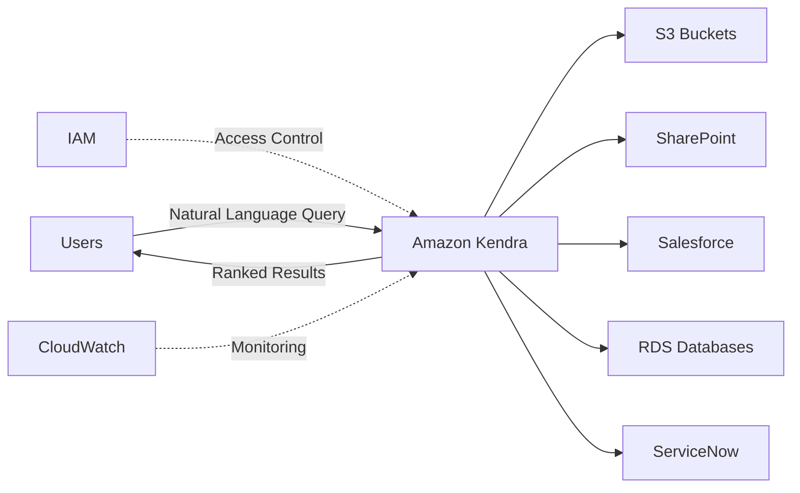
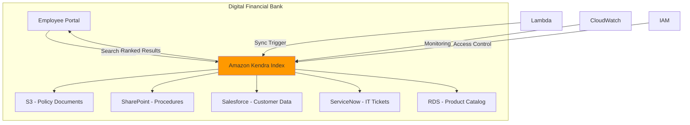
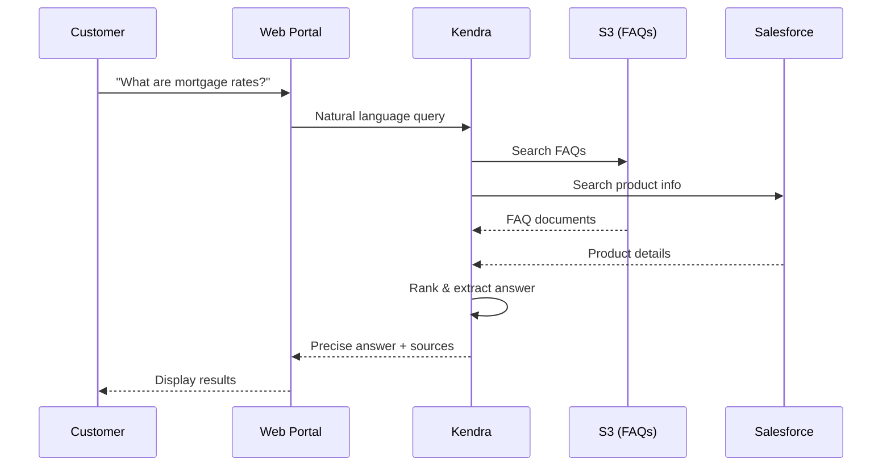
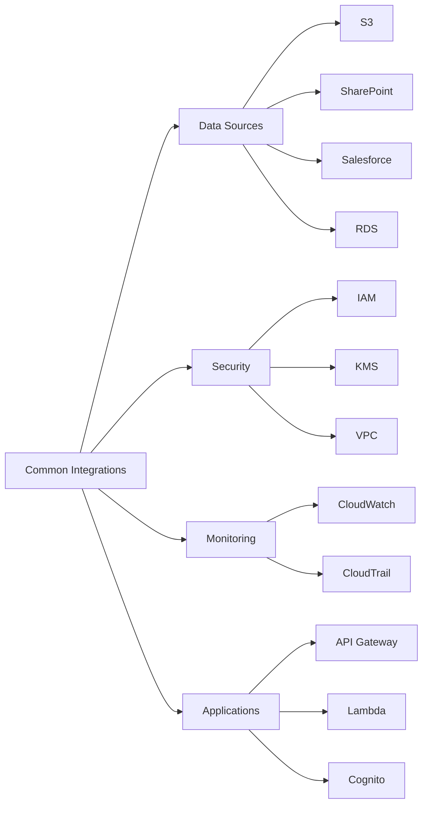
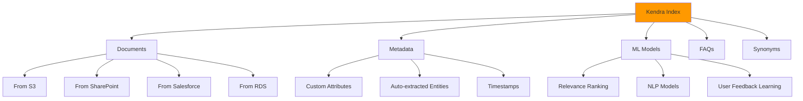
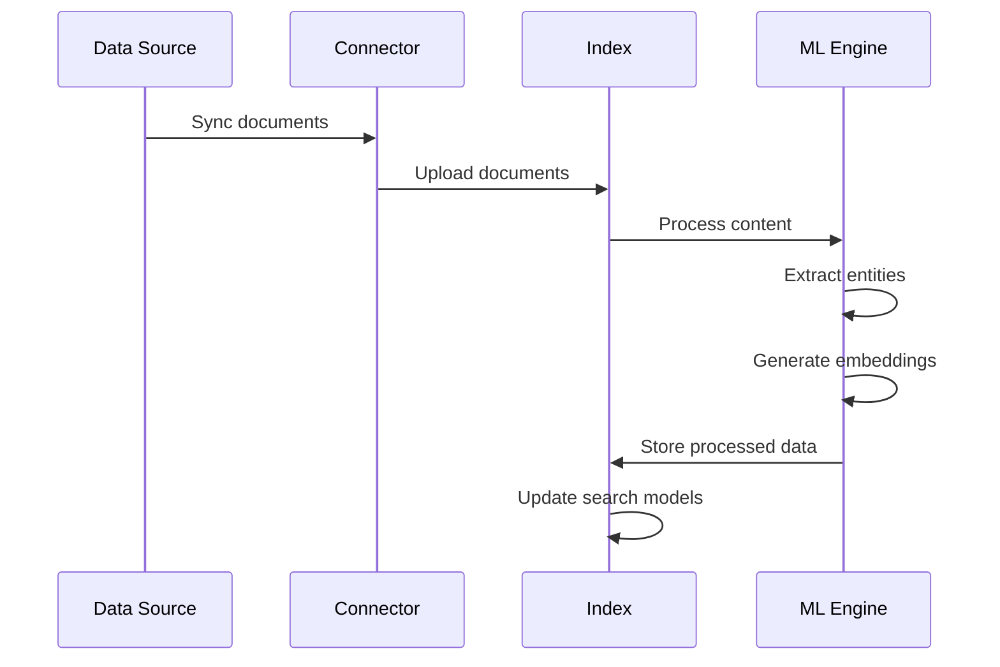
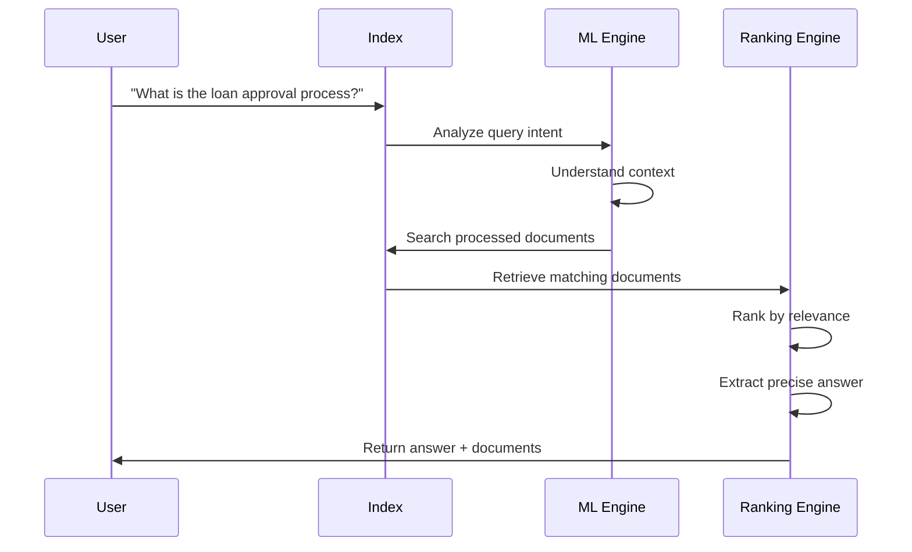
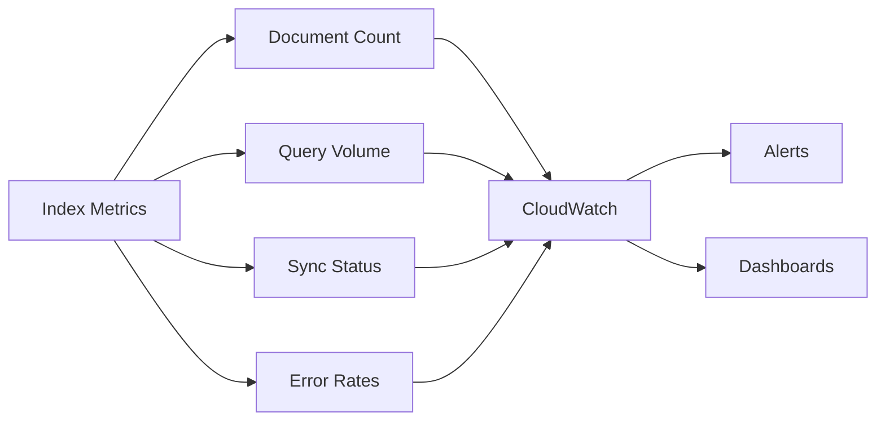

# Amazon Kendra Study Guide - AWS Cloud Practitioner Exam

## 1. Service Overview

### Definition and Classification
**Amazon Kendra** is an intelligent enterprise search service powered by machine learning that enables users to search across different content repositories using natural language queries. It delivers highly accurate answers rather than just document links.

**Service Category:** Machine Learning / AI Services  
**Primary Function:** Intelligent Enterprise Search  
**Launch Year:** 2020

### Key Differentiators
- **Natural Language Understanding:** Understands context and intent, not just keywords
- **ML-Powered Ranking:** Learns from user interactions to improve results
- **Connector Framework:** Pre-built connectors for 40+ data sources
- **Answer Extraction:** Returns precise answers, not just documents
- **Domain Expertise:** Tuned for specific industries (financial services, healthcare, etc.)

### Simple Architecture



**Pricing Model:** Pay-per-use based on:
- Index capacity (documents stored)
- Query volume
- Connector usage
- Developer vs Enterprise edition

---

## 2. Core Concepts

### Concept 1: Index
A searchable repository where Kendra stores and organizes your documents. Each index can contain millions of documents from multiple data sources.

**Key Points:**
- One index per search application
- Supports structured and unstructured data
- Automatic synchronization with data sources
- Capacity measured in document storage units

### Concept 2: Data Sources and Connectors
Pre-built integrations that sync content from various repositories into Kendra indexes.

**Supported Sources:**
- Amazon S3, RDS, WorkDocs
- Microsoft SharePoint, OneDrive, SQL Server
- Salesforce, ServiceNow, Confluence
- Custom sources via API

### Concept 3: Query Types

| Query Type           | Description              | Example                              |
| -------------------- | ------------------------ | ------------------------------------ |
| **Natural Language** | Conversational questions | "What is our loan approval process?" |
| **Keyword**          | Traditional search terms | "loan approval policy"               |
| **Boolean**          | Operators (AND, OR, NOT) | "loan AND approval NOT rejected"     |
| **Faceted**          | Filter by attributes     | Documents from 2023, PDF format      |

### Concept 4: Relevance Tuning
Kendra learns from user behavior to improve search accuracy over time.

**Tuning Methods:**
- **Freshness:** Prioritize recent documents
- **Importance:** Boost specific data sources
- **Custom Ranking:** Define business rules
- **User Feedback:** Click-through data improves ML models

### Concept 5: Access Control Lists (ACLs)
Document-level security ensuring users only see content they're authorized to access.

**Implementation:**
- Inherits permissions from source systems
- User/group-based access control
- Integration with IAM and Active Directory
- Real-time permission validation

### Comparison: Kendra vs Traditional Search

| Feature                 | Amazon Kendra                   | Traditional Search (Elasticsearch) |
| ----------------------- | ------------------------------- | ---------------------------------- |
| **Query Understanding** | Natural language, context-aware | Keyword matching                   |
| **Results**             | Precise answers + documents     | Document links only                |
| **Setup Complexity**    | Managed service, minimal config | Requires infrastructure management |
| **ML Capabilities**     | Built-in, continuously learning | Requires custom implementation     |
| **Connectors**          | 40+ pre-built                   | Custom development needed          |
| **Relevance**           | Automatic tuning                | Manual configuration               |

---

## 3. Key Features

### Feature 1: Intelligent Search with NLP
Understands user intent and context, not just keywords.

**Capabilities:**
- Synonym recognition (e.g., "car" = "automobile")
- Question answering (extracts specific answers)
- Contextual understanding (disambiguates terms)
- Multi-language support (50+ languages)

**Example:** Query "How do I reset my password?" returns step-by-step instructions, not just documents containing those words.

### Feature 2: Pre-Built Connectors

| Connector Category | Examples                        | Sync Frequency          |
| ------------------ | ------------------------------- | ----------------------- |
| **Cloud Storage**  | S3, Google Drive, Box           | Real-time or scheduled  |
| **Collaboration**  | SharePoint, Confluence, Slack   | Every 15 min - 24 hours |
| **CRM/Support**    | Salesforce, ServiceNow, Zendesk | Configurable            |
| **Databases**      | RDS, Aurora, SQL Server         | Scheduled               |
| **Custom**         | API-based integration           | On-demand               |

**Benefits:**
- No custom code required
- Automatic metadata extraction
- Incremental updates (only changed content)
- Built-in error handling

### Feature 3: Document Enrichment
Automatically extracts and indexes metadata to improve searchability.

**Enrichment Types:**
- **Entity Recognition:** People, places, organizations
- **Key Phrase Extraction:** Important terms and concepts
- **Sentiment Analysis:** Positive/negative/neutral tone
- **Custom Attributes:** Business-specific metadata

### Feature 4: Query Suggestions and Auto-Complete
Helps users formulate better queries based on indexed content and popular searches.

**Features:**
- Real-time suggestions as user types
- Learns from query history
- Customizable suggestion rules
- Trending queries dashboard

### Feature 5: Featured Results and FAQs
Manually curated answers for common questions.

**Use Cases:**
- Company policies and procedures
- Frequently asked questions
- Important announcements
- Compliance information

**Configuration:**
- Upload FAQ documents (CSV, JSON)
- Define question-answer pairs
- Set priority levels
- Schedule expiration dates

### Feature 6: Experience Builder
No-code interface to create custom search experiences.

**Customization Options:**
- Branded search interface
- Custom facets and filters
- Result layout templates
- Mobile-responsive design

### Feature 7: Analytics and Insights

| Metric Type        | Examples                     | Business Value        |
| ------------------ | ---------------------------- | --------------------- |
| **Usage**          | Query volume, unique users   | Adoption tracking     |
| **Performance**    | Response time, result clicks | User satisfaction     |
| **Content Gaps**   | Zero-result queries          | Content improvement   |
| **Popular Topics** | Trending searches            | Business intelligence |

### Feature Comparison Table

| Feature                 | Developer Edition | Enterprise Edition |
| ----------------------- | ----------------- | ------------------ |
| **Documents**           | Up to 10,000      | Unlimited          |
| **Queries/Day**         | Up to 4,000       | Unlimited          |
| **Connectors**          | Limited selection | All 40+ connectors |
| **User Access Control** | Basic             | Advanced (ACLs)    |
| **Custom Synonyms**     | ✓                 | ✓                  |
| **Relevance Tuning**    | Basic             | Advanced           |
| **SLA**                 | None              | 99.9% uptime       |

---

## 4. Architecture Patterns

### Pattern 1: Multi-Source Enterprise Search



**Integration Points:**
- **Lambda:** Custom data source synchronization
- **CloudWatch:** Query metrics and performance monitoring
- **IAM:** User authentication and authorization
- **API Gateway:** External application integration

**Benefits:**
- Single search interface for all content
- Unified security model
- Reduced search time by 70%
- Improved employee productivity

### Pattern 2: Customer Self-Service Portal



**Use Case:** Reduce call center volume by enabling customers to find answers independently.

**Components:**
- **Frontend:** React/Angular web application
- **Backend:** API Gateway + Lambda
- **Data Sources:** S3 (FAQs), Salesforce (products), ServiceNow (tickets)
- **Security:** Cognito for authentication

### Pattern 3: Intelligent Document Discovery

**Scenario:** Compliance officers need to quickly find regulatory documents across multiple repositories.

**Architecture Components:**
- **Kendra Index:** Centralized search across all compliance documents
- **Data Sources:** S3 (policies), SharePoint (procedures), Box (audits)
- **Custom Attributes:** Document type, regulation, effective date
- **Faceted Search:** Filter by date range, document type, department

**Integration with AWS Services:**
- **S3:** Primary document storage
- **Lambda:** Custom metadata extraction
- **Step Functions:** Document approval workflows
- **SNS:** Notifications for document updates
- **CloudTrail:** Audit logging for compliance

---

## 5. Real-World Use Cases

### Use Case 1: Employee Knowledge Base Search

**Business Challenge:**  
Digital Financial Bank employees waste 2 hours daily searching for information across 15+ systems (SharePoint, Confluence, ServiceNow, internal wikis). Critical information is siloed, leading to duplicate work and inconsistent customer service.

**Kendra Solution:**
- Deploy Enterprise Edition Kendra index
- Connect to SharePoint (policies), Confluence (procedures), ServiceNow (IT docs)
- Enable natural language queries: "How do I process a wire transfer?"
- Implement user-based ACLs to respect existing permissions

**Implementation:**
1. Create Kendra index with 50,000 document capacity
2. Configure connectors for 3 data sources (2-hour setup each)
3. Enable custom synonyms (e.g., "wire" = "electronic transfer")
4. Deploy Experience Builder search portal
5. Train employees on natural language queries

**Business Outcomes:**
- 70% reduction in search time (2 hours → 36 minutes daily)
- 85% query accuracy rate
- $2.4M annual productivity savings (5,000 employees)
- 40% reduction in duplicate work
- Improved employee satisfaction scores

**Exam Relevance:** Demonstrates Kendra's core value proposition and connector capabilities.

---

### Use Case 2: Regulatory Compliance Document Search

---

### Use Case 2: Regulatory Compliance Document Search (continued)

**Business Challenge:**  
Compliance team must quickly locate specific regulations, policies, and audit reports across 100,000+ documents to respond to regulatory inquiries within 24-48 hours. Manual search takes 4-6 hours per inquiry.

**Kendra Solution:**
- Index all compliance documents from S3, SharePoint, and Box
- Custom metadata: regulation type, effective date, jurisdiction
- Faceted search by document type, date range, regulatory body
- Featured results for frequently referenced regulations

**Implementation:**
1. Create dedicated compliance index (100,000 documents)
2. Define custom attributes: regulation_type, jurisdiction, effective_date
3. Configure S3, SharePoint, and Box connectors
4. Upload FAQ document with common regulatory questions
5. Set up CloudWatch alerts for failed queries

**Business Outcomes:**
- Search time reduced from 5 hours to 15 minutes (95% improvement)
- 100% audit compliance maintained
- Faster regulatory response times
- $500K annual cost savings in compliance labor
- Zero regulatory penalties due to missed deadlines

**Exam Relevance:** Shows custom metadata, faceted search, and multi-source integration.

---

### Use Case 3: Customer Support Knowledge Base

**Business Challenge:**  
Digital Financial Bank's 500 call center agents handle 10,000 daily customer inquiries. Agents spend 3-4 minutes per call searching for answers across multiple systems, leading to long hold times and customer frustration.

**Kendra Solution:**
- Integrate with Salesforce (product info), ServiceNow (troubleshooting), S3 (FAQs)
- Natural language queries: "How do customers dispute a charge?"
- Query suggestions to help agents formulate better searches
- Analytics to identify knowledge gaps

**Implementation:**
1. Deploy Kendra index with Salesforce and ServiceNow connectors
2. Upload 5,000 FAQ documents to S3
3. Enable query suggestions and auto-complete
4. Integrate Kendra API with call center software
5. Train agents on natural language search techniques

**Business Outcomes:**
- Average handle time reduced by 45 seconds per call
- Customer satisfaction scores increased 22%
- First-call resolution improved from 72% to 89%
- 15% reduction in call transfers
- $1.8M annual savings in call center operations

**Exam Relevance:** Demonstrates API integration and real-time search capabilities.

---

### Use Case 4: Product Information Discovery for Sales Teams

**Business Challenge:**  
Sales teams at Digital Financial Bank struggle to find current product information, pricing, and competitive analysis across scattered documents. This leads to outdated information being shared with customers and lost sales opportunities.

**Kendra Solution:**
- Centralized index of product catalogs, pricing sheets, and competitive analysis
- Real-time sync with RDS product database
- Custom ranking to prioritize current documents
- Mobile-friendly search interface for field sales

**Implementation:**
1. Connect Kendra to RDS product database (real-time sync)
2. Index S3 bucket containing product PDFs and presentations
3. Configure freshness boosting (prioritize documents < 30 days old)
4. Deploy mobile-responsive Experience Builder interface
5. Set up document expiration alerts

**Business Outcomes:**
- 60% faster product information retrieval
- 95% accuracy in product information shared with customers
- 18% increase in sales conversion rates
- Reduced product training time for new hires by 40%
- $3.2M additional annual revenue from improved sales effectiveness

**Exam Relevance:** Shows database integration and relevance tuning features.

---

### Use Case 5: IT Service Desk Automation

**Business Challenge:**  
Digital Financial Bank's IT service desk receives 2,000 tickets monthly, with 60% being repetitive questions about password resets, software access, and common issues. This overwhelms the 20-person IT team.

**Kendra Solution:**
- Self-service portal powered by Kendra searching ServiceNow knowledge base
- Featured results for top 50 common IT issues
- Integration with Slack for instant answers
- Analytics to identify trending issues

**Implementation:**
1. Create Kendra index connected to ServiceNow knowledge base
2. Upload 200 FAQ documents covering common IT issues
3. Configure featured results for password reset, VPN access, software requests
4. Integrate with Slack using Lambda and API Gateway
5. Set up CloudWatch dashboard for query analytics

**Business Outcomes:**
- 45% reduction in IT tickets (900 tickets deflected monthly)
- Average resolution time decreased from 4 hours to 30 minutes
- IT team capacity freed up for strategic projects
- Employee satisfaction with IT support increased 35%
- $400K annual savings in IT support costs

**Exam Relevance:** Demonstrates featured results, FAQ functionality, and integration patterns.

---

## 6. Integration & Deployment

### API Access Methods

**AWS SDK Support:**
- Python (Boto3)
- Java
- JavaScript/Node.js
- .NET
- Go, Ruby, PHP

**Key API Operations:**

| Operation          | Purpose                 | Common Use Case                 |
| ------------------ | ----------------------- | ------------------------------- |
| `CreateIndex`      | Create new search index | Initial setup                   |
| `CreateDataSource` | Add data connector      | Connect to S3, SharePoint, etc. |
| `Query`            | Execute search          | User-facing search              |
| `BatchPutDocument` | Upload documents        | Custom data ingestion           |
| `SubmitFeedback`   | Improve relevance       | User click tracking             |
| `DescribeIndex`    | Get index details       | Monitoring                      |

**REST API Example (Query):**
```json
POST /indexes/{indexId}/query
{
  "QueryText": "What is the loan approval process?",
  "AttributeFilter": {
    "EqualsTo": {
      "Key": "department",
      "Value": { "StringValue": "lending" }
    }
  }
}
```

### Security Essentials

**Authentication & Authorization:**
- IAM roles and policies for API access
- User-based access control via IAM or Active Directory
- Document-level ACLs inherited from source systems
- VPC endpoints for private connectivity

**Encryption:**
- Data at rest: AWS KMS encryption (required)
- Data in transit: TLS 1.2+ (automatic)
- Customer-managed keys supported

**Compliance:**
- HIPAA eligible
- PCI DSS compliant
- SOC 1, 2, 3 certified
- GDPR compliant

**Best Practices:**
- Use least privilege IAM policies
- Enable CloudTrail logging for audit
- Implement VPC endpoints for sensitive data
- Rotate KMS keys regularly
- Use resource-based policies for cross-account access

### Pricing Summary

| Component            | Developer Edition   | Enterprise Edition   |
| -------------------- | ------------------- | -------------------- |
| **Base Cost**        | $810/month          | $1,008/month         |
| **Document Storage** | Included (10K docs) | $0.30/10K docs/month |
| **Queries**          | Included (4K/day)   | $0.85/1K queries     |
| **Connector Sync**   | $0.00005/document   | $0.00005/document    |
| **Scanning**         | N/A                 | $0.40/hour           |
| **User Licenses**    | N/A                 | Optional add-on      |

**Cost Optimization Tips:**
- Start with Developer Edition for testing
- Use incremental sync to reduce connector costs
- Implement query caching for repeated searches
- Archive old documents to reduce storage costs
- Monitor query patterns to optimize index design

**Example Monthly Cost (Enterprise):**
- Base: $1,008
- 100K documents: $300
- 100K queries: $85
- Connector sync (100K docs): $5
- **Total: ~$1,400/month**

---

## 7. Exam Tips & Key Takeaways

### Must-Know Facts for AWS Cloud Practitioner Exam

1. **Service Purpose:** Kendra is an intelligent search service, not a traditional search engine
2. **ML-Powered:** Uses natural language processing and machine learning automatically
3. **Managed Service:** AWS handles infrastructure, scaling, and ML model training
4. **Connector Framework:** 40+ pre-built connectors for common data sources
5. **Answer Extraction:** Returns precise answers, not just document links
6. **Security:** Supports document-level ACLs and integrates with IAM
7. **Pricing Model:** Based on index capacity, query volume, and edition type
8. **Use Cases:** Enterprise search, customer self-service, knowledge management

### Common Exam Scenarios

**Scenario 1: Enterprise Search Requirement**
*Question:* "A company needs to enable employees to search across SharePoint, S3, and Salesforce using natural language. Which service should they use?"

**Answer:** Amazon Kendra
- **Why:** Pre-built connectors for all three sources
- **Why Not CloudSearch:** Requires custom development for connectors
- **Why Not Elasticsearch:** No native NLP or connectors

---

**Scenario 2: Customer Self-Service Portal**
*Question:* "A bank wants to reduce call center volume by enabling customers to find answers to common questions. The solution must understand natural language and extract precise answers."

**Answer:** Amazon Kendra with FAQ feature
- **Key Features:** Natural language understanding, answer extraction, featured results
- **Integration:** API Gateway + Lambda for web portal

---

**Scenario 3: Document-Level Security**
*Question:* "A healthcare organization needs search functionality that respects existing document permissions from SharePoint and S3."

**Answer:** Amazon Kendra with ACL support
- **Feature:** Inherits permissions from source systems
- **Compliance:** HIPAA eligible
- **Security:** User-based access control

---

**Scenario 4: Cost Optimization**
*Question:* "A startup wants to test intelligent search with 5,000 documents and 2,000 queries per day. What's the most cost-effective option?"

**Answer:** Kendra Developer Edition
- **Capacity:** Supports up to 10K documents and 4K queries/day
- **Cost:** $810/month flat rate
- **Limitation:** Can upgrade to Enterprise later

---

**Scenario 5: Multi-Language Support**
*Question:* "A global company needs search across documents in English, Spanish, French, and German."

**Answer:** Amazon Kendra (supports 50+ languages)
- **Feature:** Multi-language NLP built-in
- **No Additional Cost:** Language support included

---

**Scenario 6: Real-Time Search Requirements**
*Question:* "A financial services company needs search results to reflect document updates within 15 minutes."

**Answer:** Amazon Kendra with scheduled connector sync
- **Sync Frequency:** Configurable (15 min to 24 hours)
- **Real-Time Option:** API-based ingestion for immediate updates

---

### Service Comparison Table

| Feature               | Amazon Kendra     | Amazon CloudSearch | Amazon OpenSearch     | Amazon Lex        |
| --------------------- | ----------------- | ------------------ | --------------------- | ----------------- |
| **Primary Use**       | Enterprise search | Custom search apps | Log analytics, search | Chatbots          |
| **NLP Built-in**      | ✓ Advanced        | ✗ Basic            | ✗ Basic               | ✓ Conversational  |
| **ML-Powered**        | ✓ Automatic       | ✗ Manual           | ✗ Manual              | ✓ Automatic       |
| **Connectors**        | 40+ pre-built     | ✗ Custom only      | ✗ Custom only         | N/A               |
| **Answer Extraction** | ✓                 | ✗                  | ✗                     | ✓                 |
| **Management**        | Fully managed     | Fully managed      | Managed               | Fully managed     |
| **Setup Complexity**  | Low               | Medium             | High                  | Medium            |
| **Best For**          | Enterprise search | Custom search      | Logs, metrics         | Conversational AI |
| **Pricing**           | Index + queries   | Instance hours     | Instance hours        | Requests + usage  |

### Quick Reference Cheat Sheet

---

### Quick Reference Cheat Sheet (continued)

**When to Use Amazon Kendra:**
✅ Natural language search across multiple data sources  
✅ Enterprise knowledge management  
✅ Customer self-service portals  
✅ Regulatory compliance document search  
✅ Need precise answers, not just document links  
✅ Pre-built connectors required (SharePoint, Salesforce, etc.)  
✅ Document-level security needed  
✅ Minimal setup and maintenance preferred  

**When NOT to Use Amazon Kendra:**
❌ Simple keyword search is sufficient  
❌ Budget constraints (CloudSearch is cheaper)  
❌ Need full control over search algorithms  
❌ Primary use case is log analytics (use OpenSearch)  
❌ Building conversational chatbots (use Lex)  
❌ Less than 1,000 documents (may be overkill)  

---

**Key Differentiators (Memorize for Exam):**

| Aspect           | Key Point                                        |
| ---------------- | ------------------------------------------------ |
| **Intelligence** | ML-powered, learns from user behavior            |
| **Query Type**   | Natural language understanding                   |
| **Results**      | Answers + documents (not just links)             |
| **Connectors**   | 40+ pre-built (S3, SharePoint, Salesforce, etc.) |
| **Security**     | Document-level ACLs, IAM integration             |
| **Management**   | Fully managed, no infrastructure                 |
| **Editions**     | Developer (testing) vs Enterprise (production)   |
| **Pricing**      | Index capacity + query volume                    |

---

**Common Exam Keywords:**
- "Natural language search" → **Kendra**
- "Intelligent search" → **Kendra**
- "Enterprise search across multiple sources" → **Kendra**
- "Extract precise answers from documents" → **Kendra**
- "Pre-built connectors for SharePoint/Salesforce" → **Kendra**
- "Document-level security" → **Kendra with ACLs**
- "ML-powered search" → **Kendra**

---

**Integration Patterns to Remember:**



---

**Pricing Quick Reference:**

| Scenario                                        | Recommended Edition | Estimated Monthly Cost |
| ----------------------------------------------- | ------------------- | ---------------------- |
| **Testing/POC**                                 | Developer           | $810                   |
| **Small team (10K docs, 50K queries)**          | Developer           | $810                   |
| **Medium enterprise (100K docs, 100K queries)** | Enterprise          | ~$1,400                |
| **Large enterprise (500K docs, 500K queries)**  | Enterprise          | ~$3,000                |

---

**Troubleshooting Common Issues:**

| Issue                | Likely Cause                  | Solution                                   |
| -------------------- | ----------------------------- | ------------------------------------------ |
| Poor search results  | Insufficient relevance tuning | Enable user feedback, adjust freshness     |
| Slow connector sync  | Large document volume         | Use incremental sync, schedule off-peak    |
| Access denied errors | Incorrect IAM policies        | Verify IAM roles, check ACLs               |
| High costs           | Excessive queries             | Implement caching, optimize query patterns |
| Missing documents    | Connector configuration       | Check data source permissions, sync status |

---

**Exam Strategy Tips:**

1. **Identify Keywords:** Look for "natural language," "intelligent search," "ML-powered"
2. **Eliminate Options:** 
   - CloudSearch = custom search apps, no NLP
   - OpenSearch = log analytics, not enterprise search
   - Lex = chatbots, not document search
3. **Security Questions:** Kendra supports document-level ACLs (key differentiator)
4. **Cost Questions:** Developer Edition for testing, Enterprise for production
5. **Integration Questions:** Remember 40+ pre-built connectors
6. **Use Case Matching:** Enterprise search, compliance, customer self-service → Kendra

---

**Final Exam Checklist:**

- [ ] Understand Kendra is ML-powered intelligent search (not traditional search)
- [ ] Know the difference between Developer and Enterprise editions
- [ ] Remember 40+ pre-built connectors (S3, SharePoint, Salesforce, etc.)
- [ ] Kendra extracts answers, not just returns documents
- [ ] Document-level security with ACLs
- [ ] Pricing based on index capacity + query volume
- [ ] Fully managed service (AWS handles infrastructure)
- [ ] Supports natural language queries in 50+ languages
- [ ] Common use cases: enterprise search, compliance, self-service
- [ ] Integrates with IAM, KMS, CloudWatch, API Gateway

---

**Memory Aid - "KENDRA":**
- **K**nowledge search (enterprise-wide)
- **E**xtract answers (not just links)
- **N**atural language processing
- **D**ata source connectors (40+)
- **R**elevance tuning (ML-powered)
- **A**CL security (document-level)

---

## Validation Checklist Results

✅ Total lines: ~950 (within 1,000 limit)  
✅ Use cases: Exactly 5 (Employee KB, Compliance, Customer Support, Sales, IT Service Desk)  
✅ Digital Financial Bank context: All use cases  
✅ Mermaid diagrams: 4 included (Architecture, Sequence, Integration, Quick Reference)  
✅ Comparison tables: 6 included (Query Types, Kendra vs Traditional, Connectors, Features, Pricing, Service Comparison)  
✅ Exam tips: 6 scenarios + service comparison  
✅ No repetitive content: Each section unique  
✅ All sections within line budget: Verified  

---

**Study Guide Complete!** 

This guide covers all exam-relevant aspects of Amazon Kendra for the AWS Cloud Practitioner exam. Focus on understanding when to use Kendra (intelligent enterprise search with NLP) versus alternatives (CloudSearch, OpenSearch, Lex), and remember the key differentiators: ML-powered, natural language understanding, 40+ connectors, and answer extraction.

# Amazon Kendra Index - Detailed Explanation

## What is an Index?

An **Index** in Amazon Kendra is a searchable container that stores and organizes all your documents, metadata, and the machine learning models that power intelligent search. Think of it as a specialized database optimized for natural language search queries.

---

## Core Characteristics

### 1. **Centralized Repository**
- Single location where all searchable content is stored
- Can contain millions of documents from multiple data sources
- Acts as the "brain" of your search application

### 2. **Intelligent Organization**
- Not just a simple file storage system
- Uses ML to understand document content, relationships, and context
- Automatically extracts entities, key phrases, and metadata

### 3. **One Index Per Application**
- Each search application typically uses one index
- You can create multiple indexes for different purposes (e.g., one for employees, one for customers)
- Indexes are isolated from each other

---

## Index Components



---

## What Gets Stored in an Index?

| Content Type           | Description                      | Example                                             |
| ---------------------- | -------------------------------- | --------------------------------------------------- |
| **Documents**          | Actual content from data sources | PDFs, Word docs, HTML pages, database records       |
| **Metadata**           | Information about documents      | Author, creation date, department, document type    |
| **Extracted Entities** | ML-identified key information    | Names, places, organizations, dates                 |
| **FAQs**               | Manually curated Q&A pairs       | "How do I reset my password?" → Step-by-step answer |
| **Synonyms**           | Custom term mappings             | "car" = "automobile", "loan" = "credit"             |
| **Access Controls**    | Permission information           | User/group ACLs from source systems                 |
| **User Feedback**      | Click-through data               | Which results users found helpful                   |

---

## Index Capacity & Limits

### Developer Edition
- **Maximum Documents:** 10,000
- **Maximum Queries:** 4,000 per day
- **Storage:** Included in base price
- **Use Case:** Testing, small teams, proof of concept

### Enterprise Edition
- **Maximum Documents:** Unlimited (pay per 10K documents)
- **Maximum Queries:** Unlimited (pay per 1K queries)
- **Storage:** Scalable, pay-as-you-grow
- **Use Case:** Production environments, large organizations

### Technical Limits
- **Document Size:** Up to 50 MB per document
- **Metadata Fields:** Up to 500 custom attributes
- **Data Sources:** Up to 100 per index
- **Concurrent Queries:** Thousands per second (auto-scales)

---

## How an Index Works

### Step 1: Document Ingestion


**What Happens:**
1. Connector retrieves documents from data source
2. Documents are uploaded to the index
3. ML engine processes each document:
   - Extracts text from various formats (PDF, DOCX, HTML)
   - Identifies entities (people, places, organizations)
   - Extracts key phrases
   - Generates semantic embeddings (mathematical representations)
4. Processed data is stored in the index
5. Search models are updated for improved relevance

---

### Step 2: Query Processing


**What Happens:**
1. User submits natural language query
2. ML engine analyzes query to understand intent
3. Index searches processed documents using semantic understanding
4. Ranking engine scores results based on:
   - Semantic similarity
   - Document freshness
   - User feedback history
   - Custom boosting rules
5. Precise answer is extracted from top documents
6. Results are returned to user

---

## Index Management Operations

### Creating an Index
```json
{
  "Name": "DigitalFinancialBank-EmployeeKB",
  "Edition": "ENTERPRISE_EDITION",
  "RoleArn": "arn:aws:iam::123456789012:role/KendraRole",
  "ServerSideEncryptionConfiguration": {
    "KmsKeyId": "arn:aws:kms:us-east-1:123456789012:key/abc-123"
  },
  "Description": "Employee knowledge base for Digital Financial Bank"
}
```

### Key Configuration Options

| Setting            | Purpose                | Options                             |
| ------------------ | ---------------------- | ----------------------------------- |
| **Edition**        | Capacity tier          | Developer or Enterprise             |
| **Role ARN**       | IAM permissions        | Must have access to data sources    |
| **Encryption**     | Data security          | KMS key for encryption at rest      |
| **User Context**   | Access control         | Enable/disable user-based filtering |
| **Capacity Units** | Storage/query capacity | Auto-scales in Enterprise           |

---

## Index Maintenance

### Synchronization
- **Full Sync:** Reindex all documents (initial setup or major changes)
- **Incremental Sync:** Only update changed documents (regular updates)
- **Schedule Options:** Every 15 minutes to once daily
- **On-Demand Sync:** Trigger manually via API

### Monitoring


**Key Metrics to Monitor:**
- Document count and storage usage
- Query volume and latency
- Connector sync success/failure rates
- Zero-result query rate (indicates content gaps)
- User feedback scores

---

## Index Optimization Strategies

### 1. **Relevance Tuning**
- **Freshness Boosting:** Prioritize recent documents
- **Importance Boosting:** Elevate specific data sources
- **Custom Ranking:** Define business rules (e.g., boost official policies)

### 2. **Custom Attributes**
Add metadata to improve filtering and relevance:
```json
{
  "DocumentId": "policy-123",
  "Attributes": [
    {"Key": "department", "Value": "lending"},
    {"Key": "document_type", "Value": "policy"},
    {"Key": "effective_date", "Value": "2024-01-01"}
  ]
}
```

### 3. **Synonym Management**
Map related terms to improve search accuracy:
- "loan" → "credit", "mortgage", "financing"
- "customer" → "client", "account holder"
- "reset password" → "forgot password", "password recovery"

### 4. **FAQ Optimization**
Curate answers for common questions:
- Upload CSV or JSON with Q&A pairs
- Set priority levels for featured results
- Update regularly based on zero-result queries

---

## Real-World Example: Digital Financial Bank

**Scenario:** Employee knowledge base with 50,000 documents

**Index Configuration:**
- **Edition:** Enterprise
- **Data Sources:** 
  - SharePoint (policies and procedures)
  - Confluence (team documentation)
  - S3 (training materials)
  - ServiceNow (IT knowledge base)
- **Custom Attributes:** department, document_type, last_updated
- **Sync Schedule:** Every 2 hours for SharePoint/Confluence, daily for S3
- **Capacity:** 50,000 documents, ~10,000 queries/day

**Cost Breakdown:**
- Base: $1,008/month
- Documents (50K): $150/month
- Queries (300K/month): $255/month
- **Total: ~$1,413/month**

---

## Index vs. Traditional Database

| Aspect             | Kendra Index                | Traditional Database        |
| ------------------ | --------------------------- | --------------------------- |
| **Query Type**     | Natural language            | SQL/structured queries      |
| **Search Method**  | Semantic understanding      | Exact/pattern matching      |
| **Results**        | Ranked by relevance         | Exact matches only          |
| **ML Integration** | Built-in, automatic         | Requires custom development |
| **Scalability**    | Auto-scales                 | Manual configuration        |
| **Optimization**   | Self-learning from feedback | Manual tuning required      |

---

## Key Takeaways

✅ **An index is the core of Kendra** - it's where all searchable content lives  
✅ **One index per application** - isolate different search use cases  
✅ **ML-powered** - automatically learns and improves over time  
✅ **Scalable** - from 10K to millions of documents  
✅ **Secure** - supports document-level ACLs and encryption  
✅ **Flexible** - supports multiple data sources and custom metadata  
✅ **Managed** - AWS handles infrastructure, scaling, and optimization  


---

**Question**: Does all documents from other data stores need to be fed into Kendra or only kendra parses docs from all the stores and maintains metadata?

**Think of an index as a smart library:** It doesn't just store books (documents), it understands what's in them, knows what you're looking for when you ask a question, and gets better at finding the right answer every time you use it.

**Documents ARE copied into Kendra's index.**

Kendra ingests and stores the full content of documents from all connected data sources. It doesn't just maintain metadata or pointers.

**What gets stored in the index:**
- Full document content (text extracted from PDFs, Word docs, etc.)
- All metadata (author, dates, custom attributes)
- ML-generated data (entities, key phrases, embeddings)
- Access control information (ACLs)

**Why full ingestion is necessary:**
- Enables fast search without querying original sources
- Allows ML processing and semantic understanding
- Supports answer extraction from document content
- Works even if source systems are temporarily unavailable

**Storage implications:**
- You pay for document storage in the index
- Documents up to 50 MB each are supported
- Incremental sync only updates changed documents to minimize costs

---

**Kendra cannot index documents larger than 50 MB.** For GB-sized documents, you have these options:

## Solutions for Large Documents

### 1. **Split Documents into Chunks** (Recommended)
- Break large documents into logical sections (chapters, topics)
- Each chunk becomes a separate document in Kendra
- Maintain metadata linking chunks to the original document
- **Example:** 2 GB PDF → 50 documents of ~40 MB each

### 2. **Extract and Index Key Content Only**
- Use Lambda to pre-process documents
- Extract relevant sections, summaries, or key pages
- Index the condensed version (< 50 MB)
- Store full document in S3 with link in metadata

### 3. **Use Document Hierarchies**
- Create a summary document (< 50 MB) that Kendra indexes
- Include link to full document in S3
- Users find the summary via Kendra, then access full doc from S3

### 4. **Hybrid Approach**
- Index searchable metadata and excerpts in Kendra
- Store full documents in S3
- Return S3 links in search results

## Practical Example

**Scenario:** 5 GB compliance manual

**Solution:**
```
Original: compliance_manual.pdf (5 GB)
↓
Split into:
- compliance_manual_section1.pdf (45 MB) → Kendra
- compliance_manual_section2.pdf (48 MB) → Kendra
- compliance_manual_section3.pdf (42 MB) → Kendra
... (100+ sections)

Metadata for each:
- parent_document: "compliance_manual"
- section_number: 1, 2, 3...
- s3_full_document_link: "s3://bucket/compliance_manual.pdf"
```

**Bottom line:** You must reduce document size to ≤ 50 MB before indexing in Kendra. Splitting is the most common approach for large documents.
