# Amazon Lex - AWS Cloud Practitioner Study Guide

## Table of Contents
1. `[Service Overview](#service-overview)`
2. `[Core Concepts](#core-concepts)`
3. `[Key Features & Capabilities](#key-features--capabilities)`
4. `[Architecture Patterns](#architecture-patterns)`
5. `[Real-World Use Cases](#real-world-use-cases)`
6. `[Integration & Deployment](#integration--deployment)`
7. `[Exam Tips & Key Takeaways](#exam-tips--key-takeaways)`

---

## Service Overview

**Amazon Lex** is a fully managed AI service for building conversational interfaces (chatbots and voice bots) using the same deep learning technologies that power Amazon Alexa.

### Service Classification
- **Category**: Machine Learning / AI Services (Conversational AI)
- **Type**: Fully Managed (Serverless)
- **Pricing Model**: Pay-per-use (per text/voice request)
- **AWS Well-Architected Pillar**: Cost Optimization, Operational Excellence

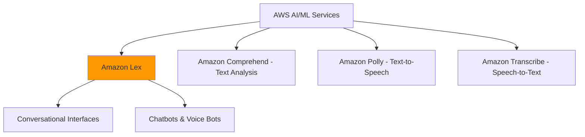

**Key Differentiator**: While Comprehend analyzes text, Lex enables two-way conversations with users through text or voice.

---

## Core Concepts

### 1. Conversational AI
Technology that enables computers to understand, process, and respond to human language in a natural, conversational manner through text or voice.

**Exam Relevance**: Lex is AWS's managed conversational AI service - no need to build NLP models from scratch.

### 2. Bot Architecture Components

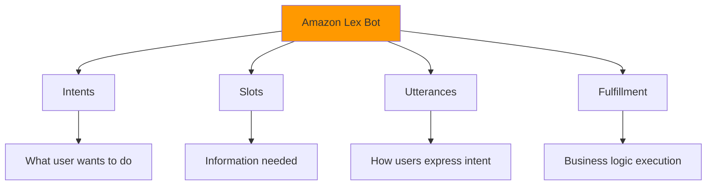

| Component       | Definition                   | Example                              |
| --------------- | ---------------------------- | ------------------------------------ |
| **Bot**         | The conversational interface | Banking Assistant Bot                |
| **Intent**      | User's goal or action        | CheckBalance, TransferMoney          |
| **Slot**        | Required information         | AccountNumber, Amount, Date          |
| **Utterance**   | Ways users express intent    | "What's my balance?", "Show balance" |
| **Fulfillment** | Backend logic execution      | Lambda function to query database    |

**Exam Tip**: Understand the hierarchy: Bot → Intents → Slots → Utterances

### 3. Natural Language Understanding (NLU)
Lex's built-in capability to understand user intent regardless of how they phrase their request.

**Example**:
- "What's my account balance?"
- "Show me how much money I have"
- "Check balance"

All map to the same **CheckBalance** intent.

### 4. Automatic Speech Recognition (ASR)
Converts spoken language into text, enabling voice-based interactions.

**Exam Tip**: Lex includes both ASR (speech-to-text) and NLU (understanding intent) in one service.

---
# Understanding Slots in Amazon Lex

## What Are Slots?

**Slots = Pieces of information the bot needs to collect to complete a task**

Think of slots as **form fields** in a conversation.

---

## Simple Example: Pizza Order

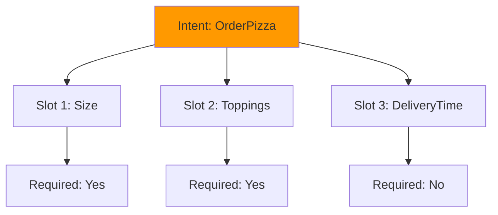

**Conversation Flow**:
```
User: "I want to order a pizza"
Bot: "What size?" ← Collecting Slot 1
User: "Large"
Bot: "What toppings?" ← Collecting Slot 2
User: "Pepperoni and mushrooms"
Bot: "What time for delivery?" ← Collecting Slot 3
User: "7pm"
Bot: "Order confirmed: Large pizza, pepperoni & mushrooms, 7pm delivery"
```

---

## Slot Collection Process

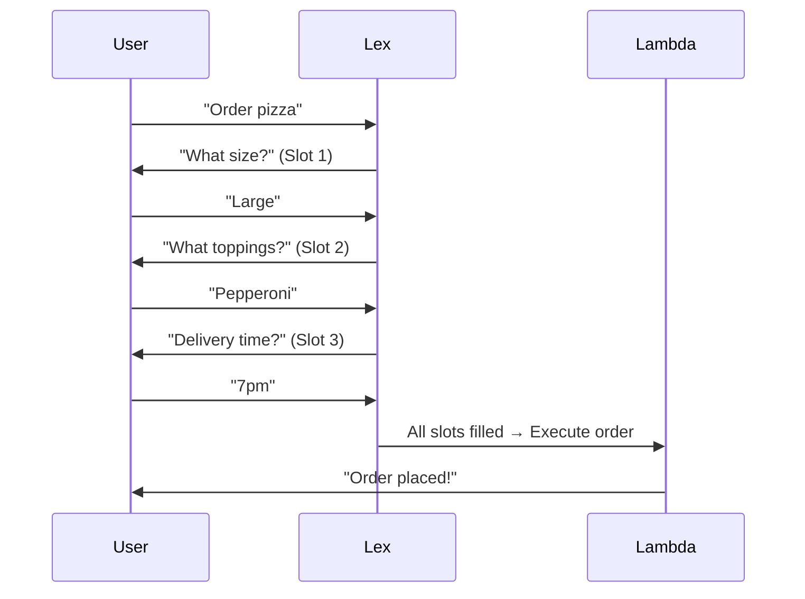

**Key Point**: Lex asks for each slot one by one until all required slots are filled.

---

## Real Example: Bank Transfer

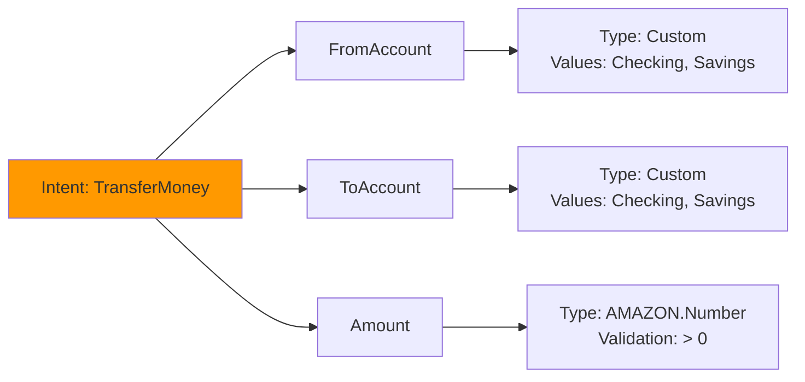

**Conversation**:
```
User: "Transfer money"
Bot: "From which account?" ← Slot: FromAccount
User: "Checking"
Bot: "To which account?" ← Slot: ToAccount
User: "Savings"
Bot: "How much?" ← Slot: Amount
User: "500"
Bot: "Confirm: Transfer $500 from Checking to Savings?"
User: "Yes"
Bot: "Transfer complete!"
```

---

## Slot Types

### Built-in Slot Types

| Slot Type               | What It Captures | Example                             |
| ----------------------- | ---------------- | ----------------------------------- |
| **AMAZON.Number**       | Numbers          | 100, 5000, 42                       |
| **AMAZON.Date**         | Dates            | "tomorrow", "Dec 25", "next Monday" |
| **AMAZON.Time**         | Times            | "3pm", "15:00", "noon"              |
| **AMAZON.EmailAddress** | Emails           | user@example.com                    |
| **AMAZON.PhoneNumber**  | Phone numbers    | +1-555-0100                         |
| **AMAZON.US_City**      | US cities        | Seattle, New York                   |

### Custom Slot Types

**Example: Account Types**
```
Slot Name: AccountType
Values:
  - Checking
  - Savings
  - Credit Card
  - Money Market
```

---

## Slot Validation

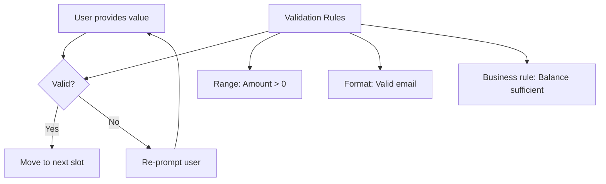

**Example with Validation**:
```
User: "Transfer $50,000"
Bot: "Amount exceeds daily limit of $10,000. Please enter a smaller amount."
User: "5,000"
Bot: "Got it. $5,000. To which account?"
```

**Lambda Validation Code**:
```python
def validate_transfer(slots):
    amount = float(slots['Amount'])
    
    if amount > 10000:
        return {
            'isValid': False,
            'violatedSlot': 'Amount',
            'message': 'Amount exceeds daily limit of $10,000'
        }
    
    if amount <= 0:
        return {
            'isValid': False,
            'violatedSlot': 'Amount',
            'message': 'Amount must be greater than zero'
        }
    
    return {'isValid': True}
```

---

## Required vs Optional Slots

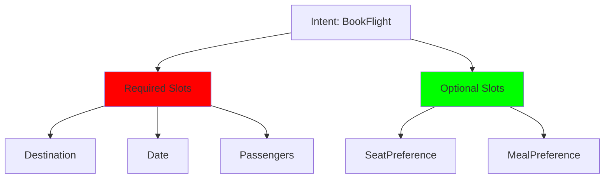

**Conversation**:
```
Bot: "Where to?" ← Required
User: "Seattle"
Bot: "What date?" ← Required
User: "Dec 15"
Bot: "How many passengers?" ← Required
User: "2"
Bot: "Any seat preference?" ← Optional (can skip)
User: "Window seats"
Bot: "Booking 2 tickets to Seattle on Dec 15, window seats"
```

**Key**: Bot MUST collect required slots, but can skip optional ones.

---

## Slot Elicitation (How Bot Asks)

**Prompt Configuration**:
```
Slot: Amount
Prompt: "How much would you like to transfer?"
Re-prompt: "Please specify the transfer amount"
Max attempts: 3
```

**Multiple Ways to Ask**:
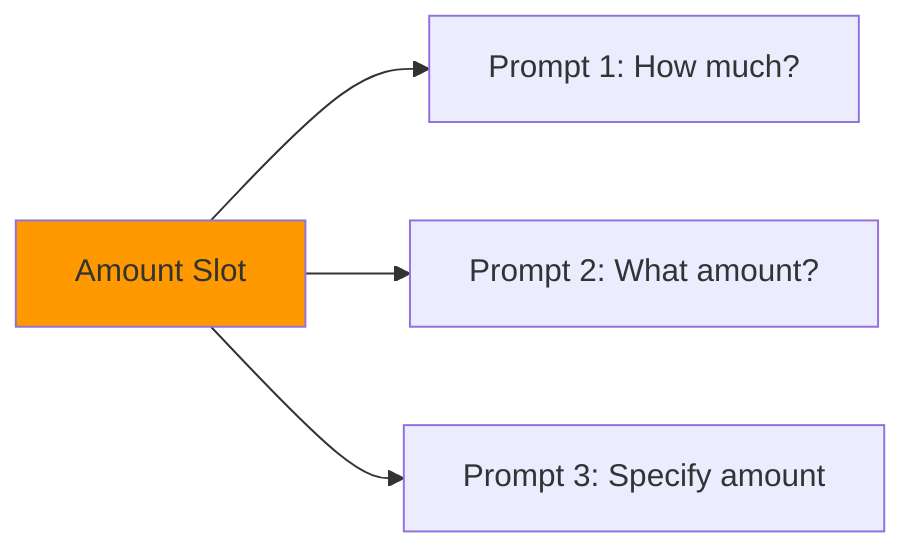

---

## Slot Filling Strategies

### 1. Sequential (One at a time)
```
Bot: "What size?"
User: "Large"
Bot: "What toppings?"
User: "Pepperoni"
```

### 2. All at Once (User provides multiple slots)
```
User: "I want a large pepperoni pizza at 7pm"
Bot: "Got it! Large pepperoni pizza for 7pm delivery. Confirm?"
```

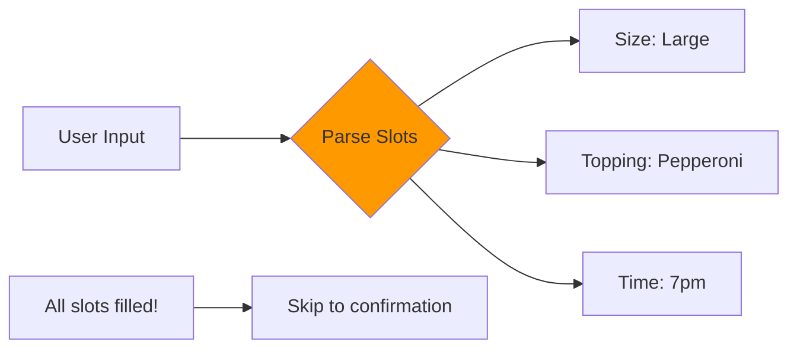

**Key**: Lex automatically extracts slots from user input, even if provided all at once.

---

## Practical Example: Hotel Booking

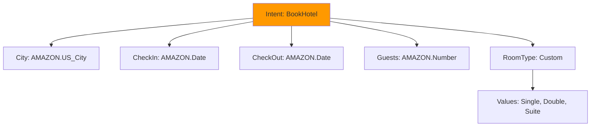

**Full Conversation**:
```
User: "Book a hotel"

Bot: "Which city?" 
User: "Seattle" ✓ Slot: City

Bot: "Check-in date?"
User: "December 15"  ✓ Slot: CheckIn

Bot: "Check-out date?"
User: "December 18"  ✓ Slot: CheckOut

Bot: "How many guests?"
User: "2"  ✓ Slot: Guests

Bot: "Room type: Single, Double, or Suite?"
User: "Double"  ✓ Slot: RoomType

Bot: "Confirm: 2 guests, Double room in Seattle, Dec 15-18?"
User: "Yes"

Bot: "Booking confirmed! Confirmation #12345"
```

---

## Slot Priority

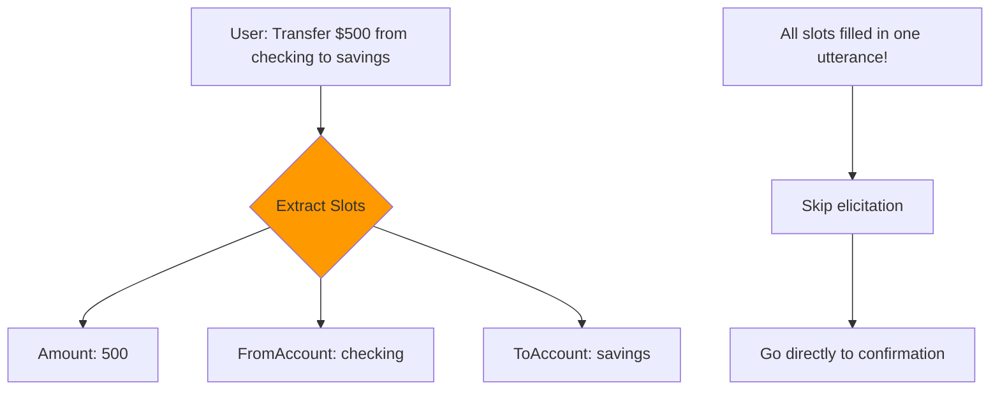

**Smart Extraction**: Lex recognizes slot values even when user provides them upfront.

---

## Summary

| Concept         | Explanation                                       |
| --------------- | ------------------------------------------------- |
| **What**        | Information needed to complete a task             |
| **Why**         | Bot needs data to execute actions                 |
| **Types**       | Built-in (Date, Number) or Custom (Account types) |
| **Required**    | Must be collected before fulfillment              |
| **Optional**    | Can be skipped                                    |
| **Validation**  | Check if value is acceptable                      |
| **Elicitation** | How bot asks for the value                        |

**Think of it like a form**:
- **Intent** = Form name (Transfer Money Form)
- **Slots** = Form fields (From Account, To Account, Amount)
- **Utterances** = Ways to open the form ("Transfer money", "Move funds")
- **Fulfillment** = Submit button action


---

## Key Features & Capabilities

### Feature Overview

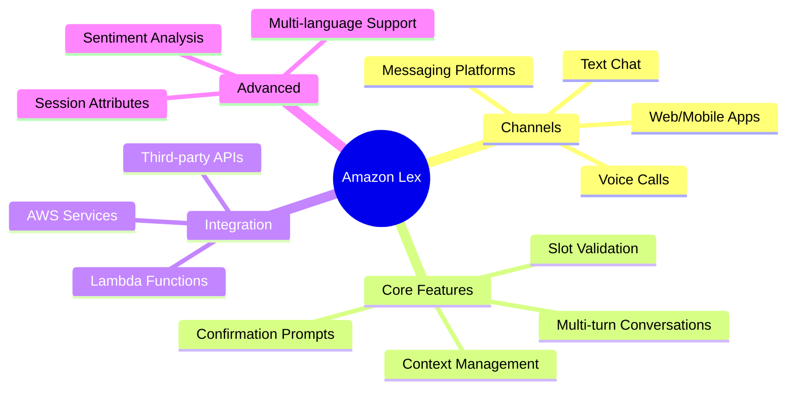

### 1. Multi-turn Conversations

**What it does**: Maintains context across multiple exchanges to gather all required information.

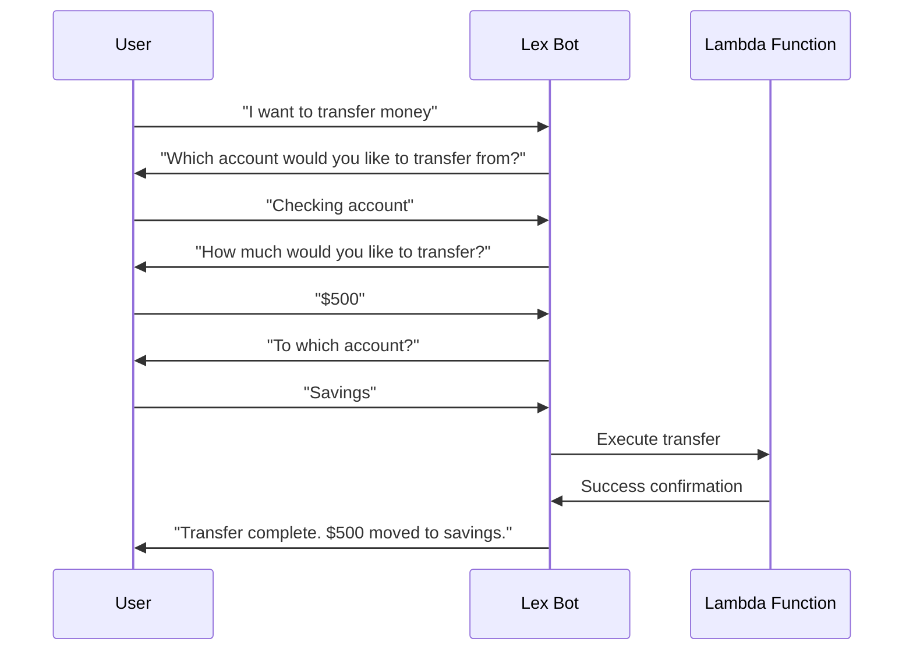

**Use Cases**:
- Complex transactions requiring multiple inputs
- Form filling through conversation
- Guided troubleshooting

**Exam Tip**: Lex automatically manages conversation state and context.

---

### 2. Slot Types & Validation

**Built-in Slot Types**:

| Slot Type           | Purpose          | Example Values           |
| ------------------- | ---------------- | ------------------------ |
| AMAZON.Number       | Numeric values   | 100, 5000                |
| AMAZON.Date         | Dates            | "tomorrow", "12/25/2024" |
| AMAZON.Time         | Time values      | "3pm", "15:00"           |
| AMAZON.EmailAddress | Email validation | user@example.com         |
| AMAZON.PhoneNumber  | Phone numbers    | +1-555-0100              |
| AMAZON.US_State     | US states        | California, NY           |

**Custom Slot Types**: Define your own values (e.g., AccountTypes: Checking, Savings, Credit)

**Slot Validation**:
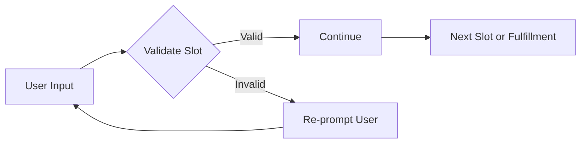

**Exam Tip**: Lex provides built-in validation for common data types.

---

### 3. Integration with AWS Services

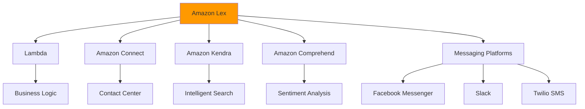

**Key Integrations**:
- **Lambda**: Execute business logic and fulfillment
- **Amazon Connect**: Build intelligent contact centers
- **Amazon Kendra**: Add FAQ and knowledge base search
- **Amazon Comprehend**: Analyze sentiment during conversations
- **Messaging Platforms**: Deploy to Facebook, Slack, Twilio

**Exam Tip**: Lex + Lambda is the most common integration pattern for fulfillment.

---

### 4. Channel Support

| Channel Type           | Use Case             | Implementation             |
| ---------------------- | -------------------- | -------------------------- |
| **Web/Mobile**         | Custom applications  | AWS SDK, Lex Runtime API   |
| **Voice**              | Phone systems        | Amazon Connect integration |
| **Facebook Messenger** | Social media support | Built-in integration       |
| **Slack**              | Internal helpdesk    | Built-in integration       |
| **Twilio SMS**         | Text messaging       | Built-in integration       |

**Exam Tip**: Lex supports both text and voice channels natively.

---

### 5. Conversation Flow Management

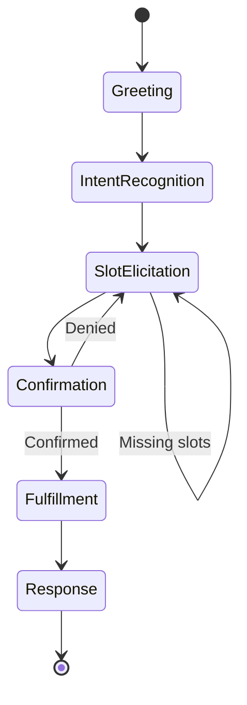

**Flow Components**:
1. **Greeting**: Initial bot message
2. **Intent Recognition**: Understand what user wants
3. **Slot Elicitation**: Gather required information
4. **Confirmation**: Verify before action
5. **Fulfillment**: Execute business logic
6. **Response**: Provide result to user

**Exam Tip**: Lex handles conversation flow automatically based on your bot configuration.

---

### 6. Context and Session Management

**Session Attributes**: Store information across conversation turns

```python
# Example: Storing user context
session_attributes = {
    'accountType': 'checking',
    'lastTransactionAmount': '500',
    'preferredLanguage': 'en-US'
}
```

**Use Cases**:
- Remember user preferences
- Track conversation history
- Pass data between intents
- Personalize responses

**Exam Tip**: Session attributes enable stateful conversations.

---

### 7. Multi-language Support

**Supported Languages** (20+):
- English (US, UK, AU, IN)
- Spanish (US, ES)
- French (FR, CA)
- German, Italian, Japanese
- Portuguese, Korean, Chinese
- And more...

**Implementation**:
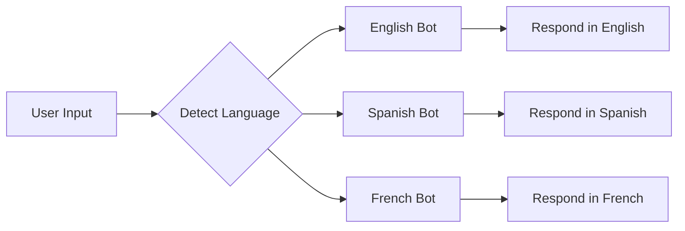

**Exam Tip**: Each language requires a separate bot configuration.

---

### 8. Sentiment Analysis Integration

**What it does**: Detects user emotion during conversation using Amazon Comprehend.

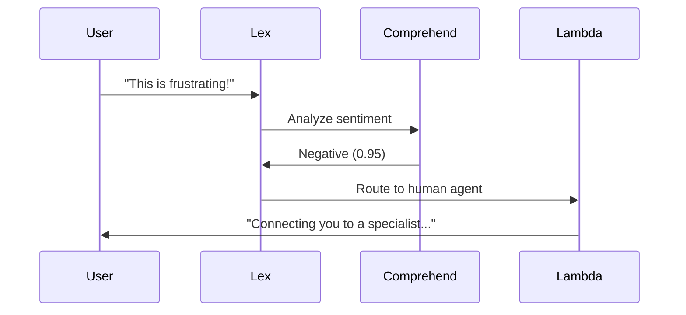

**Use Cases**:
- Escalate frustrated customers to human agents
- Adjust bot responses based on emotion
- Track customer satisfaction metrics

**Exam Tip**: Sentiment analysis requires integration with Amazon Comprehend.

---

## Architecture Patterns

### Pattern 1: Simple Q&A Bot

**Use Case**: FAQ bot, information lookup

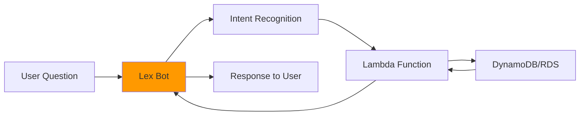

**Characteristics**:
- Single-turn conversations
- No slot elicitation needed
- Quick information retrieval
- Low complexity

**Example**: "What are your business hours?" → Direct answer

---

### Pattern 2: Transactional Bot

**Use Case**: Banking transactions, booking systems, order processing

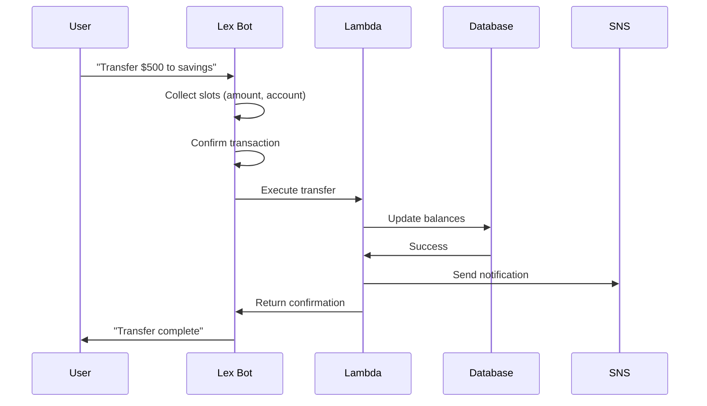

**Characteristics**:
- Multi-turn conversations
- Slot validation required
- Confirmation prompts
- Backend integration critical

**Exam Tip**: Transactional bots require Lambda for fulfillment logic.

---

### Pattern 3: Contact Center Integration

**Use Case**: Customer service, technical support

```mermaid
graph TB
    A[Customer Call] --> B[Amazon Connect]
    B --> C[Lex Voice Bot]
    C --> D{Can Bot Handle?}
    
    D -->|Yes| E[Lex + Lambda]
    E --> F[Resolve Issue]
    F --> G[End Call]
    
    D -->|No| H[Transfer to Agent]
    H --> I[Human Agent]
    I --> J[Agent Desktop]
    
    C --> K[Comprehend Sentiment]
    K -->|Negative| H
    
    style C fill:#FF9900
    style B fill:#FF9900
```

**Characteristics**:
- Voice-first interface
- Intelligent routing
- Sentiment-based escalation
- Agent handoff capability

**AWS Services Used**:
- Amazon Connect (contact center)
- Amazon Lex (conversational AI)
- Lambda (business logic)
- Amazon Comprehend (sentiment)

**Exam Tip**: Amazon Connect + Lex is AWS's solution for intelligent contact centers.

---

### Pattern 4: Omnichannel Bot
```mermaid
graph TB
    A[User Interactions] --> B[Web Chat]
    A --> C[Mobile App]
    A --> D[Facebook Messenger]
    A --> E[Slack]
    A --> F[Voice/Phone]
    
    B --> G[Amazon Lex Bot]
    C --> G
    D --> G
    E --> G
    F --> G
    
    G --> H[Lambda Fulfillment]
    H --> I[Backend Systems]
    I --> J[CRM]
    I --> K[Database]
    I --> L[APIs]
    
    H --> G
    G --> M[Unified Response]
    M --> B
    M --> C
    M --> D
    M --> E
    M --> F
    
    style G fill:#FF9900
```

**Characteristics**:
- Single bot definition
- Multiple deployment channels
- Consistent conversation logic
- Channel-specific formatting

**Benefits**:
- Maintain one bot for all channels
- Consistent user experience
- Centralized analytics
- Reduced maintenance overhead

**Exam Tip**: One Lex bot can be deployed to multiple channels simultaneously.

---

### Pattern 5: Intelligent Search Bot with Kendra

**Use Case**: Knowledge base search, document retrieval

```mermaid
sequenceDiagram
    participant U as User
    participant L as Lex Bot
    participant K as Amazon Kendra
    participant S3 as S3 Documents
    
    U->>L: "How do I reset my password?"
    L->>K: Search query
    K->>S3: Search indexed documents
    S3->>K: Relevant documents
    K->>L: Top answers with confidence
    L->>U: "Here's how to reset: [answer]"
    L->>U: "Source: User Guide page 45"
```

**Characteristics**:
- Natural language search
- Document-based answers
- Source attribution
- Confidence scoring

**AWS Services Used**:
- Amazon Lex (conversational interface)
- Amazon Kendra (intelligent search)
- S3 (document storage)

**Exam Tip**: Kendra integration enables FAQ and knowledge base functionality in Lex bots.

---

## Real-World Use Cases

### Use Case 1: Digital Banking - Virtual Assistant

**Business Challenge**: Handle 100,000+ monthly customer inquiries about accounts, transactions, and services.

**Solution Architecture**:

```mermaid
graph TB
    A[Customer] --> B[Mobile App/Web]
    B --> C[Amazon Lex Bot]
    
    C --> D{Intent Type}
    
    D -->|Check Balance| E[Lambda]
    D -->|Transfer Money| E
    D -->|Pay Bills| E
    D -->|Report Lost Card| F[High Priority Lambda]
    
    E --> G[Core Banking API]
    F --> G
    F --> H[SNS Alert]
    
    G --> I[Response]
    I --> C
    C --> B
    B --> A
    
    C --> J[Comprehend Sentiment]
    J -->|Negative| K[Escalate to Agent]
    
    style C fill:#FF9900
```

**Lex Features Used**:
- **Multi-turn Conversations**: Collect account details, amounts, dates
- **Slot Validation**: Verify account numbers, amounts within limits
- **Confirmation Prompts**: Confirm transactions before execution
- **Session Attributes**: Remember user context across intents
- **Lambda Integration**: Execute banking operations

**Intents Configured**:
- CheckBalance
- TransferMoney
- PayBill
- ViewTransactions
- ReportLostCard
- UpdateContactInfo

**Business Outcomes**:
- 70% of inquiries handled without human agents
- 24/7 availability
- Average response time < 3 seconds
- 40% reduction in call center costs
- 85% customer satisfaction score

**Exam Relevance**: Demonstrates transactional bot with multi-turn conversations and backend integration.

---

### Use Case 2: Healthcare - Appointment Scheduling Bot

**Business Challenge**: Automate appointment booking for 50+ clinics with 200+ doctors.

**Solution Architecture**:

```mermaid
sequenceDiagram
    participant P as Patient
    participant L as Lex Bot
    participant Lambda as Lambda
    participant DB as RDS Database
    participant SNS as SNS
    participant Email as SES
    
    P->>L: "I need an appointment"
    L->>P: "What type of appointment?"
    P->>L: "General checkup"
    L->>P: "Preferred date?"
    P->>L: "Next Tuesday"
    L->>Lambda: Check availability
    Lambda->>DB: Query available slots
    DB->>Lambda: Available times
    Lambda->>L: Return options
    L->>P: "Available: 9am, 2pm, 4pm"
    P->>L: "2pm works"
    L->>P: "Confirm appointment for Tuesday 2pm?"
    P->>L: "Yes"
    L->>Lambda: Book appointment
    Lambda->>DB: Create booking
    Lambda->>SNS: Send SMS reminder
    Lambda->>Email: Send confirmation email
    Lambda->>L: Confirmation
    L->>P: "Appointment confirmed!"
```

**Lex Features Used**:
- **Built-in Slot Types**: AMAZON.Date, AMAZON.Time
- **Custom Slot Types**: AppointmentType (checkup, specialist, follow-up)
- **Slot Validation**: Check date is in future, time is during business hours
- **Confirmation**: Verify appointment details before booking
- **Multi-language**: English and Spanish versions

**Business Outcomes**:
- 60% of appointments booked via bot
- Reduced no-shows by 25% (automated reminders)
- Staff freed for complex cases
- Extended booking hours (24/7)
- Improved patient satisfaction

**Exam Tip**: Healthcare bots must be HIPAA compliant - Lex is HIPAA eligible when properly configured.

---

### Use Case 3: E-commerce - Order Tracking & Support

**Business Challenge**: Handle order status inquiries and simple support requests.

**Solution Architecture**:

```mermaid
graph TB
    A[Customer Query] --> B[Lex Bot]
    
    B --> C{Intent Recognition}
    
    C -->|Track Order| D[Lambda]
    C -->|Return Item| D
    C -->|Product Info| E[Kendra Search]
    C -->|Complex Issue| F[Human Agent]
    
    D --> G[Order Management System]
    E --> H[Product Catalog]
    
    G --> I[Order Status]
    H --> J[Product Details]
    
    I --> B
    J --> B
    
    B --> K[Response to Customer]
    
    B --> L[Comprehend Sentiment]
    L -->|Frustrated| F
    
    style B fill:#FF9900
```

**Lex Features Used**:
- **Entity Recognition**: Extract order numbers from natural language
- **Kendra Integration**: Search product documentation
- **Sentiment Analysis**: Detect frustrated customers
- **Channel Deployment**: Web chat, Facebook Messenger, SMS

**Sample Conversation**:
```
Customer: "Where's my order?"
Bot: "I can help with that. What's your order number?"
Customer: "It's ABC123456"
Bot: "Your order shipped yesterday and will arrive tomorrow by 8pm."
Customer: "Can I track it?"
Bot: "Yes, tracking number: 1Z999AA10123456784"
```

**Business Outcomes**:
- 80% of tracking inquiries automated
- Reduced support tickets by 50%
- Improved response time from hours to seconds
- Increased customer satisfaction by 30%

---

### Use Case 4: IT Helpdesk - Internal Support Bot

**Business Challenge**: Support 5,000 employees with common IT issues and requests.

**Solution Architecture**:

```mermaid
graph TB
    A[Employee] --> B[Slack Integration]
    B --> C[Lex Bot]
    
    C --> D{Issue Type}
    
    D -->|Password Reset| E[Lambda]
    D -->|Software Request| F[ServiceNow API]
    D -->|VPN Issues| G[Knowledge Base]
    D -->|Hardware Problem| H[Create Ticket]
    
    E --> I[Active Directory]
    G --> J[Kendra Search]
    
    I --> K[Reset Confirmation]
    F --> L[Approval Workflow]
    J --> M[Troubleshooting Steps]
    H --> N[Ticket Created]
    
    K --> C
    L --> C
    M --> C
    N --> C
    
    C --> B
    B --> A
    
    style C fill:#FF9900
```

**Lex Features Used**:
- **Slack Integration**: Deploy directly in Slack workspace
- **Session Attributes**: Track employee ID, department
- **Multi-intent**: Handle various IT requests
- **Kendra Integration**: Search IT documentation

**Common Intents**:
- ResetPassword
- RequestSoftware
- ReportIssue
- CheckTicketStatus
- AccessRequest
- VPNHelp

**Business Outcomes**:
- 65% of requests resolved without human intervention
- Average resolution time reduced from 2 hours to 5 minutes
- IT staff focus on complex issues
- 24/7 support availability
- Reduced helpdesk costs by 45%

**Exam Tip**: Lex integrates natively with Slack for internal use cases.

---

### Use Case 5: Travel - Hotel Booking Assistant

**Business Challenge**: Enable voice and text-based hotel reservations.

**Solution Architecture**:

```mermaid
sequenceDiagram
    participant C as Customer
    participant L as Lex Bot
    participant Lambda as Lambda
    participant API as Booking API
    participant Payment as Payment Gateway
    participant Email as SES
    
    C->>L: "Book a hotel in Seattle"
    L->>C: "What dates?"
    C->>L: "December 15-18"
    L->>C: "How many guests?"
    C->>L: "2 adults"
    L->>Lambda: Search hotels
    Lambda->>API: Query availability
    API->>Lambda: Available hotels
    Lambda->>L: Return options
    L->>C: "3 hotels available. [Details]"
    C->>L: "Book the Hilton"
    L->>C: "Total: $450. Confirm?"
    C->>L: "Yes"
    L->>Lambda: Process booking
    Lambda->>Payment: Charge card
    Lambda->>API: Create reservation
    Lambda->>Email: Send confirmation
    Lambda->>L: Success
    L->>C: "Booking confirmed! Confirmation #12345"
```

**Lex Features Used**:
- **Voice Support**: Phone and Alexa integration
- **Built-in Slots**: AMAZON.Date, AMAZON.Number, AMAZON.US_City
- **Custom Slots**: RoomType (single, double, suite)
- **Confirmation**: Multi-step confirmation for payment
- **Error Handling**: Retry logic for failed bookings

**Business Outcomes**:
- 40% of bookings via conversational interface
- Reduced booking abandonment by 20%
- Extended booking hours (24/7)
- Multi-language support (5 languages)
- Improved conversion rate by 15%

---

## Integration & Deployment

### Deployment Options

```mermaid
graph TB
    A[Amazon Lex Bot] --> B[Web Deployment]
    A --> C[Mobile Deployment]
    A --> D[Voice Deployment]
    A --> E[Messaging Platforms]
    
    B --> F[JavaScript SDK]
    B --> G[React/Angular Components]
    
    C --> H[iOS SDK]
    C --> I[Android SDK]
    
    D --> J[Amazon Connect]
    D --> K[Twilio Voice]
    
    E --> L[Facebook Messenger]
    E --> M[Slack]
    E --> N[Twilio SMS]
    E --> O[Kik]
    
    style A fill:#FF9900
```

**Exam Tip**: Lex provides SDKs and built-in integrations for multiple deployment channels.

---
# Amazon Lex - AWS Cloud Practitioner Study Guide

## Service Overview

**Amazon Lex** = Build conversational interfaces (chatbots/voice bots) using Alexa's AI technology.

- **Type**: Fully managed, serverless
- **Pricing**: Pay per text/voice request
- **Key Use**: Customer service automation, virtual assistants

```mermaid
graph LR
    A[User Input] --> B[Amazon Lex]
    B --> C[Understand Intent]
    C --> D[Execute Action]
    D --> E[Respond to User]
    
    style B fill:#FF9900
```

---

## Core Concepts

### Bot Architecture

```mermaid
graph TB
    A[Lex Bot] --> B[Intent: What user wants]
    B --> C[Slots: Required info]
    C --> D[Utterances: How users ask]
    D --> E[Fulfillment: Execute logic]
    
    style A fill:#FF9900
```

**Example - Banking Bot**:
- **Intent**: TransferMoney
- **Slots**: FromAccount, ToAccount, Amount
- **Utterances**: "Transfer $500", "Move money to savings"
- **Fulfillment**: Lambda function executes transfer

---

### Multi-turn Conversation

```mermaid
sequenceDiagram
    User->>Lex: "Book a flight"
    Lex->>User: "Where to?"
    User->>Lex: "Seattle"
    Lex->>User: "What date?"
    User->>Lex: "Dec 15"
    Lex->>Lambda: Execute booking
    Lambda->>Lex: Confirmation
    Lex->>User: "Flight booked!"
```

**Key Point**: Lex maintains conversation context automatically.

---

## Key Features

### 1. Slot Types

| Type          | Example               | Use Case                 |
| ------------- | --------------------- | ------------------------ |
| AMAZON.Number | 100, 5000             | Amounts, quantities      |
| AMAZON.Date   | "tomorrow", "12/25"   | Appointments, bookings   |
| AMAZON.Time   | "3pm", "15:00"        | Scheduling               |
| Custom        | "Checking", "Savings" | Business-specific values |

### 2. Channel Support

```mermaid
graph TB
    A[Single Lex Bot] --> B[Web Chat]
    A --> C[Mobile App]
    A --> D[Facebook Messenger]
    A --> E[Slack]
    A --> F[Voice/Phone]
    
    style A fill:#FF9900
```

**Key Point**: One bot → Multiple channels

### 3. Lambda Integration

```mermaid
flowchart LR
    A[User Request] --> B[Lex]
    B --> C[Lambda]
    C --> D[Database/API]
    D --> C
    C --> B
    B --> E[Response]
    
    style B fill:#FF9900
```

**Example**:
```python
def lambda_handler(event, context):
    intent = event['currentIntent']['name']
    slots = event['currentIntent']['slots']
    
    if intent == 'CheckBalance':
        account = slots['AccountType']
        balance = get_balance(account)  # Query database
        
        return {
            'dialogAction': {
                'type': 'Close',
                'fulfillmentState': 'Fulfilled',
                'message': {
                    'contentType': 'PlainText',
                    'content': f'Your {account} balance is ${balance}'
                }
            }
        }
```

---

## Architecture Patterns

### Pattern 1: Simple Q&A Bot

```mermaid
graph LR
    A[User Question] --> B[Lex]
    B --> C[Lambda]
    C --> D[DynamoDB]
    D --> C
    C --> B
    B --> E[Answer]
    
    style B fill:#FF9900
```

**Use Case**: FAQ bot, store hours, product info

---

### Pattern 2: Transactional Bot

```mermaid
sequenceDiagram
    User->>Lex: "Transfer $500"
    Lex->>Lex: Collect slots
    Lex->>User: "Confirm transfer?"
    User->>Lex: "Yes"
    Lex->>Lambda: Execute
    Lambda->>Database: Update
    Lambda->>Lex: Success
    Lex->>User: "Done!"
```

**Use Case**: Banking, booking, ordering

---

### Pattern 3: Contact Center (Lex + Connect)

```mermaid
graph TB
    A[Customer Call] --> B[Amazon Connect]
    B --> C[Lex Voice Bot]
    C --> D{Resolved?}
    D -->|Yes| E[End Call]
    D -->|No| F[Human Agent]
    
    style B fill:#FF9900
    style C fill:#FF9900
```

**Use Case**: Automated customer service with escalation

---

### Pattern 4: Intelligent Search (Lex + Kendra)

```mermaid
graph LR
    A[User Query] --> B[Lex]
    B --> C[Kendra]
    C --> D[Search Documents]
    D --> C
    C --> B
    B --> E[Answer + Source]
    
    style B fill:#FF9900
    style C fill:#FF9900
```

**Use Case**: Knowledge base search, documentation lookup

---

## Real-World Examples

### Example 1: Banking Bot

```mermaid
graph TB
    A[Customer] --> B[Lex Bot]
    B --> C{Intent}
    C -->|Check Balance| D[Lambda]
    C -->|Transfer Money| D
    C -->|Pay Bill| D
    D --> E[Core Banking API]
    E --> F[Response]
    
    style B fill:#FF9900
```

**Intents**: CheckBalance, TransferMoney, PayBill, ReportCard
**Outcome**: 70% automation, 24/7 availability

---

### Example 2: Appointment Scheduling

```mermaid
sequenceDiagram
    Patient->>Lex: "Book appointment"
    Lex->>Patient: "What type?"
    Patient->>Lex: "Checkup"
    Lex->>Patient: "Preferred date?"
    Patient->>Lex: "Next Tuesday"
    Lex->>Lambda: Check availability
    Lambda->>Database: Query slots
    Database->>Lambda: Available times
    Lambda->>Lex: Options
    Lex->>Patient: "9am, 2pm, 4pm?"
    Patient->>Lex: "2pm"
    Lex->>Lambda: Book
    Lambda->>SNS: Send reminder
    Lex->>Patient: "Confirmed!"
```

**Outcome**: 60% automation, reduced no-shows

---

### Example 3: IT Helpdesk (Slack)

```mermaid
graph LR
    A[Employee in Slack] --> B[Lex Bot]
    B --> C{Request Type}
    C -->|Password Reset| D[Lambda + AD]
    C -->|Software Request| E[ServiceNow]
    C -->|VPN Help| F[Kendra Docs]
    
    style B fill:#FF9900
```

**Outcome**: 65% self-service, 5-minute resolution

---

## Service Comparisons

```mermaid
graph TB
    A{Need?} -->|Two-way conversation| B[Lex]
    A -->|Analyze text| C[Comprehend]
    A -->|Speech to text| D[Transcribe]
    A -->|Text to speech| E[Polly]
    A -->|Translate| F[Translate]
    A -->|Search docs| G[Kendra]
    
    style B fill:#FF9900
```

| Service        | Purpose       | Example                                    |
| -------------- | ------------- | ------------------------------------------ |
| **Lex**        | Chatbots      | "Book a flight" → Bot handles conversation |
| **Comprehend** | Text analysis | Analyze sentiment of reviews               |
| **Transcribe** | Audio → Text  | Convert call recording to text             |
| **Polly**      | Text → Audio  | Read article aloud                         |

**Key**: Lex = Interactive, Comprehend = Analysis

---

## Integration with AWS Services

```mermaid
graph TB
    A[Lex Bot] --> B[Lambda: Business logic]
    A --> C[Connect: Contact center]
    A --> D[Kendra: Search]
    A --> E[Comprehend: Sentiment]
    A --> F[DynamoDB: Data storage]
    A --> G[SNS: Notifications]
    
    style A fill:#FF9900
```

**Most Common**: Lex + Lambda + DynamoDB

---

## Security & Compliance

```mermaid
graph LR
    A[Lex Security] --> B[Encryption: KMS]
    A --> C[Access: IAM]
    A --> D[Compliance: HIPAA, PCI]
    A --> E[Privacy: No data retention]
    
    style A fill:#232F3E
```

**Key Points**:
- HIPAA eligible (healthcare)
- PCI DSS compliant (payments)
- Data encrypted at rest and in transit
- AWS doesn't use your data for training

---

## Pricing

```mermaid
graph LR
    A[Pricing] --> B[Text: $0.00075/request]
    A --> C[Voice: $0.004/request]
    
    D[Free Tier] --> E[10K text/month]
    D --> F[5K voice/month]
    
    style A fill:#FF9900
```

**Example**:
- 100K text conversations
- 5 turns each = 500K requests
- Cost: 500K × $0.00075 = **$375/month**

**Tip**: Voice costs 5x more than text

---

## Exam Scenarios

| Scenario                              | Answer                   |
| ------------------------------------- | ------------------------ |
| Build a customer service chatbot      | **Amazon Lex**           |
| Voice-enabled mobile banking          | **Lex + Lambda**         |
| Automated appointment booking (HIPAA) | **Lex (HIPAA eligible)** |
| Intelligent contact center            | **Connect + Lex**        |
| Bot that searches documentation       | **Lex + Kendra**         |
| Deploy same bot to web, mobile, Slack | **Lex (multi-channel)**  |
| Analyze customer feedback sentiment   | **Comprehend** (not Lex) |

---

## Key Takeaways

✅ **Lex = Conversational AI** (chatbots, voice bots)
✅ **Components**: Intents → Slots → Utterances → Fulfillment
✅ **Channels**: Web, mobile, voice, messaging (one bot, many channels)
✅ **Integration**: Lambda for business logic (most common)
✅ **Compliance**: HIPAA eligible, PCI DSS compliant
✅ **Pricing**: Per request (text cheaper than voice)

**Remember**: 
- Lex = Interactive conversations
- Comprehend = Text analysis
- Connect + Lex = Contact center

Would you like more details about any specific concept or use case?
