# Amazon Rekognition - AWS Cloud Practitioner Study Guide

## Table of Contents
1. `[Service Overview](#service-overview)`
2. `[Core Concepts](#core-concepts)`
3. `[Key Features & Capabilities](#key-features--capabilities)`
4. `[Architecture Patterns](#architecture-patterns)`
5. `[Real-World Use Cases](#real-world-use-cases)`
6. `[Integration & Deployment](#integration--deployment)`
7. `[Exam Tips & Key Takeaways](#exam-tips--key-takeaways)`

---

## Service Overview

**Amazon Rekognition** is a fully managed computer vision service that uses deep learning to analyze images and videos without requiring machine learning expertise.

### Service Classification
- **Category**: Machine Learning / AI Services (Computer Vision)
- **Type**: Fully Managed (Serverless)
- **Pricing Model**: Pay-per-use (per image/video analyzed)
- **AWS Well-Architected Pillar**: Cost Optimization, Operational Excellence, Security

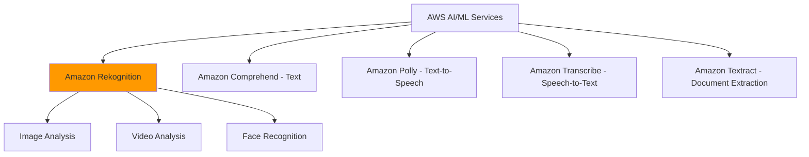

### What Makes Rekognition Unique?
- **No ML expertise required** - Pre-trained models ready to use
- **Scalable** - Processes millions of images/videos automatically
- **Real-time and batch processing** - Flexible deployment options
- **Continuous learning** - Models improve over time with AWS updates

---

## Core Concepts

### 1. Computer Vision
Technology that enables computers to interpret and understand visual information from images and videos, similar to human vision.

**Exam Relevance**: Computer vision is the underlying technology; Rekognition is AWS's managed implementation.

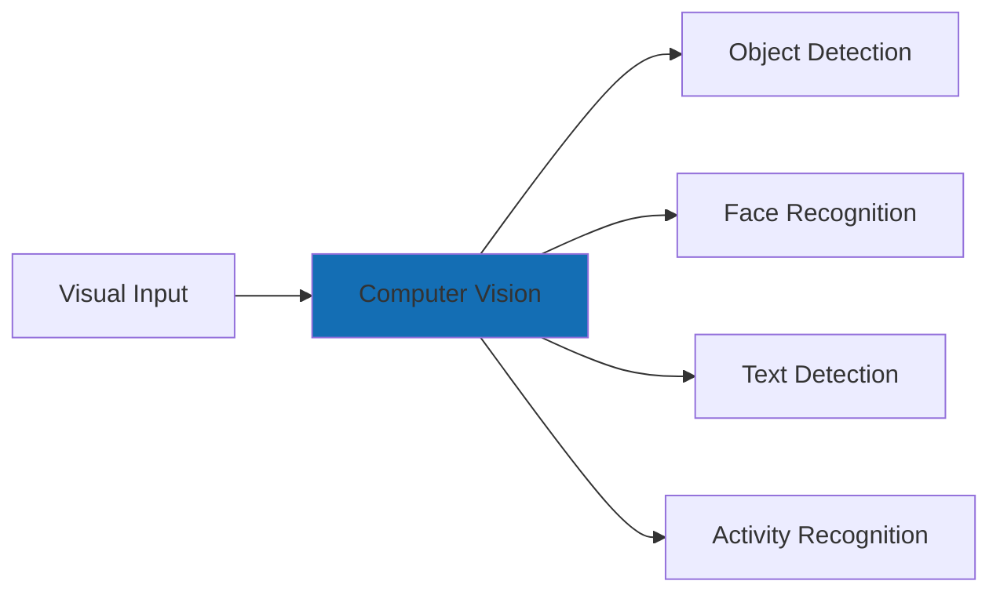

**Key Difference from Human Vision**:
- Humans: Intuitive, context-aware, emotional understanding
- Computer Vision: Pattern recognition, consistency, scalability, 24/7 operation

---

### 2. Deep Learning Models
Neural networks with multiple layers that learn to recognize patterns in visual data through training on millions of images.

**Exam Relevance**: Rekognition uses pre-trained deep learning models, so you don't need to train them yourself.

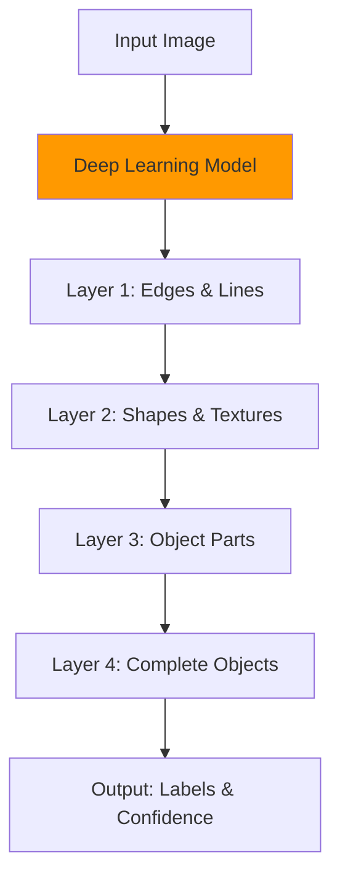

**What You Need to Know**:
- AWS trains and maintains the models
- Models continuously improve
- You only send images and receive results
- No data science skills required

---

### 3. Confidence Scores
Numerical values (0-100%) indicating how certain the model is about its predictions.

**Example**:
```
Object: "Person" - Confidence: 99.8%
Object: "Car" - Confidence: 95.2%
Object: "Tree" - Confidence: 87.5%
```

**Exam Tip**: Higher confidence = more certain. You can set minimum confidence thresholds to filter results.

---

### 4. Labels and Metadata
Descriptive information extracted from images/videos.

| Metadata Type      | Description                     | Example                               |
| ------------------ | ------------------------------- | ------------------------------------- |
| **Labels**         | Objects, scenes, activities     | "Person", "Beach", "Running"          |
| **Bounding Boxes** | Coordinates of detected objects | X: 100, Y: 200, Width: 50, Height: 80 |
| **Confidence**     | Certainty percentage            | 98.5%                                 |
| **Attributes**     | Additional properties           | Age range, gender, emotions           |
| **Timestamps**     | When detected in video          | 00:02:15 - 00:02:18                   |

---

### 5. Image vs Video Analysis

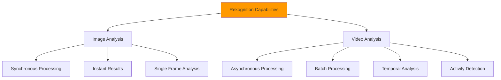

**Key Differences**:

| Aspect            | Image Analysis                | Video Analysis                   |
| ----------------- | ----------------------------- | -------------------------------- |
| **Processing**    | Synchronous (real-time)       | Asynchronous (batch)             |
| **Response Time** | Milliseconds                  | Minutes to hours                 |
| **Input Size**    | Up to 15 MB                   | Up to 10 GB                      |
| **Use Case**      | Photo verification, ID checks | Surveillance, content moderation |
| **Cost**          | Per image                     | Per minute of video              |

**Exam Tip**: Images = real-time, Videos = batch processing with SNS notifications.

---

## Key Features & Capabilities

### Feature Overview

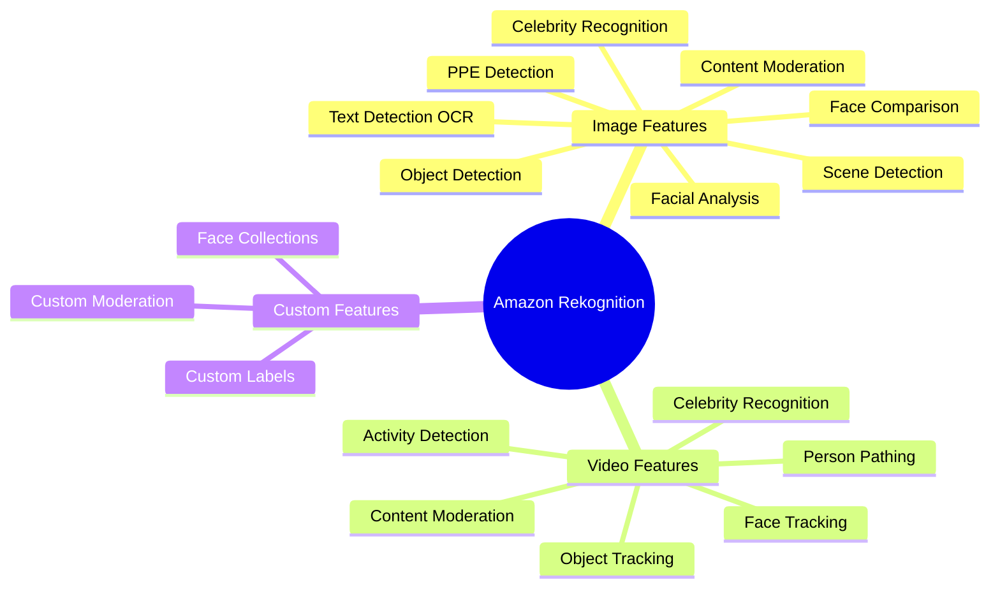

---

### 1. Object and Scene Detection

**What it does**: Identifies thousands of objects, scenes, and concepts in images.

**Detectable Categories**:
- **Objects**: Cars, phones, furniture, animals, food
- **Scenes**: Beach, office, city street, forest
- **Activities**: Running, swimming, reading, cooking
- **Concepts**: Outdoors, celebration, technology

**Digital Financial Bank Use Case**: Branch Security Monitoring

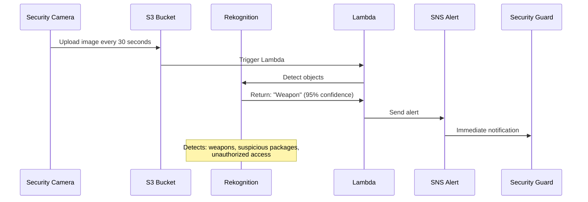

**Business Value**:
- Automated threat detection in branches
- Reduce security personnel workload
- 24/7 monitoring without fatigue
- Instant alerts for suspicious items

**API Response Example**:
```json
{
  "Labels": [
    {
      "Name": "Person",
      "Confidence": 99.8,
      "Instances": [
        {
          "BoundingBox": {
            "Width": 0.25,
            "Height": 0.68,
            "Left": 0.35,
            "Top": 0.12
          }
        }
      ]
    },
    {
      "Name": "ATM",
      "Confidence": 98.2
    }
  ]
}
```

**Exam Tip**: Object detection returns labels with confidence scores and bounding boxes for precise location.

---

### 2. Facial Analysis

**What it does**: Detects faces and analyzes facial attributes without identifying who the person is.

**Attributes Detected**:

| Attribute        | Values                             | Use Case              |
| ---------------- | ---------------------------------- | --------------------- |
| **Age Range**    | 18-25, 26-35, etc.                 | Demographics analysis |
| **Gender**       | Male, Female                       | Marketing insights    |
| **Emotions**     | Happy, Sad, Angry, Surprised, Calm | Customer satisfaction |
| **Facial Hair**  | Beard, Mustache, None              | Identity verification |
| **Eyeglasses**   | Yes, No, Sunglasses                | Compliance checks     |
| **Eyes Open**    | Yes, No                            | Liveness detection    |
| **Mouth Open**   | Yes, No                            | Speech detection      |
| **Smile**        | Yes, No                            | Sentiment analysis    |
| **Face Quality** | Brightness, Sharpness              | Photo quality check   |

**Digital Financial Bank Use Case**: Customer Experience Analytics

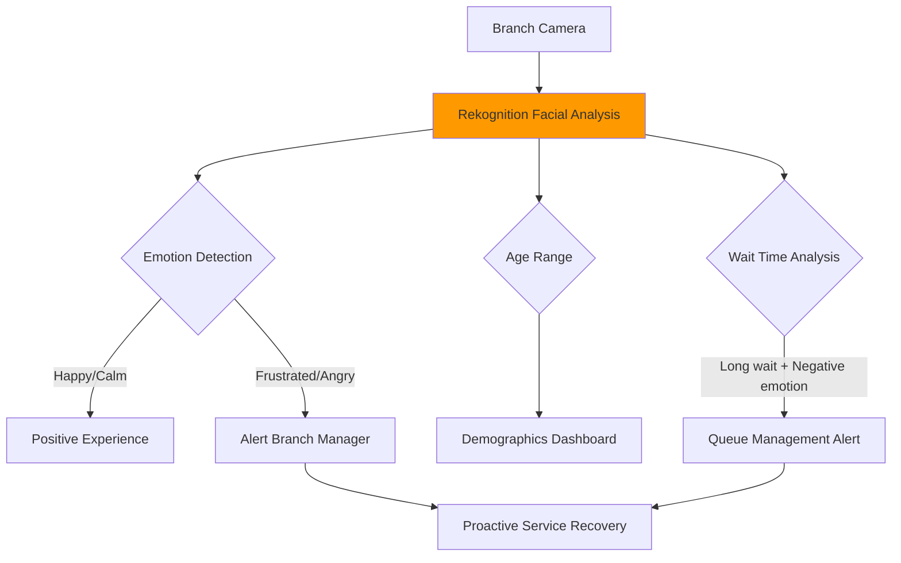

**Business Outcomes**:
- Measure customer satisfaction in real-time
- Identify service issues before complaints
- Optimize branch staffing based on traffic patterns
- Improve customer experience proactively

**Privacy Note**: Facial analysis does NOT identify individuals - it only detects attributes.

**Exam Tip**: Facial analysis ≠ Face recognition. Analysis detects attributes; recognition identifies specific people.

---

### 3. Face Comparison and Verification

**What it does**: Compares two faces to determine if they belong to the same person.

**Returns**:
- **Similarity score** (0-100%)
- **Confidence level**
- **Face match** (Yes/No based on threshold)

**Digital Financial Bank Use Case**: Account Opening & KYC Verification

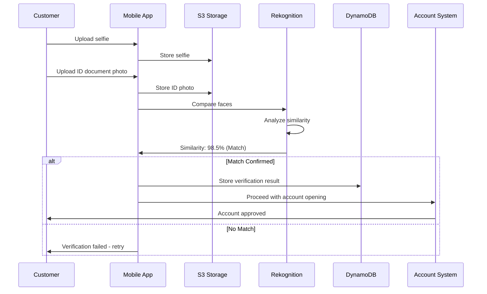

**Business Benefits**:
- Prevent identity fraud during account opening
- Reduce manual verification time from hours to seconds
- Enable remote account opening
- Comply with KYC (Know Your Customer) regulations

**Similarity Threshold Guidelines**:

| Threshold  | Use Case                                | False Positive Risk |
| ---------- | --------------------------------------- | ------------------- |
| **99%+**   | High-security (large transactions)      | Very Low            |
| **95-98%** | Standard verification (account opening) | Low                 |
| **90-94%** | Low-risk operations                     | Medium              |
| **<90%**   | Not recommended                         | High                |

**Exam Tip**: Face comparison requires TWO images - source and target. Returns similarity percentage.

---

### 4. Face Recognition with Collections

**What it does**: Identifies specific individuals by searching against a stored collection of known faces.

**How It Works**:

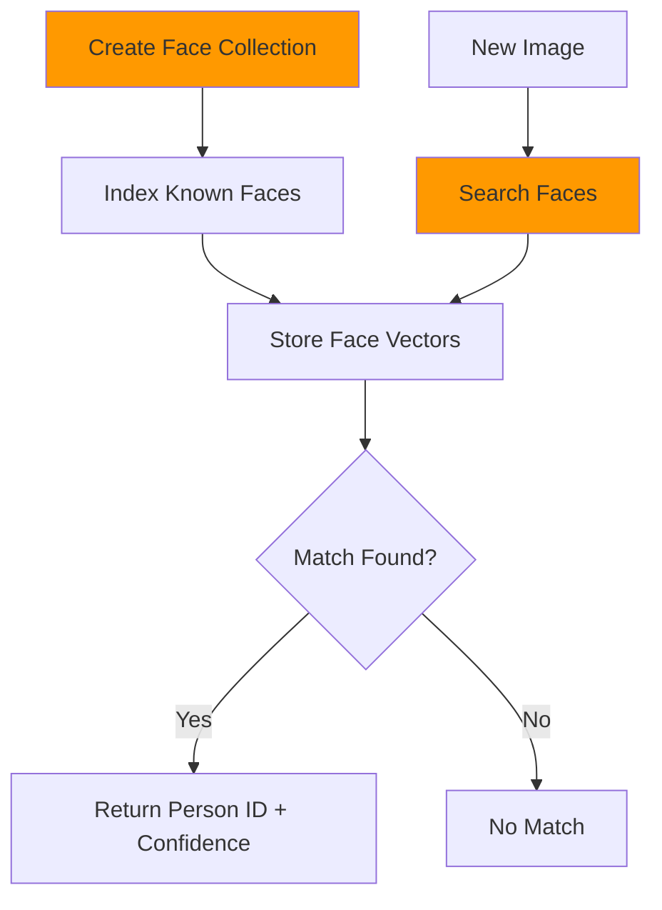

**Digital Financial Bank Use Case**: VIP Customer Recognition
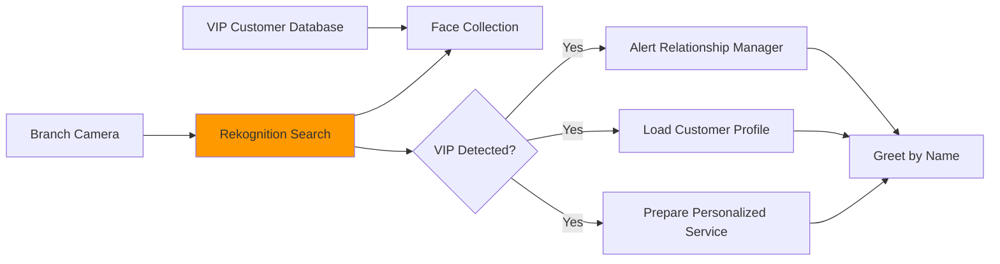

**Implementation Steps**:

1. **Create Collection**: `CreateCollection` API
2. **Index Faces**: Add VIP customer photos with unique IDs
3. **Search Faces**: Real-time search when customer enters branch
4. **Retrieve Match**: Get customer ID and confidence score
5. **Trigger Actions**: Alert staff, load preferences, prepare services

**Business Value**:
- Personalized VIP experience without check-in
- Increased customer satisfaction and loyalty
- Competitive differentiation
- Upsell opportunities through proactive service

**Face Collection Limits**:

| Limit Type                  | Value      | Notes                  |
| --------------------------- | ---------- | ---------------------- |
| **Collections per account** | 1,000      | Can request increase   |
| **Faces per collection**    | 20 million | Highly scalable        |
| **Faces per image**         | 100        | Multiple faces indexed |
| **Search response time**    | < 1 second | Real-time performance  |

**Exam Tip**: Face collections store face "vectors" (mathematical representations), NOT actual images. This is privacy-friendly.

---

### 5. Celebrity Recognition

**What it does**: Identifies famous people from entertainment, sports, business, and politics in images and videos.

**Returns**:
- Celebrity name
- Confidence score
- Face location (bounding box)
- URLs to additional information

**Digital Financial Bank Use Case**: Marketing Campaign Monitoring

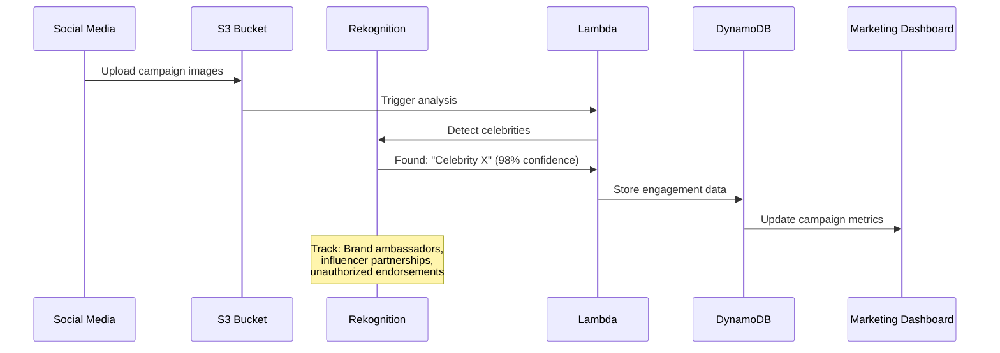

**Business Applications**:
- Monitor brand ambassador appearances
- Track influencer campaign effectiveness
- Detect unauthorized celebrity image usage
- Measure social media reach

**Exam Tip**: Celebrity recognition is a specialized feature - it doesn't require training or custom collections.

---

### 6. Text Detection (OCR)

**What it does**: Detects and extracts text from images, including scene text and document text.

**Text Types Supported**:

| Text Type            | Examples                                 | Use Case            |
| -------------------- | ---------------------------------------- | ------------------- |
| **Scene Text**       | Street signs, billboards, product labels | Real-world text     |
| **Document Text**    | Printed documents, forms                 | Document processing |
| **Handwritten Text** | Limited support                          | Notes, signatures   |
| **Multi-language**   | 50+ languages                            | Global operations   |

**Digital Financial Bank Use Case**: Check Deposit Automation

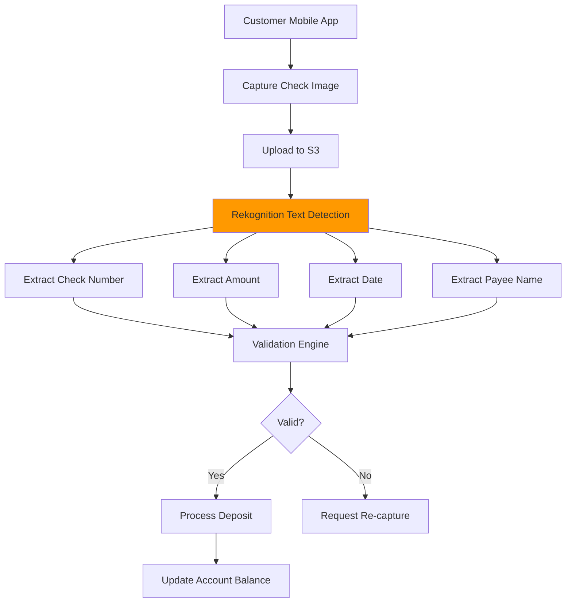

**Business Benefits**:
- Automated check processing (no manual data entry)
- Faster deposit clearing times
- Reduced processing errors
- 24/7 mobile deposit availability
- Lower operational costs

**Text Detection Output**:
```json
{
  "TextDetections": [
    {
      "DetectedText": "PAY TO THE ORDER OF",
      "Type": "LINE",
      "Confidence": 99.5,
      "Geometry": {
        "BoundingBox": {
          "Width": 0.35,
          "Height": 0.05,
          "Left": 0.15,
          "Top": 0.25
        }
      }
    },
    {
      "DetectedText": "$1,250.00",
      "Type": "LINE",
      "Confidence": 98.8
    }
  ]
}
```

**Exam Tip**: Rekognition detects text in images. For document extraction with form understanding, use Amazon Textract instead.

---

### 7. Content Moderation

**What it does**: Automatically detects inappropriate, unwanted, or offensive content in images and videos.

**Moderation Categories**:

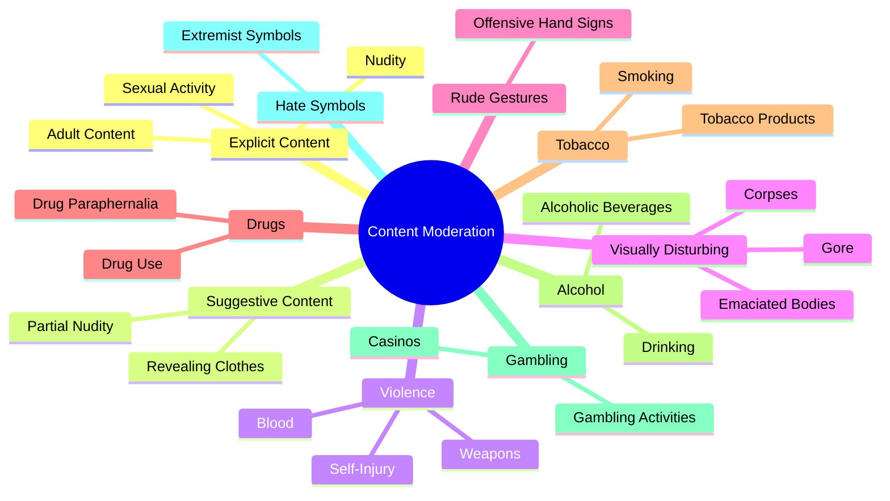

**Digital Financial Bank Use Case**: Social Media Campaign Monitoring

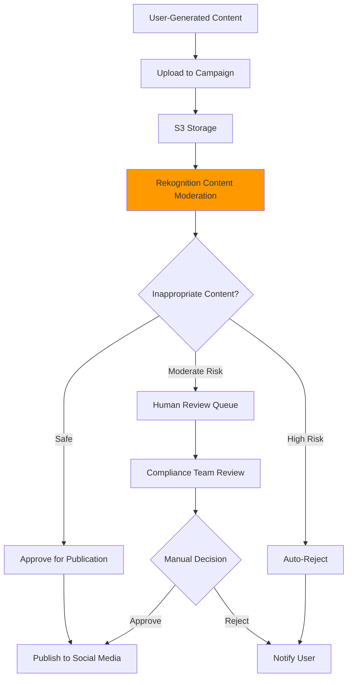

**Confidence Levels**:

| Confidence Range | Action              | Use Case          |
| ---------------- | ------------------- | ----------------- |
| **90-100%**      | Auto-block          | High-risk content |
| **70-89%**       | Human review        | Moderate risk     |
| **50-69%**       | Flag for monitoring | Low risk          |
| **<50%**         | Allow               | Safe content      |

**Business Benefits**:
- Protect brand reputation
- Comply with advertising standards
- Reduce manual moderation costs by 80%
- Scale content review to millions of images
- Consistent moderation policies

**Exam Tip**: Content moderation returns categories AND confidence scores. You set thresholds based on risk tolerance.

---

### 8. Personal Protective Equipment (PPE) Detection

**What it does**: Detects whether people are wearing required safety equipment.

**Detectable PPE**:
- Face covers (masks, respirators)
- Head covers (hard hats, helmets)
- Hand covers (gloves)

**Digital Financial Bank Use Case**: COVID-19 Compliance Monitoring

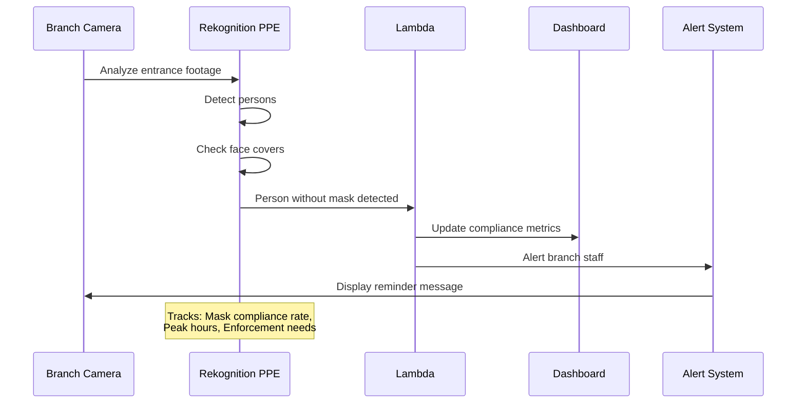

**Detection Output**:
```json
{
  "Persons": [
    {
      "BodyParts": [
        {
          "Name": "FACE",
          "EquipmentDetections": [
            {
              "Type": "FACE_COVER",
              "CoversBodyPart": {
                "Confidence": 95.5,
                "Value": true
              }
            }
          ]
        }
      ]
    }
  ]
}
```

**Business Applications**:
- Workplace safety compliance
- Automated safety audits
- Reduce manual inspections
- Generate compliance reports
- Protect employees and customers

**Exam Tip**: PPE detection is specialized for safety compliance - it detects protective equipment, not general clothing.

---

### 9. Custom Labels

**What it does**: Train custom models to detect objects and scenes specific to your business without ML expertise.

**When to Use Custom Labels**:
- Standard labels don't cover your specific needs
- Industry-specific objects (bank forms, specific equipment)
- Proprietary products or logos
- Unique business scenarios

**Digital Financial Bank Use Case**: Document Classification

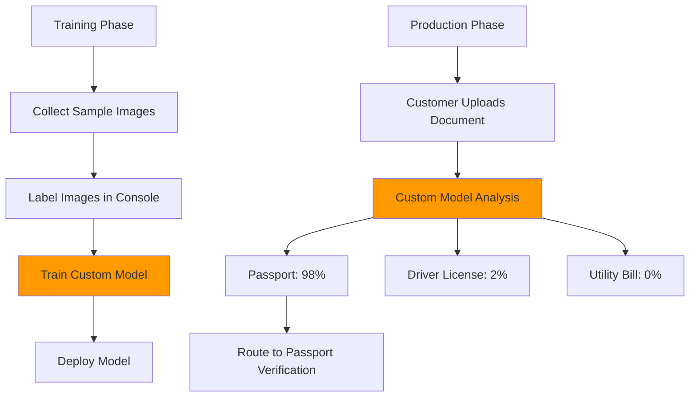

**Training Requirements**:

| Requirement         | Minimum      | Recommended          | Notes                   |
| ------------------- | ------------ | -------------------- | ----------------------- |
| **Training Images** | 10 per label | 1,000+ per label     | More = better accuracy  |
| **Labels**          | 2            | 250                  | Categories to detect    |
| **Training Time**   | 30 minutes   | 1-24 hours           | Depends on dataset size |
| **Model Hosting**   | Pay per hour | Stop when not in use | Cost optimization       |

**Training Process**:
1. **Collect Images**: Gather representative samples
2. **Label Data**: Use Rekognition console to annotate
3. **Train Model**: Automated training process
4. **Evaluate**: Review accuracy metrics
5. **Deploy**: Start inference endpoint
6. **Iterate**: Improve with more data

**Business Benefits**:
- Detect bank-specific documents (loan applications, account forms)
- Identify proprietary products or branding
- Automate specialized workflows
- No data science team required

**Exam Tip**: Custom Labels requires training data and time. Pre-built features work immediately without training.

---

### 10. Video Analysis Features

**What it does**: Analyzes video content for objects, people, activities, and inappropriate content over time.

**Video-Specific Capabilities**:

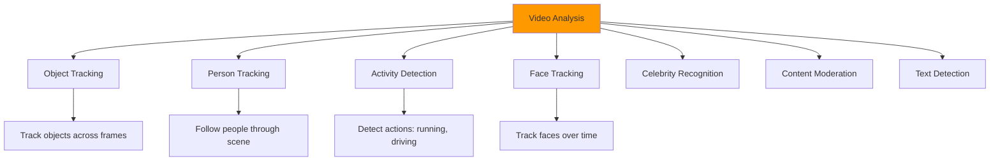

**Digital Financial Bank Use Case**: ATM Security Monitoring

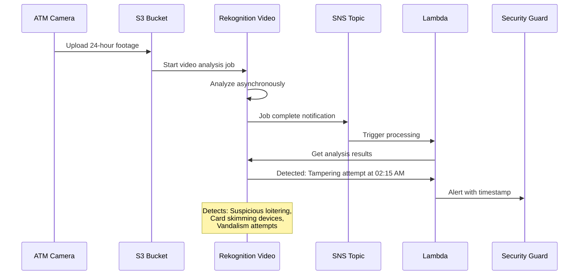

I'll streamline the remaining content and focus on essential information.

---

## Real-World Use Cases

### Use Case 1: Digital Banking - Remote Account Opening

**Business Challenge**: Enable remote account opening while preventing identity fraud.

**Solution**: 
- **Face Comparison**: Match selfie with ID photo (95%+ similarity)
- **Text Detection**: Extract ID details automatically
- **Facial Analysis**: Verify image quality and liveness

**Business Outcomes**:
- 95% automation rate
- 10-minute account opening (vs. 3 days)
- 99.5% fraud detection accuracy
- $50 cost savings per account

---

### Use Case 2: Branch Security - Threat Detection

**Business Challenge**: Monitor 500+ branches for security threats 24/7.

**Solution**:
- **Object Detection**: Identify weapons, suspicious packages
- **PPE Detection**: Verify mask compliance during pandemic
- **Activity Detection**: Detect unusual behavior patterns

**Business Outcomes**:
- Real-time threat alerts
- 80% reduction in security incidents
- Automated compliance reporting

---

### Use Case 3: Customer Experience - VIP Recognition

**Business Challenge**: Provide personalized service to high-value customers.

**Solution**:
- **Face Collections**: Store VIP customer faces
- **Real-time Search**: Identify customers upon branch entry
- **Automated Alerts**: Notify relationship managers

**Business Outcomes**:
- 40% increase in VIP satisfaction
- Proactive personalized service
- Competitive differentiation

---

## Integration & Deployment

### API Access Methods

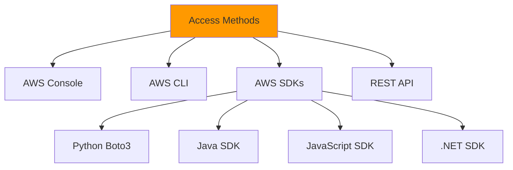

---

### Processing Modes Summary

| Mode                      | Response Time  | Input Size | Use Case               | Cost Model |
| ------------------------- | -------------- | ---------- | ---------------------- | ---------- |
| **Synchronous (Images)**  | < 1 second     | 15 MB      | Real-time verification | Per image  |
| **Asynchronous (Videos)** | Minutes-hours  | 10 GB      | Surveillance analysis  | Per minute |
| **Streaming**             | Near real-time | Continuous | Live monitoring        | Per minute |

---

### Security & Compliance

```mermaid
graph TB
    A[Security Features] --> B[Encryption]
    A --> C[Access Control]
    A --> D[Compliance]
    A --> E[Privacy]
    
    B --> F[At Rest: KMS]
    B --> G[In Transit: TLS 1.2+]
    
    C --> H[IAM Policies]
    C --> I[VPC Endpoints]
    
    D --> J[HIPAA Eligible]
    D --> K[GDPR Compliant]
    D --> L[SOC Certified]
    
    E --> M[No Data Retention]
    E --> N[Face Vectors Only]
    
    style A fill:#232F3E
```

**Key Security Points**:
- **Encryption**: KMS at rest, TLS in transit
- **Access Control**: IAM policies, VPC endpoints
- **Compliance**: HIPAA, GDPR, SOC, PCI DSS
- **Privacy**: No training on customer data, face vectors (not images) stored

**Exam Tip**: Rekognition is HIPAA eligible and stores face vectors, not actual images.

---

### Pricing Model

```mermaid
graph LR
    A[Pricing Components] --> B[Image Analysis]
    A --> C[Video Analysis]
    A --> D[Custom Labels]
    A --> E[Face Collections]
    
    B --> F[Per Image]
    C --> G[Per Minute]
    D --> H[Training + Inference]
    E --> I[Storage + Search]
    
    style A fill:#FF9900
```

**Pricing Breakdown**:

| Feature                     | Pricing                     | Free Tier                       |
| --------------------------- | --------------------------- | ------------------------------- |
| **Image Analysis**          | $0.001 per image            | 5,000 images/month (12 months)  |
| **Video Analysis**          | $0.10 per minute            | 1,000 minutes/month (12 months) |
| **Face Storage**            | $0.01 per 1,000 faces/month | Included                        |
| **Face Search**             | $0.001 per search           | Included in image tier          |
| **Custom Labels Training**  | $1.00 per hour              | None                            |
| **Custom Labels Inference** | $4.00 per hour              | None                            |

**Cost Optimization Tips**:
- Use batch processing for non-urgent analysis
- Stop Custom Labels models when not in use
- Set appropriate confidence thresholds to reduce false positives
- Use S3 Intelligent-Tiering for image storage
- Monitor usage with CloudWatch and Cost Explorer

**Exam Tip**: Rekognition has a generous free tier for new accounts - 5,000 images/month for 12 months.

---

## Exam Tips & Key Takeaways

### Must-Know Facts for AWS Cloud Practitioner

#### 1. Service Definition
✅ **Amazon Rekognition is a fully managed computer vision service that analyzes images and videos using deep learning**
- No ML expertise required
- Pre-trained models ready to use
- Pay-per-use pricing

---

#### 2. Key Features Summary

```mermaid
mindmap
  root((Rekognition))
    Image Analysis
      Object Detection
      Facial Analysis
      Face Comparison
      Text Detection OCR
      Celebrity Recognition
      Content Moderation
      PPE Detection
    Video Analysis
      Object Tracking
      Activity Detection
      Face Tracking
      Person Pathing
    Custom Features
      Custom Labels
      Face Collections
```

**Exam Tip**: If asked about image/video analysis, face recognition, or computer vision → Think Rekognition

---

#### 3. Common Exam Scenarios

**Scenario 1**: "A bank needs to verify customer identity during mobile account opening"
- **Answer**: Amazon Rekognition Face Comparison

**Scenario 2**: "A company needs to detect inappropriate content in user-uploaded images"
- **Answer**: Amazon Rekognition Content Moderation

**Scenario 3**: "A security team needs to identify VIP customers entering a building"
- **Answer**: Amazon Rekognition Face Collections with Face Search

**Scenario 4**: "A company needs to extract text from photos of receipts"
- **Answer**: Amazon Rekognition Text Detection (or Textract for complex documents)

**Scenario 5**: "A healthcare facility needs to verify employees are wearing masks"
- **Answer**: Amazon Rekognition PPE Detection

**Scenario 6**: "A company needs to analyze 10,000 hours of surveillance footage"
- **Answer**: Amazon Rekognition Video Analysis (Asynchronous)

---

#### 4. Service Comparisons

**Rekognition vs Other AWS AI Services**:

| Service         | Primary Function     | Input Type       | Use Case                           |
| --------------- | -------------------- | ---------------- | ---------------------------------- |
| **Rekognition** | Image/video analysis | Images, videos   | Face recognition, object detection |
| **Textract**    | Document extraction  | Documents, forms | OCR with form understanding        |
| **Comprehend**  | Text analysis        | Text             | Sentiment, entities, NLP           |
| **Transcribe**  | Speech-to-text       | Audio            | Convert speech to text             |
| **Polly**       | Text-to-speech       | Text             | Voice applications                 |
| **Translate**   | Language translation | Text             | Multi-language support             |

**Key Differences**:

```mermaid
graph TB
    A[Input Type?] --> B{Visual Content?}
    B -->|Images/Videos| C[Rekognition]
    B -->|Documents/Forms| D[Textract]
    B -->|Text| E[Comprehend]
    B -->|Audio| F[Transcribe]
    
    style C fill:#FF9900
```

**Exam Tip**: 
- **Rekognition**: Analyzes images/videos (visual content)
- **Textract**: Extracts text from documents with structure understanding
- Use Textract first if you need to extract text from PDFs/forms, then Rekognition for face verification

---

#### 5. Critical Distinctions

**Facial Analysis vs Face Recognition**:

| Feature      | Facial Analysis         | Face Recognition            |
| ------------ | ----------------------- | --------------------------- |
| **Purpose**  | Detect attributes       | Identify individuals        |
| **Privacy**  | Anonymous               | Identifies people           |
| **Output**   | Age, gender, emotions   | Person ID, name             |
| **Requires** | Single image            | Face collection             |
| **Use Case** | Demographics, sentiment | Access control, VIP service |

**Exam Tip**: Facial Analysis = attributes (anonymous). Face Recognition = identity (specific person).

---

#### 6. Image vs Video Processing

**Critical Differences**:

| Aspect               | Image        | Video            |
| -------------------- | ------------ | ---------------- |
| **API Call**         | Synchronous  | Asynchronous     |
| **Response**         | Immediate    | SNS notification |
| **Size Limit**       | 15 MB        | 10 GB            |
| **Processing Time**  | < 1 second   | Minutes to hours |
| **Results Location** | API response | S3 bucket        |
| **Temporal Data**    | No           | Yes (timestamps) |

```mermaid
sequenceDiagram
    participant U as User
    participant R as Rekognition
    participant SNS as SNS
    
    Note over U,R: Image Analysis (Sync)
    U->>R: Analyze image
    R->>U: Immediate results
    
    Note over U,SNS: Video Analysis (Async)
    U->>R: Start video job
    R->>U: Job ID
    R->>R: Process video
    R->>SNS: Job complete
    SNS->>U: Notification
    U->>R: Get results
```

**Exam Tip**: Images = synchronous/immediate. Videos = asynchronous/SNS notification.

---

#### 7. When to Use Rekognition

**✅ Use Amazon Rekognition When**:
- Analyzing images or videos
- Detecting faces or objects
- Verifying identity (face comparison)
- Moderating visual content
- Extracting text from images
- Recognizing celebrities
- Detecting PPE compliance
- Building custom visual detection models

**❌ Don't Use Rekognition When**:
- Analyzing text documents (use Comprehend)
- Extracting structured data from forms (use Textract)
- Converting speech to text (use Transcribe)
- Translating languages (use Translate)
- Processing audio files (use Transcribe)
- Need medical image analysis (use specialized services)

**Exam Tip**: Rekognition = visual content (images/videos) only.

---

#### 8. Limits and Quotas

**Service Limits**:

| Limit Type                | Value               | Notes                |
| ------------------------- | ------------------- | -------------------- |
| **Image size (sync)**     | 15 MB               | JPEG, PNG            |
| **Video size (async)**    | 10 GB               | MP4, MOV, AVI        |
| **Faces per image**       | 100                 | Detection limit      |
| **Face collections**      | 1,000 per account   | Can request increase |
| **Faces per collection**  | 20 million          | Highly scalable      |
| **Concurrent video jobs** | 20                  | Default limit        |
| **API rate limits**       | Varies by operation | Can request increase |

**Exam Tip**: Know the 15 MB image limit and that video processing is asynchronous.

---

#### 9. Monitoring and Logging

**Integration with AWS Services**:

| Service        | Purpose              | What to Monitor            |
| -------------- | -------------------- | -------------------------- |
| **CloudWatch** | Metrics & alarms     | API calls, errors, latency |
| **CloudTrail** | API activity audit   | Who called what, when      |
| **S3**         | Store images/results | Input/output data          |
| **SNS**        | Notifications        | Job completion, alerts     |
| **Lambda**     | Process results      | Automated workflows        |

**Key Metrics**:
- `SuccessfulRequestCount`: Successful API calls
- `UserErrorCount`: Client errors (4xx)
- `ServerErrorCount`: Service errors (5xx)
- `ResponseTime`: API latency
- `ThrottledCount`: Rate-limited requests

**Exam Tip**: Rekognition integrates with CloudWatch for monitoring and CloudTrail for auditing.

---

#### 10. Best Practices

**Operational Excellence**:
- ✅ Set appropriate confidence thresholds (95%+ for high-security)
- ✅ Implement retry logic for transient failures
- ✅ Use asynchronous processing for videos
- ✅ Monitor API usage and costs
- ✅ Tag resources for cost allocation

**Security**:
- ✅ Use IAM roles with least privilege
- ✅ Enable encryption (KMS at rest, TLS in transit)
- ✅ Use VPC endpoints for private connectivity
- ✅ Audit API calls with CloudTrail
- ✅ Implement data retention policies

**Cost Optimization**:
- ✅ Use batch processing for large volumes
- ✅ Stop Custom
